# Köpa och tilldela Power BI Pro-licenser

Power BI Pro är en enskild licens som tillåter åtkomst till allt innehåll och alla funktioner i Power BI-tjänsten, inklusive möjligheten att dela innehåll och samarbeta med andra Pro-användare. Det är bara Pro-användare som kan publicera innehåll på apparbetsytor, dela instrumentpaneler samt prenumerera på instrumentpaneler och rapporter. Mer information finns i [Power BI-funktioner efter licenstyp](service-features-license-type.md).

Den här artikeln beskriver hur du köper Power BI Pro-licenser i Office 365. Artikeln beskriver sedan de två alternativen som du har för att tilldela dessa licenser till enskilda användare: Office 365 och Azure (välj ett alternativ).

## Förutsättningar

Du måste ha rollen [**global administratör** eller **faktureringsadministratör**](https://support.office.com/article/about-office-365-admin-roles-da585eea-f576-4f55-a1e0-87090b6aaa9d) i Office 365.

För att kunna tilldela licenser i Azure måste du vara ägare till den Azure-prenumeration som Power BI använder för Active Directory-sökningar.

## Köpa licenser i Office 365

Du följer de här stegen för att köpa Power BI Pro-licenser:

1. Öppna [Administrationscenter för Microsoft 365](https://portal.office.com/adminportal/home#/homepage).

2. Välj **fakturering** > **prenumerationer** i den vänstra navigeringspanelen.

    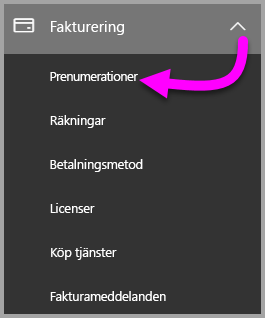

3. Klicka på **Lägg till prenumerationer** i det övre högra hörnet på sidan **Prenumerationer**.

    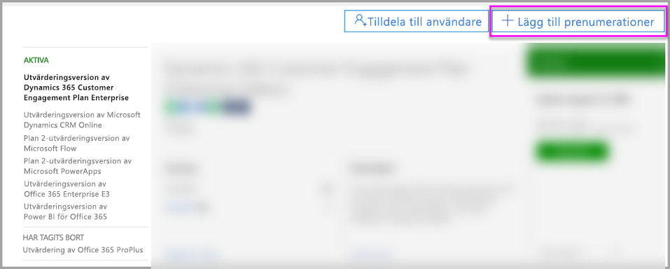

4. Leta reda på önskat prenumerationserbjudande:

    Välj **Office 365 Enterprise E5** under **Enterprise Suite**.

    

    Välj **Power BI Pro** under **Andra alternativ**.

    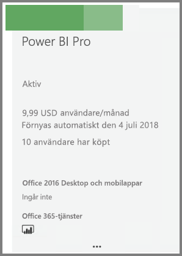

5. För pekaren över de tre punkterna ( **. . .** ) för den önskade prenumerationen och välj **Köp nu**.

    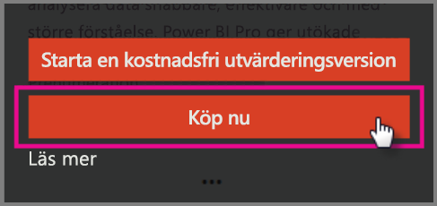

6. Välj om du vill betala **per månad** eller **för ett helt år**.

7. Under **Hur många användare vill du ha?** anger du önskat antal licenser och väljer sedan **Checka ut nu** för att slutföra transaktionen.

8. Kontrollera att den köpta prenumerationen nu visas på sidan **Prenumerationer**.

   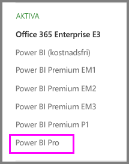

9. Om du vill lägga till fler licenser efter det inledande köpet, väljer du **Power BI Pro** på sidan **Prenumerationer** och sedan **Lägg till/ta bort licenser**.

## Tilldela licenser i Office 365

Följ de här stegen om du vill tilldela Power BI Pro-licenser till enskilda användarkonton:

1. Öppna [Administrationscenter för Microsoft 365](https://portal.office.com/adminportal/home#/homepage).

2. Expandera **Användare** i det vänstra navigeringsfönstret och klicka sedan på **Aktiva användare**.

    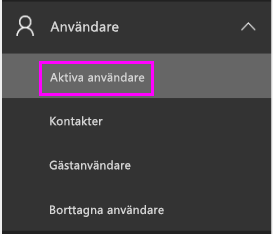

3. Välj en användare och sedan **Redigera** under **Produktlicenser**.

    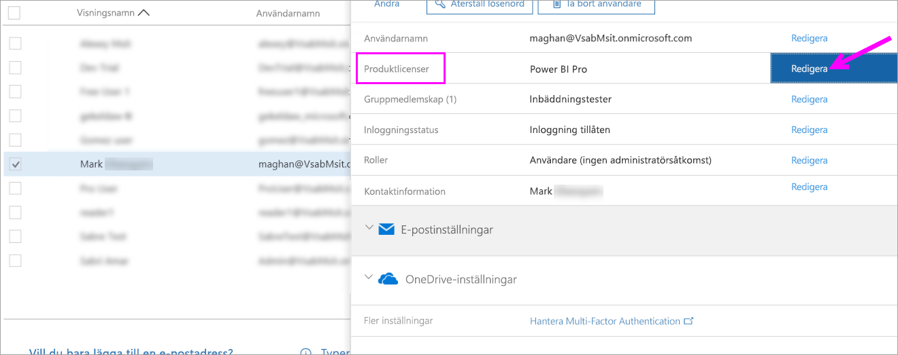

4. Under **Power BI Pro** ändrar du inställningen till **På** och klickar sedan på **Spara**.

    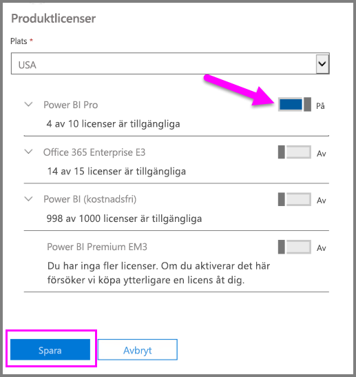

5. Under **Status** kontrollerar du att Power BI Pro-licensen har tilldelats för det valda kontot.

    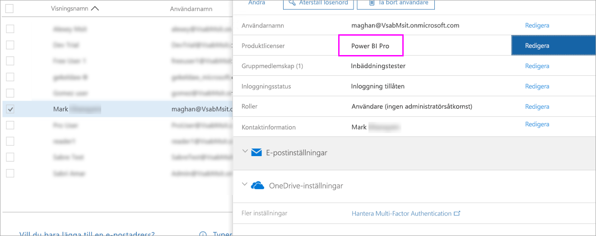

## Tilldela licenser i Azure

Följ de här stegen om du vill tilldela Power BI Pro-licenser till enskilda användarkonton:

1. Gå till [Azure-portalen](https://ms.portal.azure.com/#@microsoft.onmicrosoft.com/dashboard/private/39bc3cf7-31a4-43f6-954c-f2d69ca2f0).

2. Välj **Azure Active Directory** i det vänstra navigeringsfältet.

    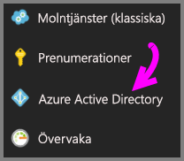

3. Under **Azure Active Directory** väljer du **Licenser**.

    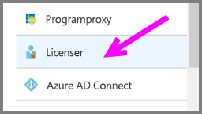

4. Under **Licenser**, väljer du **Alla produkter** och väljer sedan **Power BI Pro** för att visa listan över licensierade användare.

    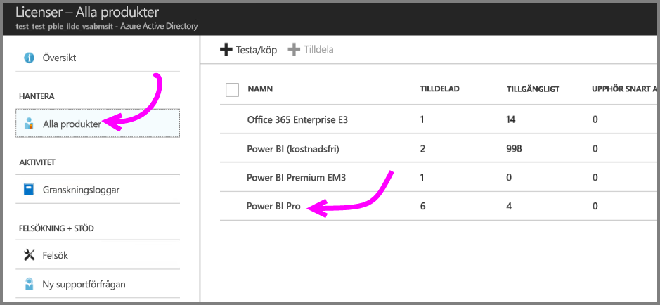

5. Klicka på **Tilldela** för att lägga till en Power BI Pro-licens till ett ytterligare användarkonto.

    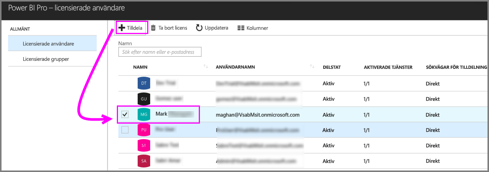

## Nästa steg

Nu när du har tilldelat licenser, kan du läsa mer om Power BI Pro.

[Power BI-licensiering i din organisation](service-admin-licensing-organization.md)

[Hitta Power BI-användare som har loggat in](service-admin-access-usage.md)

Har du fler frågor? [Fråga Power BI Community](https://community.powerbi.com/)
