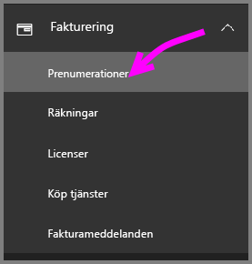
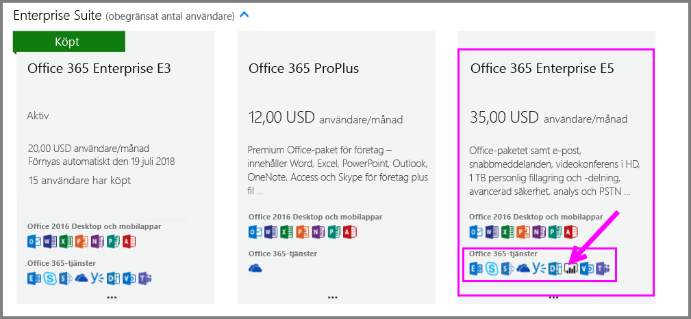
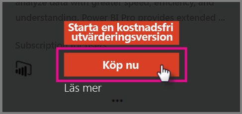
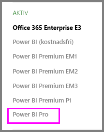

# Snabbstart: Köpa Power BI Pro-licenser

Power BI Pro är en enskild licens som tillåter åtkomst till allt innehåll och alla funktioner i Power BI-tjänsten, inklusive möjligheten att dela innehåll och samarbeta med andra Pro-användare. Endast Pro-användare kan publicera innehåll till och använda apparbetsytor, dela instrumentpaneler och prenumerera på instrumentpaneler och rapporter. Den här artikeln beskriver hur du köper Power BI Pro-licenser i Office 365.

## Förutsättningar

Du måste ha rollen [**global administratör** eller **faktureringsadministratör**](https://support.office.com/article/about-office-365-admin-roles-da585eea-f576-4f55-a1e0-87090b6aaa9d?ui=en-US&rs=en-US&ad=US) i Office 365. 

## Köpa Power BI Pro-licenser via Office 365

Du följer de här stegen för att köpa Power BI Pro-licenser:

1. Öppna [Administrationscenter för Office 365](https://portal.office.com/adminportal/home#/homepage).

2. Välj **fakturering** > **prenumerationer** i den vänstra navigeringspanelen.

    

3. Klicka på **Lägg till prenumerationer** i det övre högra hörnet på sidan **Prenumerationer**.

    

4. Leta reda på önskat prenumerationserbjudande:

    Välj **Office 365 Enterprise E5** under **Enterprise Suite**.

    

    Välj **Power BI Pro** under **Andra alternativ**.

    

5. För pekaren över de tre punkterna (...) för den önskade prenumerationen och välj **Köp nu**.

    

6. Välj om du vill betala **per månad** eller **för ett helt år**.

7. Under **Hur många användare vill du ha?** anger du önskat antal licenser och väljer sedan **Checka ut nu** för att slutföra transaktionen.

8. Kontrollera att den köpta prenumerationen nu visas på sidan **Prenumerationer**.

   

9. Om du vill lägga till fler licenser efter det inledande köpet, väljer du **Power BI Pro** på sidan **Prenumerationer** och sedan **Lägg till/ta bort licenser**.

## Nästa steg

Nu när du har köpt licenser, kan du tilldela dem till användare i din klient.

[Tilldela licenser till användare i Office 365](service-admin-assigning-power-bi-pro-licenses.md)

[Tilldela licenser till användare i Azure](service-admin-assigning-power-bi-pro-licenses-azure.md)

[Power BI-prissättningssidan](https://powerbi.microsoft.com/en-us/pricing/)
