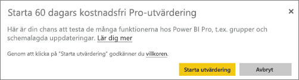

# Köp Power BI Pro
Power BI Pro är till för användare som publicerar rapporter, delar instrumentpaneler, samarbetar med kollegor i arbetsytor och engagerar sig i andra relaterade aktiviteter som möjligheten att:

* Analysera data i Excel eller Power BI Desktop
* Dela med stöd för Excel-webbappar
* Dela instrumentpaneler och samarbeta med apparbetsytor
* Visa delat innehåll
* Integrera innehåll med Microsoft Teams

IT-administratörer har några alternativ för att använda Power BI Pro i organisationen. Du kan köpa Power BI Pro via administrationscentret för Office 365, eller via din Microsoft-representant eller partner. Den här artikeln går igenom de två utvärderingsalternativen som finns tillgängliga för Power BI Pro och hur du köper som en organisation.

Läs mer om Power BI Premium och hur Power BI Pro passar in i Premium-erbjudandet i [Power BI Premium – vad är det?](service-premium.md)

## Prissättning
Den senaste prisinformationen för Power BI Pro och en tabellista över inkluderade funktioner, finns i [Power BI-priser](https://powerbi.microsoft.com/pricing/).

## 60 dagars utvärderingsversion av Power BI Pro-tjänsten för individer
När du har registrerat dig för ett kostnadsfritt konto kan du välja att testa Pro kostnadsfritt under 60 dagar. Du får åtkomst till alla Pro-funktioner under utvärderingsperioden. Power BI Pro innehåller alla funktionerna i den kostnadsfria versionen av Power BI och ytterligare funktioner för delning och samarbete. Mer information finns i [Power BI-prissättning](https://powerbi.microsoft.com/pricing). Registrera dig för Power BI om du vill testa en 60 dagars kostnadsfri utvärderingsversion av Power BI Pro, och testa någon av dessa Power BI Pro-funktioner:

* [Skapa en apparbetsyta](service-create-distribute-apps.md)
* [Dela en instrumentpanel](service-share-dashboards.md)

När du testar någon av dessa funktioner uppmanas du att starta den kostnadsfria utvärderingsversionen. Du kan också välja att använda den genom att gå till kugghjulsikonen och välja **Hantera personlig lagring**. Välj sedan **Testa Pro kostnadsfritt** till höger.

Sedan kan du välja **Starta utvärdering**.

> [!NOTE]
> Användare som utnyttjar denna Power BI Pro-utvärderingsversion visas inte i Office 365-administratörsportalen som Power BI Pro-utvärderingsanvändare (de visas som användare av den kostnadsfria Power BI-versionen). De visas dock som Power BI Pro-utvärderingsanvändare på sidan **Hantera lagring** i Power BI.

> [!NOTE]
> Om du är en IT-administratör som vill hämta och distribuera Power BI-utvärderingslicenser till flera användare i din organisation utan att de enskilda användarna ska behöva godkänna användningsvillkoren individuellt, så kan du registrera dig för en [utvärderingsprenumeration på Power BI Pro](https://portal.office.com/Signup/MainSignup15.aspx?OfferId=d59682f3-3e3b-4686-9c00-7c7c1c736085&dl=POWER_BI_PRO). Du måste vara global administratör eller faktureringsadministratör för Office 365 eller skapa en ny klient för att kunna registrera dig för en administratörsutvärderingsversion. Mer information finns i [Köpa Power BI Pro](service-admin-purchasing-power-bi-pro.md).

> [!NOTE]
> Tillgängligheten av Power BI Premium och de ändringar som gjorts i den kostnadsfria versionen av Power BI den 1 juni 2017 innebär att du är berättigad till en utökad Pro-utvärderingsversion. Mer information finns i [Aktivering av utökad Pro-utvärderingsversion](service-extended-pro-trial.md).

### Så här ser det ut i tjänsten
När du använder tjänsten kan du kontrollera att du har ett konto för en utvärderingsversion av Pro genom att gå till **kugghjulsikonen* och välja **Hantera personlig lagring**.

## Prenumerationsutvärdering i Office 365
Du kan hämta Power BI Pro som en utvärdering för din organisation. När du har prenumerationen, kan du tilldela Power BI Pro-licenser till dina användare. Mer information om hur du tilldelar licenser finns i [Tilldela licenser till användare i Office 365 ](https://support.office.com/article/Assign-or-unassign-licenses-for-Office-365-for-business-997596b5-4173-4627-b915-36abac6786dc).

> [!NOTE]
> Det finns en gräns på en organisationsutvärdering per klientorganisation. Det innebär att om någon redan har använt Power BI Pro-utvärderingen för din klientorganisation så kan du inte göra det igen. Om du behöver hjälp med det här kan du kontakta [Office 365-faktureringsstöd](https://support.office.microsoft.com/article/Contact-Office-365-for-business-support-Admin-Help-32a17ca7-6fa0-4870-8a8d-e25ba4ccfd4b?CorrelationId=552bbf37-214f-4202-80cb-b94240dcd671&ui=en-US&rs=en-US&ad=US#BKMK_call_support).
> 

1. Gå till [administrationscentret för Office 365](https://portal.office.com/admin/default.aspx).
2. Välj Fakturering > Prenumerationer i det vänstra navigeringsfönstret.
3. Välj Lägg till prenumerationer + på höger sida.
4. Under andra planer, hovrar du över ellipsen (...) för Power BI Pro och väljer starta kostnadsfri utvärdering.
   
    
5. Välj testa nu på bekräftelsesidan.
6. Välj fortsätt på orderkvittot.

Under **fakturering** > **prenumerationer**, ser du **Power BI Pro-utvärderingsversion** listat med 25 tillgängliga licenser. Det här är en enmånadersutvärdering.

### Så här ser det ut i tjänsten
När du använder tjänsten kan du verifiera att du har ett Pro-konto genom att gå till **kugghjulsikonen** och välja **Hantera personlig lagring**. Det kommer inte att stå något om att det är en utvärderingsanvändare.

## Köp prenumeration i Office 365
Du kan köpa Power BI Pro för din organisation via administrationscenter för Office 365. När du har prenumerationen, kan du tilldela Power BI Pro-licenser till dina användare. Mer information om hur du tilldelar licenser finns i [Tilldela licenser till användare i Office 365 ](https://support.office.com/article/Assign-or-unassign-licenses-for-Office-365-for-business-997596b5-4173-4627-b915-36abac6786dc).

1. Gå till [administrationscentret för Office 365](https://portal.office.com/admin/default.aspx).
2. Välj Fakturering > Prenumerationer i det vänstra navigeringsfönstret.
3. Välj Lägg till prenumerationer + på höger sida.
4. Under andra planer, hovrar du över ellipsen (...) för Power BI Pro och väljer köp nu.
   
    
5. Ange det antal licenser som du vill lägga till och markera sedan checka ut nu eller lägg till i kundvagn.
   
   > [!NOTE]
   > Du kan lägga till fler vid ett senare tillfälle om det behövs.
   > 
   > 
6. Ange den nödvändiga informationen i utcheckningsflödet.

> [!NOTE]
> Om du redan hade Power BI Pro-utvärderingsversionen kommer det gå direkt till utcheckningen där du ombeds att ange antalet licenser som du vill ha.
> 
> 

Under **fakturering** > **prenumerationer**, ser du **Power BI Pro** listat. Om du senare väljer att du vill lägga till fler licenser, går du tillbaka till **lägg till prenumerationer** och välja **ändra licensantal**.

### Så här ser det ut i tjänsten
När du använder tjänsten kan du verifiera att du har ett Pro-konto genom att gå till **kugghjulsikonen** och välja **Hantera personlig lagring**.

## Respitperiod
Det finns en respitperiod på 30 dagar efter att en Power BI Pro-licens har gått ut. 

Power BI Pro har samma prenumerationslivscykel som Office 365. Mer information finns i [Vad händer med mina data och åtkomst när Office 365 för företag-prenumerationen går ut?](https://support.office.com/en-us/article/What-happens-to-my-data-and-access-when-my-Office-365-for-business-subscription-ends-4436582f-211a-45ec-b72e-33647f97d8a3)

## Nästa steg
[Självregistrering för Power BI](service-self-service-signup-for-power-bi.md)  
[Power BI (kostnadsfri) i din organisation](service-admin-service-free-in-your-organization.md)  
[Aktivering av utökad Pro-utvärderingsversion](service-extended-pro-trial.md)  
[Power BI Premium – vad är det?](service-premium.md)  
[Så här köper du Power BI Premium](service-admin-premium-purchase.md)  
[Power BI Premium – white paper](https://aka.ms/pbipremiumwhitepaper)  

Har du fler frågor? [Fråga Power BI Community](http://community.powerbi.com/)

