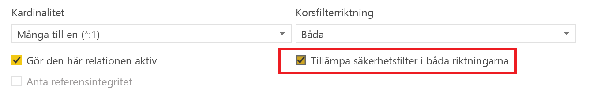
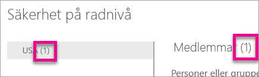
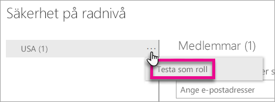

# Säkerhet på radnivå (RLS) med Power BI

Säkerhet på radnivå (RLS) med Power BI kan användas för att begränsa åtkomst till data för givna användare. Filter begränsar åtkomst till data på radnivå och du kan definiera filter inom roller. Tänk på att medlemmar i en arbetsyta har åtkomst till datauppsättningar i arbetsytan i Power BI-tjänsten. RLS begränsar inte åtkomsten till data.

Du kan konfigurera RLS för datamodeller som importerats till Power BI med Power BI Desktop. Du kan också konfigurera RLS på datauppsättningar som använder DirectQuery, till exempel SQL Server. Tidigare kunde du endast att implementera RLS inom lokala Analysis Services-modeller utanför Power BI. För Analysis Services live-anslutningar konfigurerar du säkerhet på radnivå på den lokala modellen. Säkerhetsalternativet visas inte för datauppsättningar med live-anslutning.

[!INCLUDE [include-short-name](./includes/rls-desktop-define-roles.md)]

Som standard använder säkerhetsfiltrering på radnivå sig av enkelriktade filter, oavsett om relationerna är inställda på enkelriktade eller dubbelriktade. Du kan aktivera dubbelriktad korsfiltrering med säkerhet på radnivå manuellt genom att markera relationen och markera kryssrutan **Tillämpa säkerhetsfilter i båda riktningarna**. Du bör markera den här rutan när du implementerar [dynamisk säkerhet på radnivå](https://docs.microsoft.com/sql/analysis-services/supplemental-lesson-implement-dynamic-security-by-using-row-filters), där du anger säkerhet på radnivå baserat på användarnamn eller inloggnings-ID.

Mer information finns i [dubbelriktad korsfiltrering med DirectQuery i Power BI Desktop](desktop-bidirectional-filtering.md) och den tekniska artikeln [skydda Tabular BI-Semantikmodellen](http://download.microsoft.com/download/D/2/0/D20E1C5F-72EA-4505-9F26-FEF9550EFD44/Securing%20the%20Tabular%20BI%20Semantic%20Model.docx).

[!INCLUDE [include-short-name](./includes/rls-desktop-view-as-roles.md)]

## Hantera säkerheten på din modell

Om du vill hantera säkerheten på din datamodell, gör du följande.

1. Välj **ellipsen (...)**  för en datauppsättning.
2. Välj **säkerhet**.
   
   

Det här tar dig till RLS-sidan där du kan lägga till medlemmar i en roll som du skapade i Power BI Desktop. Endast ägare av datauppsättningen ser säkerhet. Om datauppsättningen är i en grupp, visas bara säkerhetsalternativet för gruppens administratörer. 

Du kan bara skapa eller ändra roller i Power BI Desktop.

## Arbeta med medlemmar

### Lägg till medlemmar

Du kan lägga till en medlem i rollen genom att skriva in e-postadressen eller namnet på användaren, säkerhetsgruppen eller distributionslistan som du vill lägga till. Den här medlemmen måste vara inom din organisation. Du kan inte lägga till grupper som skapas i Power BI.

Du kan också se hur många medlemmar som är en del av rollen efter numret i parentes bredvid rollnamnet eller bredvid medlemmar.

### Ta bort medlemmar

Du kan ta bort medlemmar genom att välja X bredvid deras namn. 

## Validera rollen i Power BI-tjänsten

Du kan validera att den roll som du har definierat fungerar genom att testa rollen. 

1. Välj **ellipsen (...)**  bredvid rollen.
2. Välj **testa data som roll**

Du ser sedan rapporter som är tillgängliga för den här rollen. Instrumentpaneler visas inte i den här vyn. I det blå fältet ovan visas vad som används.

Du kan testa andra roller eller en kombination av roller, genom att välja **visar som**.

Du kan välja att visa data som en specifik person, eller så kan du välja en kombination av tillgängliga roller för att verifiera att de fungerar. 

Om du vill återgå till normal visning, väljer du **tillbaka till säkerhet på radnivå**.

[!INCLUDE [include-short-name](./includes/rls-usernames.md)]

## Använd RLS med apparbetsytor i Power BI

Om du publicerar din Power BI Desktop-rapport till en apparbetsyta i Power BI-tjänsten, används rollerna till skrivskyddade medlemmar. Du behöver indikera att medlemmar bara kan se Power BI-innehåll i inställningarna för apparbetsytan.

> [!WARNING]
> Om du har konfigurerat apparbetsytan så att medlemmar har redigeringsbehörighet, tillämpas inte RLS-roller för dem. Användare kommer att kunna se alla data.

[!INCLUDE [include-short-name](./includes/rls-limitations.md)]

[!INCLUDE [include-short-name](./includes/rls-faq.md)]

## Nästa steg
[Sälkerhet på radnivå (RLS) med Power BI Desktop](desktop-rls.md)  

Har du fler frågor? [Fråga Power BI Community](http://community.powerbi.com/)