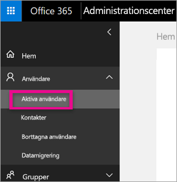
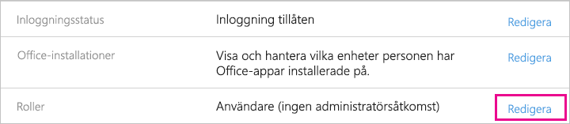
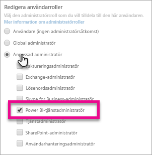
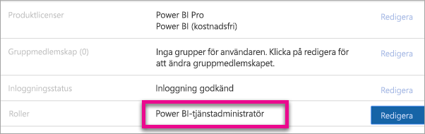

# <a name="understanding-the-power-bi-service-administrator-role"></a>Förstå administratörsrollen för Power BI-tjänsten

Lär dig använda Power BI-administratörsrollen i din organisation. Användare i den här rollen har fullständig kontroll över en Power BI-klient och dess administrativa funktioner (förutom licensiering).

Power BI-administratörsrollen kan tilldelas användare som ska ha åtkomst till Power BI-administratörsportalen utan att även ge dem fullständig administrativ Office 365-åtkomst.

Användarhanteringsadministratörer i Office 365 tilldelar användare till rollen Power BI-tjänstadministratör i Administrationscentret för Microsoft 365 eller genom att använda ett PowerShell-skript. När en användare har tilldelats får denne åtkomst till [Power BI-administratörsportalen](service-admin-portal.md). Där får de åtkomst till användningsstatistik för hela klienten och kan styra den klientomfattande användningen av Power BI-funktionerna.

## <a name="limitations-and-considerations"></a>Begränsningar och överväganden

Rollen Power BI-tjänstadministratör ger inte åtkomst till följande funktioner:

* Möjlighet att ändra användare och licenser i administrationscentret för Microsoft 365,

* Åtkomst till granskningsloggarna. Mer information finns i [Använda granskning i din organisation](service-admin-auditing.md).

## <a name="assign-users-to-the-admin-role-in-office-365"></a>Tilldela användare till administratörsrollen i Office 365

Följ dessa steg om du vill tilldela användare till Power BI-administratörsrollen i Microsoft 365 Administrationscenter.

1. I [administrationscentret för Microsoft 365](https://portal.office.com/adminportal/home#/homepage) väljer du **Användare** > **Aktiva användare**.

    

1. Välj den användare som du vill tilldela rollen.

1. Välj **Redigera** under **roller**.

    

1. Välj **Anpassad administratör** > **Power BI-tjänstadministratör**.

    

1. Välj **spara** och sedan **Stäng**.

Du bör se **Power BI-tjänstadministratör** som användarens roll i listan.



## <a name="assign-users-to-the-admin-role-with-powershell"></a>Tilldela användare till administratörsrollen med PowerShell

Du kan också tilldela användare till roller med hjälp av PowerShell. Användare hanteras i Azure Active Directory (Azure AD). Om du inte redan har Azure AD PowerShell-modulen kan du [hämta och installera den senaste versionen](https://www.powershellgallery.com/packages/AzureAD/).

1. Anslut först till Azure AD:
   ```
   PS C:\Windows\system32> Connect-AzureAD
   ```

1. Sedan hämtar du **ObjectId** för rollen **Power BI-tjänstadministratör**. Du kan köra [Get-AzureADDirectoryRole](/powershell/module/azuread/get-azureaddirectoryrole) för att hämta **ObjectId**

    ```
    PS C:\Windows\system32> Get-AzureADDirectoryRole

    ObjectId                             DisplayName                        Description
    --------                             -----------                        -----------
    00f79122-c45d-436d-8d4a-2c0c6ca246bf Power BI Service Administrator     Full access in the Power BI Service.
    250d1222-4bc0-4b4b-8466-5d5765d14af9 Helpdesk Administrator             Helpdesk Administrator has access to perform..
    3ddec257-efdc-423d-9d24-b7cf29e0c86b Directory Synchronization Accounts Directory Synchronization Accounts
    50daa576-896c-4bf3-a84e-1d9d1875c7a7 Company Administrator              Company Administrator role has full access t..
    6a452384-6eb9-4793-8782-f4e7313b4dfd Device Administrators              Device Administrators
    9900b7db-35d9-4e56-a8e3-c5026cac3a11 AdHoc License Administrator        Allows access manage AdHoc license.
    a3631cce-16ce-47a3-bbe1-79b9774a0570 Directory Readers                  Allows access to various read only tasks in ..
    f727e2f3-0829-41a7-8c5c-5af83c37f57b Email Verified User Creator        Allows creation of new email verified users.
    ```

    I det här fallet är **ObjectId** för rollen 00f79122-c45d-436d-8d4a-2c0c6ca246b.

1. Nu ska du hämta användarens **ObjectId**. Du kan hitta det genom att köra [Get-AzureADUser](/powershell/module/azuread/get-azureaduser).

    ```
    PS C:\Windows\system32> Get-AzureADUser -ObjectId 'tim@contoso.com'

    ObjectId                             DisplayName UserPrincipalName      UserType
    --------                             ----------- -----------------      --------
    6a2bfca2-98ba-413a-be61-6e4bbb8b8a4c Tim         tim@contoso.com        Member
    ```

1. Om du vill lägga till medlemmen för rollen kör du [Add-AzureADDirectoryRoleMember](/powershell/module/azuread/add-azureaddirectoryrolemember).

    | Parameter | Beskrivning |
    | --- | --- |
    | ObjectId |Rollens ObjectId. |
    | RefObjectId |Medlemmarnas ObjectId. |

    ```powershell
    Add-AzureADDirectoryRoleMember -ObjectId 00f79122-c45d-436d-8d4a-2c0c6ca246bf -RefObjectId 6a2bfca2-98ba-413a-be61-6e4bbb8b8a4c
    ```

## <a name="next-steps"></a>Nästa steg

[Administrera Power BI i din organisation](service-admin-administering-power-bi-in-your-organization.md)  
[Power BI-administratörsportalen](service-admin-portal.md)  

Har du fler frågor? [Fråga Power BI Community](https://community.powerbi.com/)