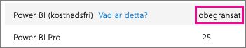
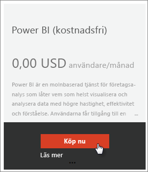
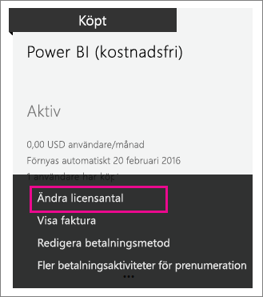

# Power BI (kostnadsfri) i din organisation
Här ska vi titta på hur erbjudandet Power BI (kostnadsfri) kan användas inom din organisation. En organisation innebär att du har en klientorganisation och kan hantera användare och tjänster inom den klientorganisationen. Som administratör, kan du styra licenstilldelningen, eller så kan du tillåta användarna att registrera sig individuellt. Vi ska titta på licensen för Power BI (kostnadsfri) och hur du kan styra individuella registreringar.

## Individuella registreringar kontra licenstilldelning
Användare i din organisation kan få tillgång till Power BI på två olika sätt. De kan registrera dig för Power BI individuellt, eller så kan du tilldela en Power BI-licens till dem från administrationsportalen för Office 365.

Om du tillåter individuella registreringar så minskar belastningen på organisationens administratörer genom att låta användare som är intresserade av Power BI registrera sig kostnadsfritt.

För mer kontroll, kan du blockera individuell registrering och tilldela licenser för Power BI själv i administrationscentret för Office 365. Det låter dig specificera vem som har åtkomst till vilka tjänster i din organisation. Det är också ett bra alternativ om du behöver hantera granskning och vill veta exakt vem som kan använda vad.

## Så här får du det obegränsade licensblocket
I administrationscentret för Office 365 under **fakturering** > **licenser** kan du antingen se Power BI (kostnadsfri) med obegränsade licenser eller inte.

Det här blocket med licenser kommer att visas efter den första gången någon registrerat sig för Power BI som individ. Under den här processen, fästs det här licensblocket till din organisation och en licens tilldelas användaren som registrerar sig.

Om du blockerar individuell registrering och ingen har registrerat sig, ser du inte det här licensblocket. Du kan antingen tillåta individuella användarregistreringar och låta en användare registrera sig, eller så kan du hämta kostnadsfria licenser via Office 365-flödet lägg till prenumeration vilket vi kommer diskutera härnäst.

När licensblocket för Power BI (kostnadsfri) finns tillgängligt, kan du tilldela de licenserna till dina användare. Mer information om hur du tilldelar licenser finns i [Tilldela licenser till användare i Office 365 ](https://support.office.com/article/Assign-or-unassign-licenses-for-Office-365-for-business-997596b5-4173-4627-b915-36abac6786dc).

## Hämta kostnadsfria licenser via lägg till prenumeration i Office 365
1. Gå till [administrationscentret för Office 365](https://portal.office.com/admin/default.aspx).
2. Välj **fakturering** > **prenumerationer** i den vänstra navigeringspanelen.
3. Välj **lägg till prenumerationer +** på höger sida.
4. Under andra planer, hovrar du över **ellipsen (...)** för Power BI (kostnadsfri) och väljer **köp nu**.
   
    
5. Ange det antal licenser som du vill lägga till och markera sedan **Checka ut nu** eller **Lägg till i kundvagn**.
   
   > [!NOTE]
   > Du kan lägga till fler vid ett senare tillfälle om det behövs.
   > 
   > 
6. Ange den nödvändiga informationen i utcheckningsflödet.

Det sker inget köp när du gör på det här sättet, men du behöver ange din kreditkortsinformation för debitering eller välja att faktureras.

Om du väljer senare att du vill lägga till fler licenser, går du tillbaka till **lägg till prenumerationer** och väljer **ändra licensantal** för Power BI (kostnadsfri).

Du kan nu tilldela dessa licenser till dina användare. Mer information om hur du tilldelar licenser finns i [Tilldela licenser till användare i Office 365 ](https://support.office.com/article/Assign-or-unassign-licenses-for-Office-365-for-business-997596b5-4173-4627-b915-36abac6786dc).

## Aktivera eller inaktivera individuell användarregistrering i Azure Active Directory
Som administratör, kan du välja att aktivera eller inaktivera individuell användarregistrering som en del av Azure Active Directory (AAD). Om du vet hur man använder AAD PowerShell-kommandon, kan du aktivera eller inaktivera, ad hoc-prenumerationer själv. [Läs mer](https://technet.microsoft.com/library/jj151815.aspx)

AAD-inställningen som styr detta är **AllowAdHocSubscriptions**. De flesta klienter har inställningen inställd till sant, vilket innebär att den är aktiverad. Om du har köpt Power BI via en partner, kan detta vara inställt till falskt som standard, vilket innebär att det är inaktiverat.

1. Först måste du måste logga in på Azure Active Directory med dina Office 365-autentiseringsuppgifter. Den första raden ber om dina autentiseringsuppgifter. Den andra raden ansluter till Azure Active Directory.
   
     $msolcred = get-credential   connect-msolservice -credential $msolcred
   
   
2. När du har loggat in, kan du utfärda följande kommando för att se vad din klient är konfigurerad för.
   
     Get-MsolCompanyInformation | fl AllowAdHocSubscriptions
3. Du kan använda det här kommandot för att aktivera ($true) eller inaktivera ($false) AllowAdHocSubscriptions.
   
     Set-MsolCompanySettings -AllowAdHocSubscriptions $true

> [!NOTE]
> Den här blockeringen förhindrar att nya användare i din organisation registrerar sig för Power BI. Användare som registrerar sig för Power BI innan du inaktiverar nya registreringar för din organisation, behåller sina licenser.
> 
> 

## Nästa steg
[Självregistrering för Power BI](service-self-service-signup-for-power-bi.md)  
[Köp Power BI Pro](service-admin-purchasing-power-bi-pro.md)  
[Registrera dig för Power BI (kostnadsfri) med en anpassad Azure Active Directory-klient](developer/create-an-azure-active-directory-tenant.md)  
[Power BI Premium – vad är det?](service-premium.md)  
[Power BI Premium – white paper](https://aka.ms/pbipremiumwhitepaper)  

Har du fler frågor? [Fråga Power BI Community](http://community.powerbi.com/)

