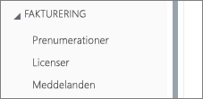

# <a name="unable-to-add-power-bi-to-office-365-partner-subscription"></a>Det går inte att lägga till Power BI till en Office 365-partnerprenumeration

Med Office 365 kan företag sälja Office 365 paketerat och integrerat med sina egna lösningar, vilket ger slutkunderna en enda kontaktpunkt för inköp, fakturering och support.

Om du är intresserad av att köpa Power BI tillsammans med din prenumeration på Office 365, rekommenderar vi att du kontaktar din partner. Om din partner inte erbjuder Power BI för tillfället finns det olika alternativ som du kan överväga.

## <a name="work-with-your-partner-to-purchase-power-bi"></a>Köp Power BI i samarbete med din partner

Om du vill köpa en prenumeration på Power BI Pro eller Power BI Premium kan du arbeta med din partner för se vilka alternativ du har:

* Partnern samtycker till att lägga till Power BI i deras portfölj så att du kan köpa från dem.

* Partnern kan överföra dig till en modell där du kan köpa Power BI direkt från Microsoft eller en annan partner som erbjuder Power BI.

## <a name="purchase-from-microsoft-or-another-channel"></a>Köp från Microsoft eller en annan kanal

Beroende på relationen med din partner kan du köpa Power BI direkt från Microsoft eller en annan partner. Du kan verifiera om du kan lägga till Power BI-prenumerationer eller inte i administrationscenter för Microsoft 365 (kräver medlemskap i rollen global administratör eller faktureringsadministratör).

1. Gå till [Administrationscenter för Microsoft 365](https://admin.microsoft.com/AdminPortal/Home#/homepage).

1. Öppna **Fakturering** i den vänstra menyn:

    * Om du ser **Prenumerationer** kan du skaffa tjänsten hos Microsoft direkt eller kontakta en partner som erbjuder Power BI.

        

    * Om du inte ser **Prenumerationer** kan du inte köpa från Microsoft direkt eller från en annan partner.

Om din partner inte erbjuder Power BI och du inte kan köpa direkt från Microsoft eller en annan partner kan du överväga att registrera dig för en kostnadsfri utvärderingsversion.

## <a name="sign-up-for-a-free-trial"></a>Registrera dig för en kostnadsfri utvärderingsversion

Du kan registrera dig för en kostnadsfri utvärderingsversion. Om du inte köper Power BI Pro i slutet av utvärderingsperioden har du fortfarande en kostnadsfri licens som erbjuder många av funktionerna i Power BI. Mer information finns i [Power-funktioner efter licenstyp](service-features-license-type.md).

### <a name="enable-ad-hoc-subscriptions"></a>Aktivera ad hoc-prenumerationer

Som standard är enskild registrering, även kallat ad hoc-prenumeration, inaktiverad. I det här fallet visas ett meddelande när du försöker registrera dig om att: *IT-avdelningen har inaktiverat registrering för Microsoft Power BI*.


Om du vill aktivera ad hoc-prenumerationer kan du kontakta din partner och begära att de aktiverar detta. Om du är administratör för din klient och vet hur man använder Azure Active Directory PowerShell-kommandon, kan du aktivera ad hoc-prenumerationer själv. [Azure Active Directory PowerShell för Graph](/powershell/azure/active-directory/install-adv2/)

1. Logga in på Azure Active Directory med dina Office 365-autentiseringsuppgifter. Den första raden i följande skript uppmanar dig att ange dina autentiseringsuppgifter. Den andra raden ansluter till Azure Active Directory.

    ```powershell
    $msolcred = get-credential
    connect-msolservice -credential $msolcred
    ```

    

1. När du har loggat in kör du följande kommando för att kontrollera den aktuella inställningen för `AllowAdHocSubscriptions`.

    ```powershell
    Get-MsolCompanyInformation
    ```

1. Kör följande kommando för att aktivera kostnadsfri registrering.

    ```powershell
    Set-MsolCompanySettings -AllowAdHocSubscriptions $true
    ```

## <a name="next-steps"></a>Nästa steg

[Power BI-licensiering i din organisation](service-admin-licensing-organization.md)

Har du fler frågor? [Fråga Power BI Community](http://community.powerbi.com/)