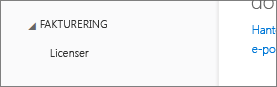

# Det går inte att lägga till Power BI till en Office 365-partnerprenumeration
Med Office 365 kan företag sälja Office 365 paketerat och integrerat med sina egna lösningar, vilket ger slutkunderna en enda kontaktpunkt för inköp, fakturering och support.

Om du är intresserad av att köpa Power BI tillsammans med din prenumeration på Office 365, rekommenderar vi att du kontaktar din partner. Om din partner inte erbjuder Power BI finns det olika alternativ som du kan överväga.

1. Du kan köpa tjänsten från en annan kanal, antingen direkt från Microsoft eller från en annan partner. Det här alternativet är inte tillgängligt för alla kunder beroende på vilken relation med partnern de har. Du kan kontrollera detta genom att gå till **Office 365 Admin Portal** > **Fakturering** > **Prenumerationer**. Om du ser **Prenumerationer** kan du skaffa tjänsten hos Microsoft direkt eller kontakta en partner som erbjuder Power BI.
   
    
2. Om du inte ser **Prenumerationer** under **Fakturering** kan du inte köpa från Microsoft direkt eller en annan partner. 
   
   

Om du inte kan köpa Power BI direkt finns det fortfarande några alternativ, beroende på vilken typ av Power BI-prenumeration som du är intresserad av.

[Power BI (kostnadsfri)](#power-bi-free)

[Power BI Pro och Premium](#power-bi-pro)

## Power BI (kostnadsfri)
Om det kostnadsfria erbjudandet för Power BI passar dig kan du registrera dig för tjänsten utan några extra kostnader. Som standard är enskild registrering, även kallat ad hoc-prenumeration, inaktiverad. När du försöker registrera dig för Power BI visas ett meddelande om att din IT-avdelning har inaktiverat registrering för Microsoft Power BI.

    Your IT department has turned off signup for Microsoft Power BI.

Om du vill aktivera ad hoc-prenumerationer kan du kontakta din partner och begära att de aktiverar detta. Om du är administratör för din klient och vet hur man använder Azure Active Directory PowerShell-kommandon, kan du aktivera ad hoc-prenumerationer själv. [Läs mer](https://technet.microsoft.com/library/jj151815.aspx)

1. Du måste först logga in på Azure Active Directory med dina Office 365-autentiseringsuppgifter. Den första raden ber om dina autentiseringsuppgifter. Den andra raden ansluter till Azure Active Directory.
   
        $msolcred = get-credential
        connect-msolservice -credential $msolcred
   
    
2. När du har loggat in kan du använda följande kommando för att aktivera kostnadsfri registrering.
   
        Set-MsolCompanySettings -AllowAdHocSubscriptions $true

## Power BI Pro och Premium
Om du vill köpa en prenumeration på Power BI Pro eller Power BI Premium måste du tillsammans med din partner se vilka alternativ du har.

* Partnern samtycker till att lägga till Power BI i deras portfölj så att du kan köpa från dem.
* Partnern kan överföra dig till en modell där du kan köpa Power BI direkt från Microsoft eller en annan partner som erbjuder Power BI.

Den här videon beskriver Office 365-syndikering och inköp av Power BI:

<iframe width="560" height="315" src="https://www.youtube.com/embed/C357phT94A8" frameborder="0" allowfullscreen></iframe>

## Nästa steg
[Hantera Azure AD med hjälp av Windows PowerShell](https://technet.microsoft.com/library/jj151815.aspx)  
[Power BI Premium – vad är det?](service-premium.md)

Har du fler frågor? [Fråga Power BI Community](http://community.powerbi.com/)

