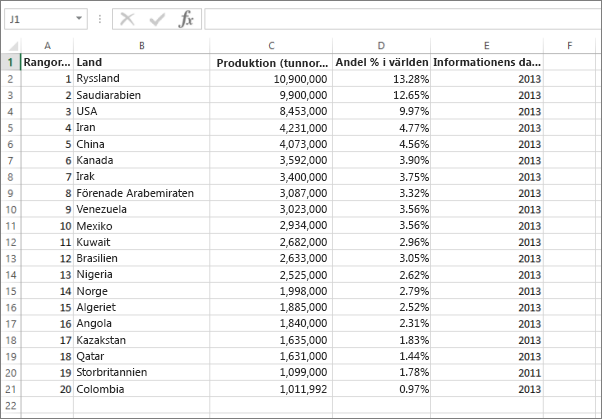
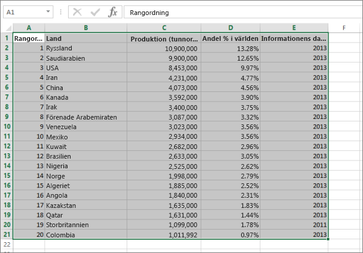

# Fel: Det gick inte att hitta några data i din Excel-arbetsbok

>[!NOTE]
>Den här artikeln gäller för Excel 2007 och senare.

När du importerar en Excel-arbetsbok till Power BI kan du se följande fel:

*Fel: Det gick inte att hitta några data i din Excel-arbetsbok. Dina data är kanske inte korrekt formaterade. Du behöver redigera din arbetsbok i Excel och sedan importera den igen.*

## Snabblösning
1. Redigera din arbetsbok i Excel.
2. Välj cellområdet som innehåller dina data. Den första raden ska innehålla kolumnrubrikerna (kolumnnamnen).
3. Tryck på **Ctrl + T** för att skapa en tabell.
4. Spara din arbetsbok.
5. Gå tillbaka till Power BI och importera arbetsboken igen, eller om du arbetar i Excel 2016 och du har sparat din arbetsbok på OneDrive för företag, klickar du på fil > publicera i Excel.

## Information
### Orsak
I Excel, kan du skapa en **tabell** från ett cellområde, vilket gör det enklare att sortera, filtrera och formatera data.

När du importerar en Excel-arbetsbok, letar Power BI efter dessa tabeller och importerar dem till en datauppsättning. Om den inte hittar några tabeller, visas detta felmeddelande.

### Lösning
1. Öppna din arbetsbok i Excel. 
    >[!NOTE]
    >De här bilderna är från Excel 2013. Om du använder en annan version, kan saker se något annorlunda ut, men stegen är desamma.
    
    
2. Välj cellområdet som innehåller dina data. Den första raden ska innehålla dina kolumnrubriker (kolumnnamnen):
   
    
3. I menyfliksområdet på fliken **infoga**, klickar du på **tabell**. (Eller, som ett kortkommando, trycker du på **Ctrl + T**.)
   
    
4. Du ser följande dialogruta. Kontrollera att **min tabell har rubriker** är markerat och välj **Ok**:
   
    
5. Nu är dina data formaterade som en tabell:
   
    
6. Spara din arbetsbok.
7. Gå tillbaka till Power BI. Välj Hämta data längst ned i det vänstra navigeringsfönstret.
   
    
8. I rutan **Filer** väljer du **Hämta**.
   
    
9. Importera din Excel-arbetsbok igen. Den här gången borde importen hitta tabellen och lyckas.
   
    Om importen fortfarande misslyckas, berättar du för oss genom att klicka på **Community ** i hjälp-menyn:
   
    
