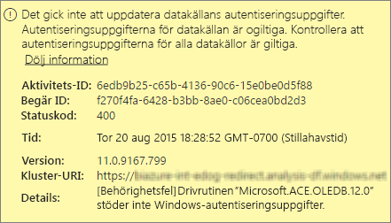
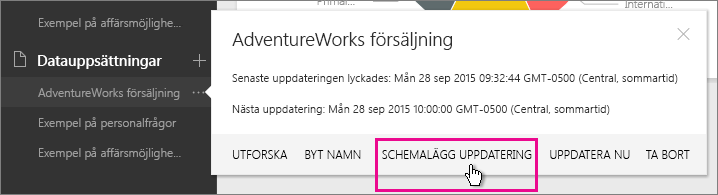
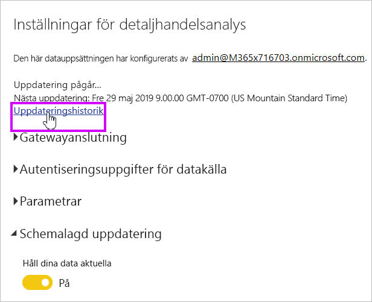
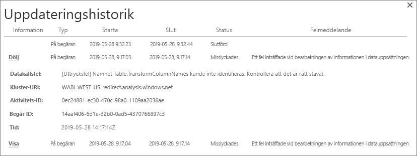
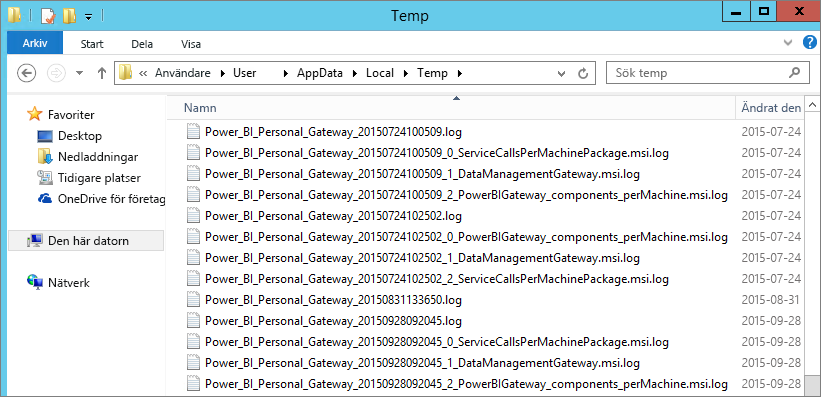

# Felsöka Power BI Gateway – Personal
Nedan går vi igenom några vanliga problem som kan uppstå när du använder Power BI Gateway – Personal.

> [!NOTE]
> Den aktuella versionen av gatewayen för personligt bruk är **Lokal datagateway (personlig)**. Uppdatera din installation om du vill använda den här versionen.
> 
> 

## Uppdatera till den senaste versionen
Flera problem kan uppstå om gatewayversionen är föråldrad.  Det är en allmänt bra vana att kontrollera att du har den senaste versionen.  Om du inte har uppdaterat din gateway på en månad eller längre, bör du överväga att installera den senaste versionen av gatewayen och se om du kan återskapa problemet.

## Installation
**Den personliga gatewayen kräver 64-bitar** – Om du har en 32-bitars dator kan du inte installera den personliga gatewayen. Operativsystemet måste vara 64-bitars. Du behöver installera en 64-bitars version av Windows eller installera den personliga gatewayen på en 64-bitars dator.

**Den personliga gatewayen kan inte installeras som tjänst trots att du är lokal administratör på datorn** – Installationen kan misslyckas om användaren finns i datorns lokala administratörsgrupp men grupprincipen inte tillåter det aktuella användarnamnet att logga in som en tjänst.  Börja med att kontrollera om grupprincipen tillåter att en användare loggar in som en tjänst. Vi arbetar på att lösa problemet. [Läs mer](https://technet.microsoft.com/library/cc739424.aspx)

**Tidsgränsen uppnåddes** – Detta är vanligt om datorn (fysisk eller virtuell dator) som du installerar den personliga gatewayen på har en processor med enkel kärna. Stäng alla program och inaktivera alla processer som inte behövs och försök installera igen.

**Data Management Gateway eller Analysis Services Connector kan inte installeras på samma dator som den personliga gatewayen** – Om du redan har Analysis Services Connector eller Data Management Gateway installerat måste du först avinstallera anslutningsprogrammet (Connector) eller gatewayen och sedan försöka installera den personliga gatewayen.

> [!NOTE]
> Om det uppstår problem under installationen kan installationsloggarna innehålla information som kan hjälpa dig att lösa det. Se [Installationsloggar](#SetupLogs) för mer information.
> 
> 

 **Proxykonfiguration** – Du kan stöta på problem med att konfigurera din personliga gateway om miljön har behov av en proxy. Mer information om hur du konfigurerar proxyinformation finns i [Konfigurera proxyinställningar för Power BI-gatewayerna](service-gateway-proxy.md)

## Uppdatera schema
**Fel: Autentiseringen som lagras i molnet saknas.**

Du kan få detta fel i inställningarna för \<datauppsättningen\> om du har en schemalagd uppdatering och sedan avinstallerat och ominstallerat din personliga gateway. När du avinstallerar en personlig gateway tas datakällans autentiseringsuppgifter för en datauppsättning som har konfigurerats för uppdatering bort från Power BI-tjänsten.

**Lösning:** Gå till uppdateringsinställningarna för en datauppsättning i Power BI. Klicka på Redigera autentiseringsuppgifter i Hantera datakällor för alla datakällor med fel och logga in till datakällan igen.

**Fel: De angivna autentiseringsuppgifterna för datauppsättningen är ogiltiga. Uppdatera autentiseringsuppgifterna genom en uppdatering eller i dialogrutan Inställningar för datakälla om du vill fortsätta.**

**Lösning**: Om du får ett meddelande om autentiseringsuppgifter, kan det betyda:

* Kontrollera att användarnamn och lösenord som används för att logga in till datakällor är aktuella. Gå till datauppsättningens uppdateringsinställningar i Power BI. Klicka på Redigera autentiseringsuppgifter i Hantera datakällor för att uppdatera autentiseringsuppgifterna för datakällan.
* Kombinationsprogram mellan en molnkälla och en lokal källa kan, för en enskild fråga, inte uppdateras i den personliga gatewayen om en av källorna använder OAuth för autentisering. Ett exempel på detta är ett kombinationen mellan CRM Online och en lokal SQL Server. Detta kommer att misslyckas eftersom CRM Online kräver OAuth.
  
  Detta är ett känt problem och något som vi håller på och utreder. Undvik problemet genom ha en separat fråga för molnkällan och den lokala källan och använd en ihopkopplings- eller tilläggsfråga för att kombinera dem.

**Fel: Datakällan stöds inte.**

**Lösning:** Om du får ett meddelande om en datakälla som inte stöds i inställningarna för Uppdatera schema, kan det betyda: 

* Datakällan stöds för närvarande inte för uppdatering i Power BI. 
* Excel-arbetsboken innehåller inte en datamodell, endast kalkylbladsdata. Power BI stöder för närvarande bara uppdatering om den överförda Excel-arbetsboken innehåller en datamodell. När du importerar data med Power Query i Excel, måste du välja alternativet för att läsa in data till datamodellen. Detta garanterar att dina data importeras till en datamodell. 

**Fel: [Det går inte att kombinera data] &lt;frågedel&gt;/&lt;... &gt; / &lt;... &gt; ansluter till datakällor som har sekretessnivåer som inte kan användas tillsammans. Återskapa den här datakombinationen.**

**Lösning**: Det här felet beror på sekretessbegränsningarna och de typer av datakällor som du använder.

**Fel: Fel i datakälla: Det går inte att konvertera värdet ”\[Tabell\]” till typen Tabell.**

**Lösning**: Det här felet beror på sekretessbegränsningarna och de typer av datakällor som du använder.

**Fel: Otillräckligt med utrymme för den här raden.**

Detta kan inträffa om du har en rad som är större än 4 MB i storlek. Du behöver avgöra vad raden är utifrån din datakälla och försöka att filtrera bort den eller minska dess storlek.

## Datakällor
**Dataprovider saknas** – Den personliga gatewayen är bara 64-bitars. Det krävs att en 64-bitars version av dataprovidrarna är installerad på samma dator där den personliga gatewayen är installerad. Exempel: Om datakällan i datauppsättningen är Microsoft Access, måste du installera din 64-bitars ACE-provider på samma dator som där du har installerat din personliga gateway.  

>[!NOTE]
>Om du har 32-bitars Excel kan du inte installera en 64-bitars ACE-provider på samma dator.

**Windows-autentisering stöds inte för Access-databas** – Power BI stöder för närvarande endast anonym autentisering för Access-databas. Vi arbetar på att aktivera Windows-autentisering för Access-databasen.

**Inloggningsfel när du anger autentiseringsuppgifter för en datakälla** – Om du får ett fel som liknar detta när du anger Windows-autentiseringsuppgifter för en datakälla kan det hända att du fortfarande har en äldre version av den personliga gatewayen. [Installera den senaste versionen av Power BI Gateway – Personal](https://powerbi.microsoft.com/gateway/).

  

**Fel: Inloggningsfel vid val av Windows-autentisering för en datakälla med hjälp av ACE OLEDB** – Om du får följande felmeddelande när du anger autentiseringsuppgifterna för en datakälla med hjälp av ACE OLEDB-providern:

Power BI stöder för närvarande inte Windows-autentisering för en datakälla med hjälp av ACE OLEDB-providern.

**Lösning:** Välj Anonym autentisering för att kringgå felet. För en äldre ACE OLEDB-provider, motsvarar anonyma autentiseringsuppgifter Windows-autentiseringsuppgifter.

## Paneluppdatering
Se följande artikel om det uppstår ett fel med uppdateringen av en panel på instrumentpanelen.

[Felsöka panelfel](refresh-troubleshooting-tile-errors.md)

## Verktyg för felsökning
### Uppdateringshistorik
Med **Uppdateringshistorik** kan du se vilka fel som har inträffat och få användbara data om du behöver skapa en supportbegäran. Du kan visa både schemalagda uppdateringar och sådana som görs på begäran. Så här går du till **Uppdateringshistorik**.

1. I Power BI-navigeringsfönstret i **Datauppsättningar** väljer du en datauppsättning &gt;Öppna meny&gt; **Schemalägg uppdatering**.
   
2. I **Inställningar för...** &gt;**Uppdatera schema**, väljer du **Uppdateringshistorik**.  
   
   
   

### Händelseloggar
Det finns flera händelseloggar som kan ge information. De två första, **Data Management Gateway** och **PowerBIGateway**, finns tillgängliga om du är administratör på datorn.  Om du inte är administratör, och du använder den personliga gatewayen, visas loggposterna i **programloggen**.

**Data Management Gateway**- och **PowerBIGateway**-loggarna finns under **Program- och tjänstloggar**.

### Fiddlerspårning
[Fiddler](http://www.telerik.com/fiddler) är ett kostnadsfritt verktyg från Telerik som övervakar HTTP-trafik.  Du kan se trafiken från och till med Power BI-tjänsten från klientdatorn. Här kan visas fel och annan relaterad information.

### Installationsloggar
Om den **personliga gatewayen** inte kan installeras, visas en länk för att visa installationsloggen. Här kan du läsa information om felet. Detta är Windows installationsloggar, också kända som MSI-loggar. De kan vara ganska komplexa och svåra att läsa. Vanligtvis visas det resulterande felet längst ned, men det är inte enkelt att ta reda på orsaken till felet. Det kan bero på fel i en annan logg eller på ett fel som befinner sig högre upp i loggen.

Som alternativ kan du gå till **Temp-mappen** (%temp%) och leta efter filer som börjar med **Power\_BI\_**.

> [!NOTE]
> Om du går till %temp% kan du hamna i en undermapp till temp.  **Power\_BI\_**-filerna finns i roten av temporärkatalogen.  Du kan behöva gå upp en nivå eller två.
> 
> 

## Nästa steg
[Konfigurera proxyinställningar för Power BI-gatewayerna](service-gateway-proxy.md)  
[Datauppdatering](refresh-data.md)  
[Power BI Gateway – Personal](personal-gateway.md)  
[Felsöka panelfel](refresh-troubleshooting-tile-errors.md)  
[Felsöka den lokala datagatewayen](service-gateway-onprem-tshoot.md)  
Har du fler frågor? [Prova Power BI Community](http://community.powerbi.com/)

