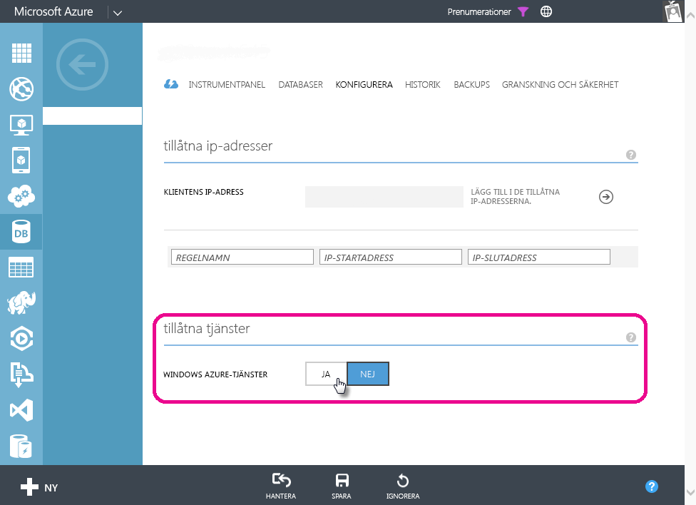

# Felsöka schemalagd uppdatering för Azure SQL-databaser i Power BI
Detaljerade anvisningar om hur du konfigurerar schemalagd uppdatering finns att läsa i [Uppdatera data i Power BI](refresh-data.md).

Försök att ställa in en lämplig brandväggsregel när du ställer in en schemalagd uppdatering för Azure SQL-databasen, om du ser ett fel med felkod 400 när du redigerar autentiseringsuppgifterna:

1. Logga in på Azure Management Portal
2. Gå till Azure SQL-servern som du konfigurerar uppdateringar för
3. Aktivera 'Windows Azure-tjänster ”i området tillåtna tjänster

  

Har du fler frågor? [Prova Power BI Community](http://community.powerbi.com/)

