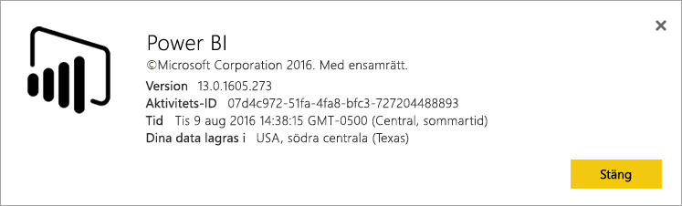
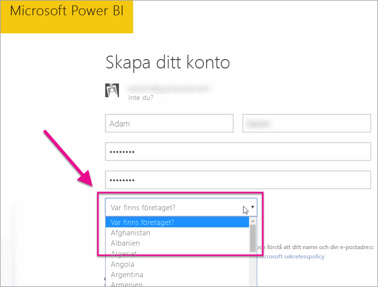

# Var finns min Power BI-klient?

<iframe width="560" height="315" src="https://www.youtube.com/embed/0fOxaHJPvdM?showinfo=0" frameborder="0" allowfullscreen></iframe>

Lär dig var din Power BI-klient finns och hur den platsen har valts. Det är viktigt att lära sig platsen eftersom det kan påverka dina interaktioner med tjänsten.

## Så här fastställer du var Power BI-klient finns

Följ dessa steg för att hitta den region som din klient finns i.

1. I Power BI-tjänsten på den översta menyn väljer du hjälp ( **?** ) och sedan **Om Power BI**.

1. Leta efter värdet bredvid **dina data lagras i**. Det är den region där din klientorganisation finns. Värdet är även den region där dina data lagras, såvida du inte använder dedikerade kapaciteter i olika regioner för dina arbetsytor.

    

## Så här väljs dataregionen

Dataområdet baseras på det land som du väljer när du skapar klienten. Valet gäller för registreringen för både Office 365 och Power BI eftersom den här informationen delas. Om det är en ny klient väljer du rätt land i listan när du registrerar dig.

Power BI väljer det dataområde som är närmast ditt val, vilket avgör var data lagras för din klientorganisation.

> [!IMPORTANT]
> Du kan inte ändra valet när du väl har skapat klientorganisationen.

Fler frågor? [Prova Power BI Community](https://community.powerbi.com/)

