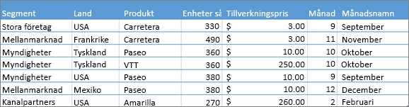
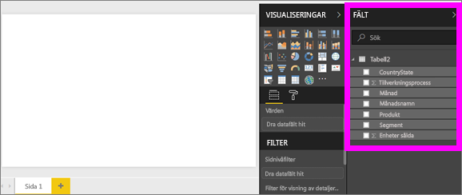
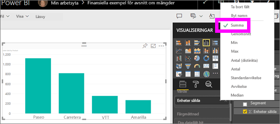
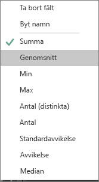
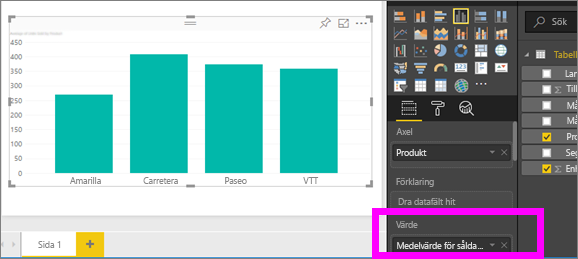
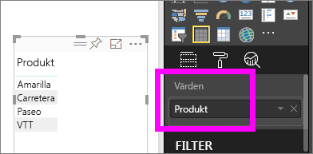
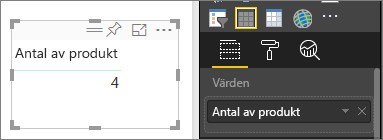
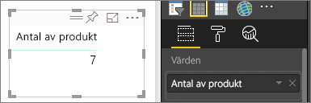
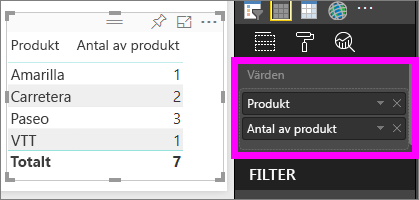

# Arbeta med aggregeringar (summa, medelvärde osv.) i Power BI-tjänsten
## Vad är en aggregering för något?
Ibland kan du vilja kombinera värden matematiskt i dina data. Den matematiska åtgärden kan vara summa, medelvärde, maximum, antal osv. När du kombinerar värden i dina data, det kallas för att *aggregera*. Resultatet av den matematiska åtgärden blir en *aggregering*. 

När Power BI-tjänsten och Power BI Desktop skapar visualiseringar, kan de aggregera dina data. Ofta är det just det aggregatet som du vill ha, men andra gånger kan du vilja aggregera värdena på ett annat sätt.  En summa kontra ett medelvärde till exempel. Det finns flera olika sätt att hantera och ändra den aggregering som används i en visualisering.

Först ska vi ta en titt på data*typer* eftersom datatypen avgör hur och om den kan sammanställas.

## Typer av data
De flesta datauppsättningar har mer än en typ av data. På den mest grundläggande nivån, är data antingen numeriska eller inte. Numeriska data kan aggregeras med summa, medelvärde, antal, minimum, varians och mycket mer. Även textdata, ofta kallad *kategorisk* data, kan aggregeras. Om du försöker aggregera ett kategoriskt fält (genom att placera det i en bucket som är enbart numerisk, som **Värden** eller **Knappbeskrivningar**) kommer Power BI att räkna antalet förekomster av varje kategori eller räkna distinkta förekomster av varje kategori. Särskilda typer av data som datum, har även de några egna aggregeringsalternativ: tidigaste, senaste, första och sista. 

I exemplet nedan:
- **Sålda enheter** och **Tillverkningskostnad** är kolumner som innehåller numeriska data
-  **Segment**, **Land**, **Produkt**, **Månad** och **Månadsnamn** innehåller kategoriska data

   

När du skapar en visualisering i Power BI, aggregeras numeriska fält (standard är *summa*) över vissa kategoriska fält.  Till exempel, Enheter sålda ***per produkt***, Enheter sålda ***per månad*** och Tillverkningskostnad ***per segment***. Vissa numeriska fält kallas **mått**. Det är lätt att identifiera mått i Power BI-rapportredigeraren – mått visas med symbolen ∑ i fältlistan. Mer information finns i [Rapportredigeraren... ta en rundtur](service-the-report-editor-take-a-tour.md).

## Varför fungerar inte aggregeringen som jag vill?
Att arbeta med aggregeringar i Power BI-tjänsten kan vara förvirrande. Du kanske har ett numeriskt fält och Power BI låter dig inte ändra aggregeringen. Eller så har du t.ex. ett fält med år som du inte vill aggregera, du vill bara räkna antalet förekomster.

Ofta är källan till problemet hur fältet har definierats i datauppsättningen. Fältet kanske definierats som text och det förklarar varför det inte kan summeras eller tas ett medelvärde för. Tyvärr [kan endast datauppsättningens ägare ändra hur ett fält kategoriseras](desktop-measures.md). Så om du har ägarbehörighet för datauppsättningen, antingen i Desktop eller det program som användes för att skapa datauppsättningen (till exempel Excel) kan du lösa problemet. Annars måste du kontakta datauppsättningens ägare för hjälp.  

För att hjälpa dig med det här har vi ett särskilt avsnitt i slutet av den här artikeln som kallas **Tips och felsökning**.  Om du inte hittar svaret där kan du ställa din fråga i [Power BI Community-forumet](http://community.powerbi.com) och få ett snabbt svar direkt från Power BI-teamet.

## Ändra hur ett numeriskt fält aggregeras
Anta att du har ett diagram som summerar enheter sålda för olika produkter, men du vill hellre ha medelvärdet. 

1. Skapa ett diagram som använder en kategori och ett mått. I det här exemplet använder vi enheter sålda per produkt.  Som standard skapar Power BI ett diagram som summerar sålda enheter (mått i Värde-brunnen) för varje produkt (kategori i Axel-brunnen).

   

2. I visualiseringsfönstret, högerklickar du på måttet och väljer den aggregeringstyp som passar. I det här fallet väljer vi Medelvärde. Om du inte ser den aggregering du behöver, finns Tips och felsökning nedan.  
   
   
   
   > [!NOTE]
   > Alternativen i listrutan varierar beroende på 1) vilket fält som valts och 2) hur fältet har kategoriserats av datauppsättningens ägare.
   > 
3. Din visualiseringen använder nu aggregering efter medelvärde.

   

##    Sätt att aggregera dina data

Här visas några av de alternativ som kan vara tillgängliga vid aggregering av ett fält:

* **Summera inte**. När det här alternativet är valt behandlas varje värde i fältet separat och summeras därför inte. Använd det här alternativet om du har en kolumn med numeriska ID:n som inte ska summeras.
* **Summera**. Adderar alla värden i fältet.
* **Medelvärde**. Räknar ut ett aritmetiskt medelvärde för värdena.
* **Minimum**. Visar det minsta värdet.
* **Maximum**. Visar det högsta värdet.
* **Antal (ej tomma).** Räknar ut antalet värden i ett fält som inte är tomt.
* **Antal (distinkta).** Räknar ut antalet olika värden i fältet.
* **Standardavvikelse.**
* **Avvikelse**.
* **Median**.  Visar medianvärdet (mitten). Det här värdet har samma antal objekt över och under.  Om det finns två medianer räknar Power BI ut ett medelvärde.

Till exempel följande data:

| Land | Belopp |
|:--- |:--- |
| USA |100 |
| Storbritannien |150 |
| Kanada |100 |
| Tyskland |125 |
| Frankrike | |
| Japan |125 |
| Australien |150 |

Ger följande resultat:

* **Summera inte**: Varje värde visas separat
* **Summa**: 750
* **Medelvärde**: 125
* **Maximum**:  150
* **Minimum**: 100
* **Antal (ej tomma):** 6
* **Antal (distinkta):** 4
* **Standardavvikelse:** 20,4124145 ...
* **Avvikelse:** 416,666 ...
* **Medianvärde:** 125

## Skapa en aggregering med hjälp av ett kategorifält (text)
Du kan även aggregera ett icke-numeriskt fält. Om du exempelvis har ett produktnamnsfält, kan du lägga till det som ett värde och ställa in det som **Antal**, **Distinkt antal**, **Första** eller **Sista**. 

1. I det här exemplet har vi dragit **Produkt**-fältet till Värden-brunnen. Värden-brunnen används vanligtvis för numeriska fält. Power BI identifierar att det här fältet är ett textfält, ställer in aggregeringen till **Summera inte** och ger oss en tabell med en kolumn.
   
   
2. Om vi ändrar aggregeringen från standardvärdet **Summera inte** till **Antal (distinkta)**, räknar Power BI antalet olika produkter. I det här fallet finns det 4.
   
   
3. Om vi ändrar aggregeringen till **Antal**, räknar Power BI det totala antalet. I det här fallet finns det 7 poster för **Produkt**. 
   
   

4. Genom att dra samma fältet (i det här fallet **Produkt**) till Värden-brunnen och lämna standardaggregeringen **Summera inte**, delar Power BI upp antalet efter produkt.

   

## Överväganden och felsökning
F:  Varför har jag inte alternativet **Summera inte**?

S:  Det fält du har valt är troligen ett beräknat mått eller avancerat mått som skapats i Excel eller [Power BI Desktop](desktop-measures.md). Varje beräknat mått har en egen hårdkodad formel. Du kan inte ändra den aggregering som används.  Om den till exempel är en summa, kan den bara vara en summa. I listan Fält anges *beräknade mått* med kalkylatorsymbolen.

F:  Mitt fält **är** numeriskt, varför är mina enda alternativ **Antal** och **Distinkt antal**?

S1:  Sannolikt är förklaringen att datauppsättningens ägare, oavsiktligt eller avsiktligt, *inte* har klassificerat fältet som ett tal. Om en datauppsättning till exempel har fältet **år** kan datauppsättningens ägare kategorisera det som text eftersom det är troligare att fältet **år** ska räknas (till exempel antal människor som föddes 1974) i stället för att summeras eller visa ett medelvärde. Om du är ägare kan du öppna datauppsättningen i Power BI Desktop och använda fliken **Modellering** till att ändra datatypen.  

S2: Om fältet har en kalkylatorikon, innebär det att det är ett *beräknat mått* och varje beräknat mått har sin egen hårdkodade formel som bara kan ändras av datauppsättningens ägare. Den beräkning som används kan vara en enkel aggregering, som ett medelvärde eller en summa, men det kan också vara något mer komplicerat som procenten av bidraget till den överordnade kategorin eller totalt antal som körs sedan årets start. Power BI kommer inte summera eller räkna ut ett medelvärde som resultat, utan kommer i stället bara göra en ny beräkning (med den hårdkodade formeln) för varje datapunkt.

S3:  En annan möjlighet är att du har släppt fältet i en *bucket* som endast tillåter kategoriska värden.  I så fall är dina enda alternativ antal och distinkt antal.

S4:  Ett tredje alternativ är att du använder fältet som en axel. I ett stapeldiagrams axel visar till exempel Power BI en stapel för varje distinkt värde – den aggregerar inte fältvärdena alls. 

>[!NOTE]
>Undantaget till denna regel är punktdiagram som *kräver* aggregerade värden för X- och Y-axlarna.

F:  Varför kan jag inte aggregera textfält för SSAS-datakällor (SQL Server Analysis Services)?

S:  Live-anslutningar till flerdimensionella SSAS-modeller tillåter inte några aggregeringar på klientsidan, inklusive första, sista, medelvärde, minimum, maximum och summa.

F:  Jag har ett punktdiagram och jag vill *inte* att mitt fält ska aggregeras.  Hur gör jag?

S:  Lägg till fältet i **Information** i stället för X- eller Y-axelns bucket.

F:  När jag lägger till ett numeriskt fält i en visualisering summeras de flesta som standard, men vissa har medelvärde, antal eller någon annan typ av aggregering som standard.  Varför är inte standardaggregeringen alltid likadan?

S:  Datauppsättningens ägare har möjlighet att ange en standardsummering för varje fält. Om du är ägare till en datauppsättning kan du ändra standardsummeringen på fliken **Modellering** i Power BI Desktop.

F:  Jag är ägare till en datauppsättning och vill se till att ett fält aldrig aggregeras.

S:  I Power BI Desktop på fliken **Modellering** anger du **Datatyp** som **Text**.

F:  Jag kan inte se **Summera inte** som ett alternativ i min listruta.

S:  Försök att ta bort fältet och sedan lägga till det igen.

Har du fler frågor? [Prova Power BI Community](http://community.powerbi.com/)

