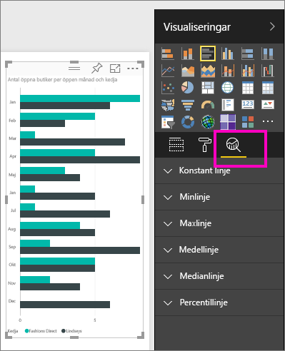
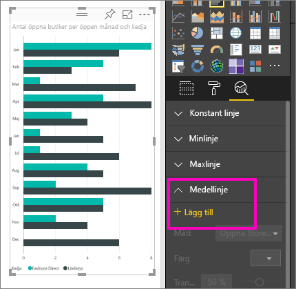
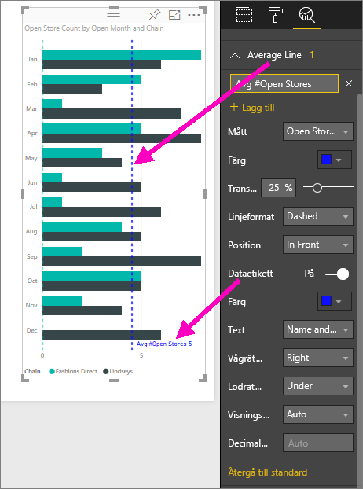
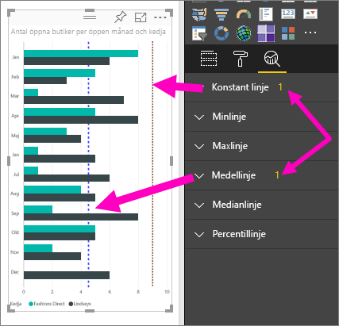
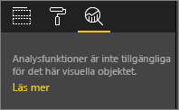

# Skapa dynamiska referensrader för visuella objekt i Power BI-tjänsten

Med fönstret **Analytics** i **Power BI-tjänsten** kan du lägga till dynamiska *referensrader* i visualiseringar och ange fokus för viktiga trender eller insikter.

> [!NOTE]
> Fönstret **Analytics** visas bara när du väljer ett visuellt objekt på rapportarbetsytan.
> 
> 

## Använda fönstret Analytics
I fönstret **Analytics** kan du skapa följande typer av dynamiska referenslinjer (alla rader är inte tillgängliga för alla typer av visuella objekt):

* X-axel konstant linje
* Y-axel konstant linje
* Minimilinje
* Maxlinje
* Medellinje
* Medianlinje
* Percentillinje

Följ dessa steg om du vill visa tillgängliga dynamiska referenslinjer för ett visuellt objekt:

1. Välj eller skapa en visualisering och välj sedan ikonen **Analytics** från fönstret **Visualiseringar**.

2. Välj nedpilen för typen av rad som du vill skapa för att visa dess alternativ. I det här fallet väljer vi **Medellinje**.
   
   

3. Om du vill skapa en ny linje väljer du **+ Lägg till** och bestämmer dig för den åtgärd som ska användas för att skapa linjen.  Listrutan **Mått** fylls automatiskt med tillgängliga data från den valda visualiseringen. Nu ska vi använda **Antal öppna butiker**.

5. Det finns många typer av alternativ för din linje, som färg, genomskinlighet, stil och placering (i förhållande till det visuella objektets dataelement). Om du vill märka raden, ger du den en rubrik och flyttar skjutreglaget för **Dataetikett** till **På**.  I det här fallet ger vi linjen namnet *Snitt # öppna butiker* och anpassar några av de andra alternativen som visas nedan.
   
   

1. Observera siffran som visas bredvid objektet **Medellinje** i fönstret **Analytics**. Det anger hur många dynamiska linjer som det för närvarande finns i ditt visuella objekt, samt vilken typ de är. Om vi lägger till en **Konstant rad** som målet 9 för antal butiker kan du se att fönstret **Analytics** visar att vi nu också har en referenslinje för **Konstant rad** som tillämpas på den här visualiseringen.
   
   
   

Det finns många typer av intressanta analyser som du kan lyfta fram genom att skapa dynamiska referenslinjer i fönstret **Analytics**.

## Överväganden och felsökning

Om det visuella objekt som du har valt inte kan ha dynamiska referenslinjer (i det här fallet **Karta**), visas följande när du väljer fönstret **Analytics**.
   

Möjligheten att använda dynamiska referenslinjer beror på vilken typ av visuellt objekt som används. I följande lista visas vilka dynamiska linjer som är tillgängliga för de olika visuella objekten:

Alla dynamiska linjer är tillgängliga i följande visuella objekt:

* Ytdiagram
* Linjediagram
* Punktdiagram
* Grupperat stående stapeldiagram
* Grupperat liggande stapeldiagram

Följande visuella objekt kan bara använda en *konstant linje* från fönstret **Analytics**:

* Staplad yta
* Liggande stapel
* Stående stapel
* 100 % liggande stapeldiagram
* 100 % stående stapeldiagram

För följande visuella objekt är *trendlinjen* för närvarande det enda alternativet:

* Ej staplad linje
* Grupperat stående stapeldiagram

Slutligen går det för närvarande inte att använda icke-kartesiska visuella objekt med dynamiska linjer från fönstret **Analytics**, till exempel:

* Matris
* Cirkeldiagram
* Ring
* Tabell

## Nästa steg
[Analytics-fönstret i Power BI Desktop](desktop-analytics-pane.md)

Har du fler frågor? [Prova Power BI Community](https://community.powerbi.com/)

