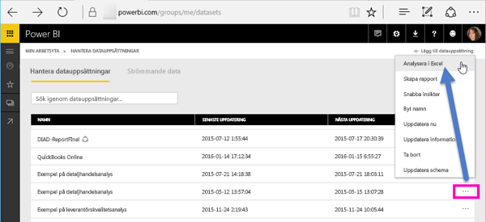
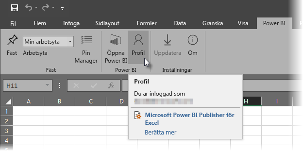
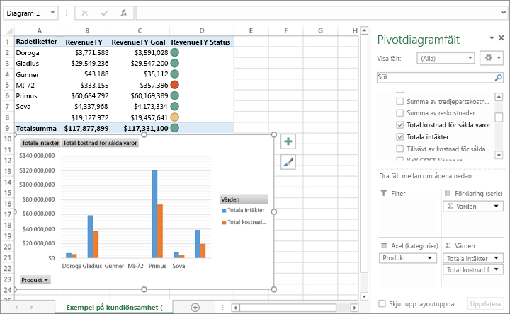

# Analysera i Excel
Det finns tillfällen när du kanske vill använda Excel för att visa och interagera med en datauppsättning som du har i Power BI. Med **Analysera i Excel** kan du göra just det och komma åt funktionerna för pivottabell, diagram och utsnitt i Excel baserat på den datauppsättning som finns i Power BI.

## Krav
Det finns några krav för att använda **Analysera i Excel**:

* **Analysera i Excel** stöds för Microsoft Excel 2010 SP1 och senare.
* Pivottabeller i Excel stöder inte dra och släpp-aggregering av numeriska fält. Datauppsättningen i Power BI *måste ha fördefinierade mått*.
* Vissa organisationer kan ha grupprincipregler som förhindrar installation av nödvändiga **Analysera i Excel**-uppdateringar i Excel. Kontrollera med administratören om det inte går att installera uppdateringarna.
* **Analysera i Excel** kräver en Pro-licens. Mer information om skillnaderna i funktionalitet mellan de olika licenstyperna finns i [Power BI-funktioner efter licenstyp](service-features-license-type.md). 

## Hur fungerar det?
När du väljer **Analysera i Excel** på ellipsmenyn (...) som är associerad med en datauppsättning eller en rapport i **Power BI**, skapar Power BI en odc-fil och hämtar den från webbläsaren till din dator.

När du öppnar filen i Excel, visas en tom **pivottabell** och en **Fält**-lista med tabeller, fält och mått från Power BI-datauppsättningen. Du kan skapa pivottabeller och diagram och analysera din datauppsättning precis som om du arbetade med en lokal datauppsättning i Excel.

Odc-filen har en MSOLAP-anslutningssträng som ansluter till din datauppsättning i Power BI. När du analyserar eller arbetar med dina data, ställer Excel frågor till datauppsättningen i Power BI och returnerar resultaten till Excel. Om datauppsättningen ansluter till en datakälla i realtid med hjälp av DirectQuery, frågar Power BI datakällan och returnerar resultatet till Excel.

**Analysera i Excel** är mycket användbart för datauppsättningar och rapporter som ansluter till *Analysis Services-tabeller* eller *flerdimensionella* databaser, eller från Power BI Desktop-filer eller Excel-arbetsböcker med datamodeller vars modellmått skapas med hjälp av Data Analysis-uttryck (DAX).

## Kom igång med Analysera i Excel
Välj ellipsmenyn bredvid en rapport eller datauppsättning i Power BI (... bredvid namnet på rapporten eller datauppsättning) och välj **Analysera i Excel** på menyn som visas.

### Installera Excel-uppdateringar
När du använder **Analysera i Excel** för första gången, måste du installera uppdateringar av Excel-biblioteken. Du uppmanas att ladda ned och köra Excel-uppdateringar (detta startar installationen av *SQL_AS_OLEDDB.msi*, Windows installationspaket). Det här paketet installerar **Microsoft Analysis Services OLE DB-provider för Microsoft SQL Server 2016 RC0 (förhandsversion)**.

> [!NOTE]
> Var noga med att markera **Visa inte detta igen** i dialogrutan **Installera Excel-uppdateringar**. Du behöver bara installera uppdateringen en gång.
> 
> 

Om du behöver installera Excel-uppdateringarna för **Analysera i Excel** igen, kan du hämta dem från **hämtningsikonen** i Power BI, enligt följande bild.

### Logga in i Power BI
Även om du är inloggad i Power BI i webbläsaren, kan du första gången du öppnar en ny odc-fil i Excel bli ombedd att logga in i Power BI med ditt Power BI-konto. Detta autentiserar anslutningen från Excel till Power BI.

### Användare med flera Power BI-konton
Vissa användare har flera Power BI-konton och dessa användare kan råka ut för en situation där de är inloggade i Power BI med ett konto, men det konto som har åtkomst till den datauppsättning som används i Analysera i Excel är ett annat konto. I dessa fall kan du få ett meddelande om **förbud** eller inloggningsfel när du försöker komma åt en datauppsättning som används i en Analysera i Excel-arbetsbok.

Du ges en ny möjlighet att logga in och då kan du logga in med det Power BI-konto som har åtkomst till datauppsättningen som används av Analysera i Excel. Du kan också välja **Profil** på menyfliken **Power BI** i Excel, vilket identifierar vilket konto som du är inloggad med för tillfället och innehåller en länk där du kan logga ut (och följaktligen logga in med ett annat konto).

### Aktivera dataanslutningar
För att analysera dina Power BI-data i Excel, uppmanas du att kontrollera filnamnet och sökvägen för odc-filen och sedan välja **Aktivera**.

> [!NOTE]
> Administratörer för Power BI-klienter kan använda *Power BI-administratörsportalen* för att inaktivera användningen av **Analysera i Excel** med lokala datauppsättningar som förvaras i Analysis Services-databaser. När alternativet är inaktiverat, är **Analysera i Excel** inaktiverat för Analysis Services-databaser, men fortsätter att vara tillgängligt för användning med andra datauppsättningar.
> 
> 

## Analysera mera
Nu när Excel har öppnats och du har en tom pivottabell, är du redo att göra alla typer av analyser med din Power BI-datauppsättning. Precis som för andra lokala arbetsböcker kan du med Analysera i Excel skapa pivottabeller och diagram, lägga till data från andra källor och så vidare. Och naturligtvis kan du skapa olika kalkylblad med alla typer av vyer för dina data.

> [!NOTE]
> Det är viktigt att veta att användning av **Analysera i Excel** visar alla data på detaljnivå för alla användare med behörighet för datauppsättningen.
> 
> 

## Spara
Du kan spara den här Power BI-datauppsättningsanslutna arbetsboken precis som vilken arbetsbok som helst. Du kan dock inte publicera eller importera arbetsboken tillbaka till Power BI eftersom du bara kan publicera eller importera arbetsböcker till Power BI som har data i tabeller eller som har en datamodell. Eftersom den nya arbetsboken bara har en anslutning till datauppsättningen i Power BI, skulle det bara vara att gå runt i cirklar att publicera eller importera den till Power BI!

## Dela
När din arbetsbok har sparats kan du dela den med andra Power BI-användare i din organisation.

När en användare som du har delat arbetsboken med öppnar arbetsboken, ser han eller hon dina pivottabeller och data som de visades när arbetsboken senast sparades, vilket inte nödvändigtvis är den senaste versionen av dina data. För att hämta den senaste versionen av dina data måste användaren använda knappen **Uppdatera** på menyfliken **Data**. Och eftersom arbetsboken ansluter till en datauppsättning i Power BI, måste användare som försöker uppdatera arbetsboken logga in i Power BI och installera Excel-uppdateringarna första gången de försöker uppdatera med den här metoden.

Eftersom användarna måste uppdatera datauppsättningen, och uppdatering för externa anslutningar inte stöds i Excel Online, rekommenderar vi att användarna öppnar arbetsboken i skrivbordsversionen av Excel på datorn.

## Felsökning
Det kan finnas tillfällen när Analysera i Excel ger ett oväntat resultat eller funktionen inte fungerar som väntat. [Den här sidan innehåller lösningar för vanliga problem när du använder Analysera i Excel](desktop-troubleshooting-analyze-in-excel.md)