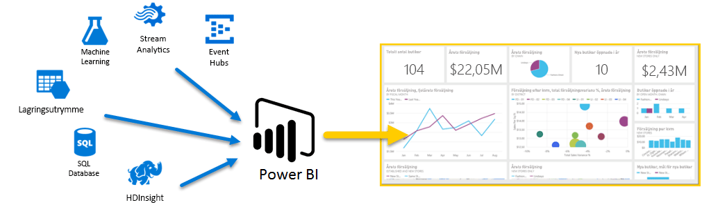
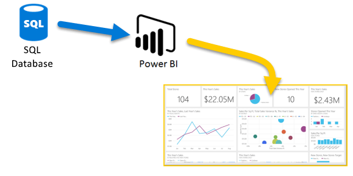

# Azure och Power BI

Med **Azures** tjänster och **Power BI** kan du förvandla dina bearbetningar till analyser och rapporter som ger inblick i din verksamhet i realtid. Oavsett om din databearbetning är molnbaserad eller lokal, enkel eller komplex, från en källa eller massivt skalad, lagrad eller i realtid, har Azure och Power BI en inbyggd anslutning och integrering som ger dina Business Intelligence-åtgärder liv.

I Power BI finns en mängd olika Azure-anslutningar och de Business Intelligence-lösningar som du kan skapa med dessa tjänster blir lika unika som din verksamhet. Du kan ansluta enbart en eller ett fåtal Azure-datakällor och sedan utforma och förfina dina data för att skapa anpassade rapporter.

## Azure SQL Database och Power BI

Du kan börja med en enkel anslutning till en Azure SQL Database och sedan skapa rapporter som övervakar företagets verksamhet. Med hjälp av [Power BI Desktop](desktop-getting-started.md) kan du skapa rapporter som identifierar de trender och KPI:er som för din verksamhet framåt.

Det finns mycket mer information om du vill veta mer om [Azure SQL Database](http://azure.microsoft.com/services/sql-database/).

## Omvandla, utforma och koppla molndata

Har du mer komplexa data och olika typer av datakällor? Inga problem. Med **Power BI Desktop** och Azure-tjänsterna är anslutningarna bara ett tryck bort med dialogrutan **Hämta data**. Inom samma fråga kan du ansluta till din **Azure SQL Database**, din **Azure HDInsight**-datakälla och din **Azure-blobblagring** (eller **Azure-tabellagring**). Välj sedan endast de delmängder som du behöver och förfina därifrån.

Du kan dessutom skapa olika rapporter för olika målgrupper med hjälp av samma dataanslutningar och till och med samma fråga. Skapa en ny rapportsida, förfina dina visualiseringar för varje målgrupp och observera hur den håller koll på din verksamhet.

Mer information finns i följande resurser:

* [Azure SQL Database](http://azure.microsoft.com/services/sql-database/)
* [Azure HDInsight](http://azure.microsoft.com/services/hdinsight/)
* [Azure Storage](http://azure.microsoft.com/services/storage/) (blobb- och tabellagring)

## Arbeta komplext (och aktuellt) med hjälp av Azure-tjänsterna och Power BI

Du kan expandera så mycket som du behöver med Azure och Power BI. Utnyttja databearbetning från flera källor, använd massiva realtidssystem, [Stream Analytics](http://azure.microsoft.com/services/stream-analytics/) och [Event Hubs](http://azure.microsoft.com/services/event-hubs/) samt slå samman olika SaaS-tjänster i Business Intelligence-rapporter för att ge ditt företag en fördel.

## Kontextinsikter med Power BI Embedded-analys

Bädda in fantastiska interaktiva datavisualiseringar i program, webbplatser, portaler och annat, och dra nytta av dina affärsdata. Med [Power BI Embedded som en resurs i Azure](https://azure.microsoft.com/services/power-bi-embedded/) kan du enkelt bädda in interaktiva rapporter och instrumentpaneler, så att användarna får konsekventa och exakta upplevelser på alla enheter.  Power BI som används med inbäddning av analys hjälper dig via Data -> Kunskap -> Insikter -> Åtgärder.  Dessutom kan du utöka funktionerna i Power BI och Azure genom att bädda in analyser i din [organisations interna program och portaler](https://powerbi.microsoft.com/en-us/developers/embedded-analytics/organization/).

Det finns mycket information om Power BI-API:er i [Power BI Developer-portalen](http://dev.powerbi.com).

Mer information finns i [Vad kan utvecklare göra med Power BI?](developer/what-can-you-do.md)

## Bädda in dina Power BI-data i din app

Bädda in fantastiska interaktiva datavisualiseringar i program, webbplatser, portaler och annat, och visa dina affärsdata i sin kontext. När du använder [Power BI Embedded i Azure](https://azure.microsoft.com/services/power-bi-embedded/) kan du enkelt bädda in interaktiva rapporter och instrumentpaneler, så att användarna får konsekventa och exakta upplevelser på alla enheter.

## Vad kan du göra med Azure och Power BI?

Det finns alla typer av scenarier där **Azure** och **Power BI** kan kombineras – möjligheterna är lika unika som din verksamhet. Mer information om **Azure-tjänsterna** finns på [översiktssidan](https://docs.microsoft.com/azure/machine-learning/team-data-science-process/plan-your-environment), som beskriver **dataanalysscenarier med Azure** och hur du omvandlar dina datakällor till information som styr din verksamhet framåt.