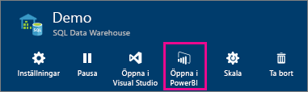
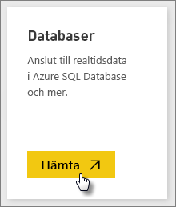
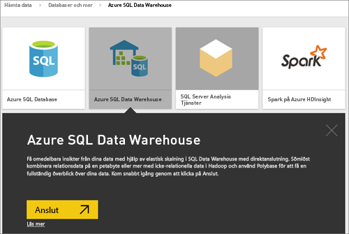
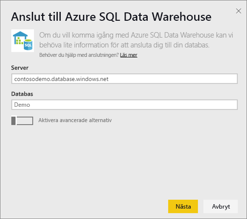
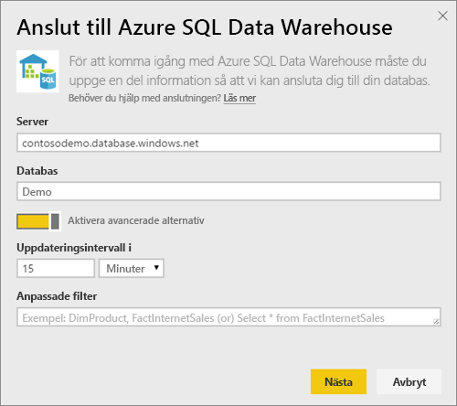
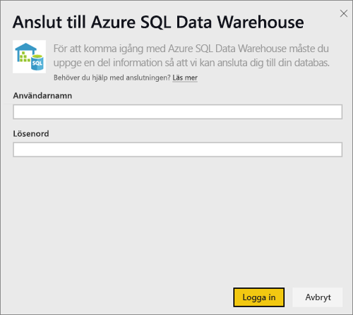
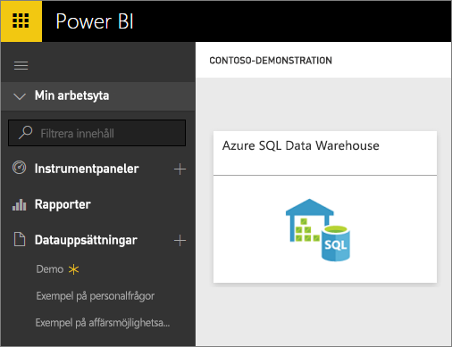
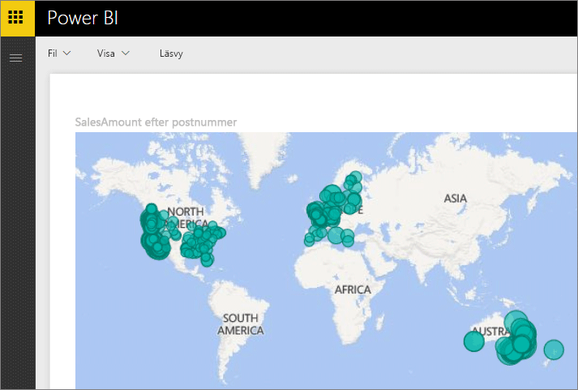
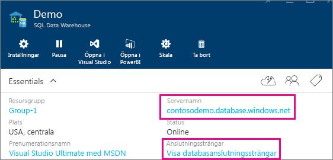

# Azure SQL Data Warehouse med DirectQuery

Med Azure SQL Data Warehouse med DirectQuery kan du skapa dynamiska rapporter baserade på data och mått som du redan har i Azure SQL Data Warehouse. Med DirectQuery skickas frågor tillbaka till din Azure SQL Data Warehouse i realtid medan du utforskar dessa data. Frågor i realtid, i kombination med skalan för SQL Data Warehouse, gör att du kan skapa dynamiska rapporter på några få minuter mot flera terabyte av data. Dessutom tillåter införandet av knappen **Öppna i Power BI** användare att ansluta Power BI direkt till SQL Data Warehouse utan att behöva ange informationen manuellt.

När du använder SQL Data Warehouse-anslutningsprogrammet:

* Ange det fullständigt kvalificerade servernamnet vid anslutning (se nedan för information)
* Se till att brandväggsreglerna för servern är konfigurerade för ”Tillåt åtkomst till Azure-tjänster”.
* Varje åtgärd, som att markera en kolumn eller lägga till ett filter, kommer direkt att fråga informationslagret
* Paneler är inställda på att uppdateras ungefär var 15:e minut och uppdatering behöver inte schemaläggas.  Du kan justera uppdateringen i Avancerade inställningar när du ansluter.
* Frågor och svar är inte tillgängligt för DirectQuery-datauppsättningar
* Schemaändringar plockas inte upp automatiskt

Dessa begränsningar och anteckningar kan ändras när vi fortsätter att förbättra upplevelsen. Stegen för att ansluta beskrivs nedan.

## Använda knappen ”Öppna i Power BI”

> [!Important]
> Vi har förbättrat anslutningen till Azure SQL Data Warehouse.  Använd Power BI Desktop för bästa möjliga anslutning till din Azure SQL Data Warehouse-datakälla.  När du har skapat din modell och rapport kan du publicera den till Power BI-tjänsten.  Direktanslutningen för Azure SQL Data Warehouse i Power BI-tjänsten är nu inaktuell.

Det enklaste sättet att flytta mellan din SQL Data Warehouse och Power BI är med knappen **Öppna i Power BI** i Azure Portal. Med den här knappen kan du sömlöst börja skapa nya instrumentpaneler i Power BI.

1. Kom igång genom att gå till din SQL Data Warehouse-instans i Azure Portal. Observera att SQL Data Warehouse bara finns i Azure-portalen just nu.

2. Klicka på knappen **Öppna i Power BI**

    

3. Om vi inte kan logga in dig direkt eller om du inte har ett Power BI-konto, behöver du logga in.

4. Du dirigeras till sidan för SQL Data Warehouse-anslutning med informationen från ditt SQL Data Warehouse ifylld. Ange dina autentiseringsuppgifter och tryck på anslut för att skapa en anslutning.

## Ansluta via Power BI

SQL Data Warehouse visas också på sidan Power BI Hämta data. 

1. Välj **Hämta data** längst ned i navigeringsfönstret.  

    

2. I **Databaser**, välj **Hämta**.

    

3. Välj **SQL Data Warehouse** \> **Anslut**.

    

4. Ange nödvändig information för att ansluta. Avsnittet **Hitta parametrar** nedan visar var dessa data kan finnas i Azure-portalen.

    

    

    

   > [!NOTE]
   > Användarnamnet ska vara en användare som har definierats i din Azure SQL Data Warehouse-instans.

5. Granska datauppsättningen mer detaljerat genom att välja den nya panelen eller den nyligen skapade datauppsättningen som anges med en asterisk. Den här datauppsättningen har samma namn som din databas.

    

6. Du kan utforska alla tabeller och kolumner. Att markera en kolumn kommer att skicka en fråga till källan, vilket dynamiskt skapar ditt visuella objekt. Filter ska också översättas till frågor tillbaka till ditt informationslager. Detta visuella objekt kan sparas i en ny rapport och fästas igen på instrumentpanelen.

    

## Hitta parametervärden

Det fullständigt kvalificerade servernamnet och databasnamnet återfinns i Azure Portal. Observera att SQL Data Warehouse bara finns i Azure-portalen just nu.

> [!NOTE]
> Om din Power BI-klient finns i samma region som Azure SQL Data Warehouse debiteras du inte för utgående trafik. Du kan se var din Power BI-klient finns genom att följa [de här instruktionerna](https://docs.microsoft.com/power-bi/service-admin-where-is-my-tenant-located).

[!INCLUDE [direct-query-sso](includes/direct-query-sso.md)]

## Nästa steg

* [Vad är Power BI?](fundamentals/power-bi-overview.md)  
* [Hämta data för Power BI](service-get-data.md)  
* [Azure SQL Data Warehouse](/azure/sql-data-warehouse/sql-data-warehouse-overview-what-is/)

Har du fler frågor? [Prova Power BI Community](https://community.powerbi.com/)
