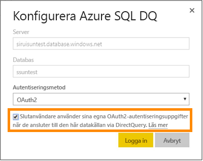

# Azure SQL Database med DirectQuery
Här kan du lära dig hur du kan ansluta direkt till Azure SQL Database och skapa rapporter med realtidsdata. Du kan hålla dina data vid källan och inte i Power BI.

Med DirectQuery skickas frågor tillbaka till din Azure SQL Database medan du utforskar dessa data i rapportvyn. Den här användningen föreslås för användare som är bekanta med databaser och de enheter som de ansluter till.

**OBS:**

* Ange det fullständigt kvalificerade servernamnet vid anslutning (se nedan för mer information)
* Se till att brandväggsreglerna för databasen är konfigurerade för ”[Tillåt åtkomst till Azure-tjänster](https://msdn.microsoft.com/library/azure/ee621782.aspx)”.
* Varje åtgärd, som att markera en kolumn eller lägga till ett filter, skickar en fråga tillbaka till databasen
* Panelerna uppdateras varje timme (uppdateringen behöver inte schemaläggas). Detta kan justeras i Avancerade inställningar när du ansluter.
* Frågor och svar är inte tillgänglig för DirectQuery-datauppsättningar
* Schemaändringar plockas inte upp automatiskt

Dessa begränsningar och anteckningar kan ändras när vi fortsätter att förbättra upplevelsen. Stegen för att ansluta beskrivs nedan.

> [!Important]
> Vi har förbättrat anslutningen till Azure SQL Database.  Använd Power BI Desktop för bästa möjliga anslutning till din Azure SQL Database-datakälla.  När du har skapat din modell och rapport kan du publicera den till Power BI-tjänsten.  Direktanslutningen för Azure SQL Database i Power BI-tjänsten är nu inaktuell.
>

## Power BI Desktop och DirectQuery
För att ansluta till Azure SQL Database med DirectQuery, behöver du använda Power BI Desktop. Den här metoden erbjuder ytterligare flexibilitet och funktioner. Rapporter som skapas med Power BI Desktop kan senare publiceras i Power BI-tjänsten. Du kan lära dig mer om hur du ansluter till [Azure SQL Database med DirectQuery](desktop-use-directquery.md) i Power BI Desktop. 

## Enkel inloggning

När du har publicerat en Azure SQL DirectQuery-datauppsättning till tjänsten, kan du aktivera enkel inloggning (SSO) via Azure Active Directory (AD Azure) OAuth2 för dina slutanvändare. 

Om du vill aktivera enkel inloggning går du till datauppsättningens inställningar, öppnar fliken **Datakällor** och markerar rutan för enkel inloggning.

När alternativet för enkel inloggning är aktiverat och dina användares åtkomstrapporter har skapats ovanpå datakällan, skickar Power BI sina autentiserade autentiseringsuppgifter för Microsoft Azure Active Directory i frågorna till Azure SQL-databasen. Detta möjliggör för Power BI att respektera säkerhetsinställningarna som är konfigurerade på datakällsnivå.

Alternativet för enkel inloggning börjar fungera för alla datauppsättningar som använder den här datakällan. Autentiseringsmetoden som används för importscenarier påverkas inte.

> [!Note]
> Azure Multi-Factor Authentication (MFA) stöds inte. Användare som vill använda enkel inloggning med Azure SQL DirectQuery måste undantas från MFA.
>

## Hitta parametervärden
Det fullständigt kvalificerade servernamnet och databasnamnet återfinns i Azure Portal.

## Nästa steg
[Använda DirectQuery i Power BI Desktop](desktop-use-directquery.md)  
[Vad är Power BI?](power-bi-overview.md)  
[Hämta data för Power BI](service-get-data.md)  
Har du fler frågor? [Prova Power BI Community](http://community.powerbi.com/)
