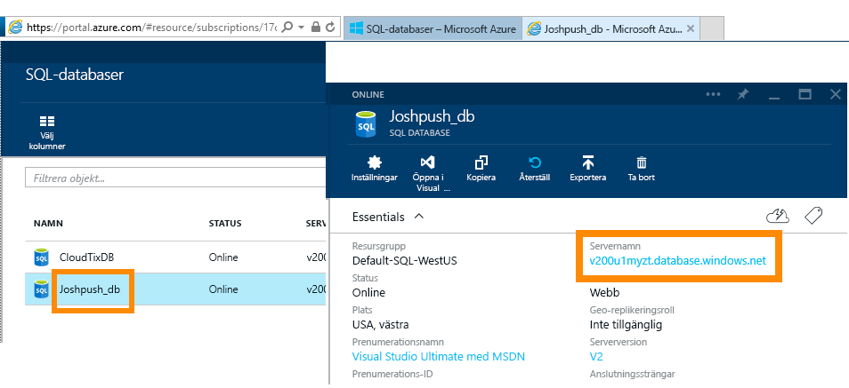
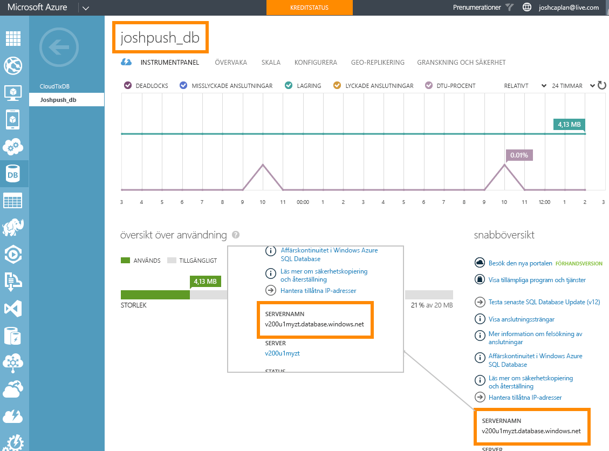

# Azure SQL Database med DirectQuery
Här kan du lära dig hur du kan ansluta direkt till Azure SQL Database och skapa rapporter med realtidsdata. Du kan hålla dina data vid källan och inte i Power BI.

Med DirectQuery skickas frågor tillbaka till din Azure SQL Database medan du utforskar dessa data i rapportvyn. Den här användningen föreslås för användare som är bekanta med databaser och de enheter som de ansluter till.

**OBS:**

* Ange det fullständigt kvalificerade servernamnet vid anslutning (se nedan för mer information)
* Se till att brandväggsreglerna för databasen är konfigurerade för ”[Tillåt åtkomst till Azure-tjänster](https://msdn.microsoft.com/library/azure/ee621782.aspx)”.
* Varje åtgärd, som att markera en kolumn eller lägga till ett filter, skickar en fråga tillbaka till databasen
* Panelerna uppdateras med ungefär 15 minuters mellanrum (uppdatering behöver inte schemaläggas). Detta kan justeras i Avancerade inställningar när du ansluter.
* Frågor och svar är inte tillgänglig för DirectQuery-datauppsättningar
* Schemaändringar plockas inte upp automatiskt

Dessa begränsningar och anteckningar kan ändras när vi fortsätter att förbättra upplevelsen. Stegen för att ansluta beskrivs nedan. 

## Power BI Desktop och DirectQuery
För att ansluta till Azure SQL Database med DirectQuery, behöver du använda Power BI Desktop. Den här metoden erbjuder ytterligare flexibilitet och funktioner. Rapporter som skapas med Power BI Desktop kan senare publiceras i Power BI-tjänsten. Du kan lära dig mer om hur du ansluter till [Azure SQL Database med DirectQuery](desktop-use-directquery.md) i Power BI Desktop. 

## Ansluta via Power BI
Du kan inte längre ansluta till Azure SQL Database direkt från Power BI-tjänsten. När du väljer [Azure SQL Database-anslutningsprogrammet](https://app.powerbi.com/getdata/bigdata/azure-sql-database-with-live-connect) blir du ombedd att upprätta anslutningen i Power BI Desktop. Du kan sedan publicera dina Power BI Desktop-rapporter i Power BI-tjänsten. 

### Hitta parametervärden
Det fullständigt kvalificerade servernamnet och databasnamnet återfinns i Azure Portal.

## Nästa steg
[Använda DirectQuery i Power BI Desktop](desktop-use-directquery.md)  
[Kom igång med Power BI](service-get-started.md)  
[Hämta data för Power BI](service-get-data.md)  
Har du fler frågor? [Försök med att fråga Power BI Community](http://community.powerbi.com/)

