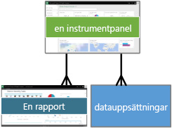
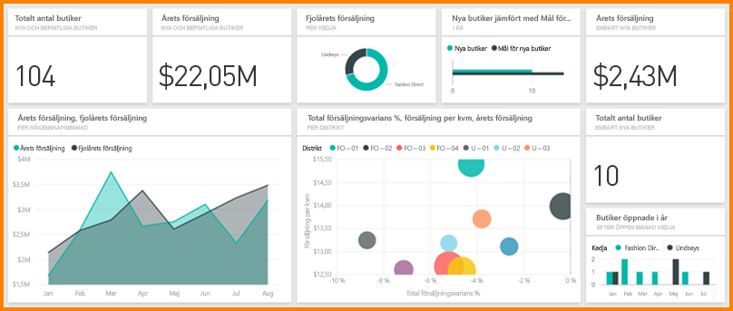

# Power BI – grundläggande begrepp för Power BI-tjänsten
<!-- Shared newnav Include -->
[!INCLUDE [newnavbydefault](./includes/newnavbydefault.md)]

Den här artikeln förutsätter att du redan har [registrerat dig för Power BI](service-self-service-signup-for-power-bi.md) och [lagt till vissa data](service-get-data.md).

När du öppnar Power BI-tjänsten, visas en ***instrumentpanel***. Instrumentpaneler är något som särskiljer Power BI-tjänsten från Power BI Desktop.

De viktigaste funktionerna i Power BI-tjänstens användargränssnitt är följande:

1. navigeringsfält
2. instrumentpanel med paneler
3. ruta för frågor och svar
4. knapparna hjälp och feedback
5. instrumentpanelsrubrik
6. Startprogram för Office 365-app
7. Power BI-hemknappar
8. Ytterligare instrumentpanelsåtgärder

Vi går in på dessa senare, men först ska vi gå igenom några Power BI-begrepp.

Eller så kanske du vill se den här videon innan du läser resten av artikeln.  Videon går igenom de grundläggande begreppen och ger en genomgång av Power BI-tjänsten.

<iframe width="560" height="315" src="https://www.youtube.com/embed/B2vd4MQrz4M" frameborder="0" allowfullscreen></iframe>

## Power BI-begrepp
De tre större byggblocken i Power BI är: ***instrumentpaneler***, ***rapporter*** och ***datauppsättningar***. Du kan inte ha instrumentpaneler och rapporter utan data (eller, du kan ha tomma instrumentpaneler och tomma rapporter, men de är inte användbara förrän de har data), så vi börjar med **datauppsättningar**.

## Datauppsättningar
En *datauppsättning* är en samling data som du *importerar* eller *ansluter* till. Med Power Bi kan du ansluta till och importera alla typer av datauppsättningar och placera dem tillsammans på en och samma plats.  

I navigeringsfältet visas de datauppsättningar som du har anslutit till eller importerat under rubriken **datauppsättningar**. Varje listad datauppsättning representerar en enskild datakälla, till exempel en Excel-arbetsbok på OneDrive, eller en lokal SSAS tabular-datauppsättning eller en Salesforce-datauppsättning. Det finns många olika datakällor som stöds och vi lägger till nya hela tiden. [Visa en lista över datauppsättningstyper som kan användas med Power BI](service-get-data.md).

**EN** datauppsättning ...

* kan användas flera gånger.
* kan användas i olika rapporter.
* Visualiseringar från denna enda datauppsättning kan visas på många olika instrumentpaneler.
  
  

För att [ansluta till eller importera en datauppsättning](service-get-data.md) välj **Hämta data** (längst ned i navigeringsfältet) eller välj plusikonen bredvid rubriken **Datauppsättningar**. Följ instruktionerna för att ansluta till eller importera en specifik källa och lägga till datauppsättningen till din arbetsyta. Nya datauppsättningar anges i det vänstra navigeringsfältet och markeras med en gul asterisk. Ditt arbete i Power BI ändrar inte den underliggande datauppsättningen.

Om du [ingår i en ***app-arbetsyta***](service-collaborate-power-bi-workspace.md), är datauppsättningar som lagts till av en medlem i arbetsytan tillgängliga för de andra medlemmarna på arbetsytan.

Datauppsättningar kan uppdateras, döpas om, utforskas, används för att skapa rapporter och tas bort. Välj datauppsättningen för att utforska den. Vad du faktiskt gör är att öppna datauppsättningen i rapportredigeraren där du verkligen kan börja utforska data och skapa visualiseringar. Så låt oss gå vidare till nästa avsnitt  – rapporter.

### Gå djupare:
* [Power BI Premium – vad är det?](service-premium.md)
* [Hämta data för Power BI](service-get-data.md)
* [Exempel datauppsättningar och innehållspaket för Power BI](sample-datasets.md)

## Rapporter
En Power BI-rapport är en eller flera sidor av visualiseringar (tabeller och diagram som linjediagram, cirkeldiagram, treemaps och många andra). Visualiseringar kallas också ***visuella objekt***. Alla visualiseringar i en rapport kommer från en enda datauppsättning. Rapporter kan skapas från grunden i Power BI, importeras med instrumentpaneler som kollegor delar med dig eller de kan skapas när du ansluter till datauppsättningar från Excel, Power BI Desktop, databaser, SaaS-program och [innehållspaket](service-organizational-content-pack-introduction.md).  När du ansluter till en Excel-arbetsbok med Power View-blad, skapar Power BI en rapport baserad på dessa blad. Och när du ansluter till ett SaaS-program, importerar Power BI en förskapad rapport.

Det finns två lägen för att visa och interagera med rapporter: [Läsvy](service-report-open-in-reading-view.md) och [Redigeringsvy](service-interact-with-a-report-in-editing-view.md).  Endast den person som skapade rapporten, delägare och de som beviljats behörighet, har åtkomst till alla funktionerna för utforskning, design, version och delning i rapportens ***Redigeringsvy***. Och de personer som de delar rapporten med kan utforska och interagera med rapporten med hjälp av ***Läsvy***.   

Dina rapporter visas i navigeringsfönstret under rubriken **Rapporter**. Varje listad rapport representerar en eller flera sidor av visualiseringar baserade på en av de underliggande datauppsättningarna. Om du vill öppna en rapport, markerar du den. Som standard öppnas rapporten i Läsvy först.  Välj bara **Redigera rapport** för att öppna den i redigeringsvyn (om du har tillräcklig behörighet).  Om rapporter finns i en delad instrumentpanel kommer du INTE att se rapporten i navigeringsfältet. Öppna i stället delade rapporter direkt från den delade instrumentpanelen genom att välja en panel för instrumentpanel (mer information om dessa senare).

**EN** rapport ...

* kan associeras med flera instrumentpaneler (paneler fästa från en rapport kan visas på flera instrumentpaneler).
* kan skapas med hjälp av data från en datauppsättning. (ett litet undantaget är att Power BI Desktop kan kombinera fler än en datauppsättning i en rapport och att rapporten inte kan importeras till Power BI)
  
  

## Instrumentpaneler
En *instrumentpanel* är något som du skapar eller något en kollega skapar och delar med dig. Det är en enda arbetsyta som innehåller noll eller flera paneler och widgetar. Varje panel visar en enda [visualisering](power-bi-report-visualizations.md) som skapats från en datauppsättning och fästs på instrumentpanelen. Det finns många sätt att lägga till paneler i instrumentpanelen; för många för att omfattas i det här översiktsavsnittet. Läs mer i [Paneler på instrumentpanelen i Power BI](service-dashboard-tiles.md). 

I navigeringsfältet visas ”dina” instrumentpaneler under rubriken **Instrumentpaneler**. ”Dina” innebär att du har åtkomst till dem, inte nödvändigtvis att du skapade dem. Varje instrumentpanel representerar en anpassad vy av någon delmängd av de underliggande datauppsättningarna.  Om du äger instrumentpanelen, har du också tillgång till underliggande datauppsättning(ar) och de visas i navigeringsfältet under **datauppsättningar**.  Om instrumentpanelen delades med dig, har den en delningsikon  bredvid sig och, beroende på hur den delades, kanske du kan eller inte kan se de underliggande datauppsättningarna som anges i ditt navigeringsfält.

> [!NOTE]
> Fästning och paneler beskrivs i detalj nedan under rubriken ”instrumentpanel med paneler”.
> 
> 

**EN** instrumentpanel ...

* kan visa visualiseringar från många olika datauppsättningar
* kan visa visualiseringar från många olika rapporter
* kan visa visualiseringar som fästs från andra verktyg (t.ex. Excel)
  
  

### Gå djupare:
**En instrumentpanel kan [skapas från grunden](service-dashboard-create.md)**  – skapa en ny tom instrumentpanel och hämta data. 

**Du eller en kollega kan skapa en instrumentpanel och [dela den](service-share-dashboards.md)**  – när du har accepterat inbjudan, läggs den delade instrumentpanelen (och eventuella tillhörande rapporter och datauppsättningar) till i navigeringsfältet. Power BI Pro krävs för att både dela en instrumentpanel och visa en delad instrumentpanel.

**Ibland importeras instrumentpaneler med datauppsättningen eller skapas när du ansluter till datauppsättningen**. Till exempel så tillfrågas du via guiden **Hämta data** för Salesforce om du vill att en instrumentpanel och/eller rapport skapas från datauppsättningen. 

**Varför skapar personer instrumentpaneler?**  Här är några av orsakerna:

* för att få en överblick över all information som behövs för att fatta beslut
* för att övervaka den viktigaste informationen om verksamheten
* för att se till att alla kollegor är på samma sida och ser och använder samma information
* för att övervaka hälsotillståndet för ett företag, en produkt, en affärsenhet, en marknadsföringskampanj o.s.v.
* för att skapa en anpassad vy av en större instrumentpanel – alla mått som är viktiga för mig

## Min arbetsyta
Vi har nu kommit tillbaka till din Power BI-instrumentpanel och arbetsyta. Låt oss ta en närmare titt på de delar som utgör landningssidan för Power BI-tjänsten.

### 1. **Navigeringsfält**
Använd navigeringsfältet för att flytta mellan byggblocken i Power BI: instrumentpaneler, rapporter och datauppsättningar.  

  

* Välj **Hämta data** för att [lägga till datauppsättningar, rapporter och instrumentpaneler i Power BI](service-get-data.md).
* Expandera eller komprimera navigeringsfältet med den här ikonen .
* Använd **Sök** för att hitta särskilda objekt i navigeringsfältet.
* Välj en plusikon  för att skapa en ny instrumentpanel eller få en ny datauppsättning.
* De angivna **instrumentpanelerna, rapporterna** och **datauppsättningarna** är tillgängliga att användas.  Delade instrumentpaneler är skrivskyddade och visar delningsikonen  .
* Namnen på instrumentpanelen, rapporten och datauppsättningen matchar normalt namnet på den underliggande datauppsättningsfilen – men du kan [byta namn på dem](service-rename.md).
* Högerklicka på en instrumentpanel, rapport eller datauppsättning för att visa den sammanhangsberoende menyn. 
  
  

Enkelklicka

* på en rubrik för att minimera eller expandera den
* på en instrumentpanel för att visa den
* på en rapport för att öppna den i Läsvy
* på en datauppsättning för att utforska den

### 2. **Instrumentpanel med paneler**
Instrumentpaneler består av [paneler](service-dashboard-tiles.md).  Paneler skapas i rapportens redigeringsvy, frågor och svar, andra instrumentpaneler och kan fästas från Excel och SSRS. En särskild typ av panel som kallas en [widget](service-dashboard-add-widget.md) läggs till direkt på instrumentpanelen. Panelerna som visas på en instrumentpanel har särskilt placerats där av en rapportskapare/-ägare.  Att lägga till en panel på en instrumentpanel kallas *fästning*.

Mer information finns i **Instrumentpaneler** (ovan).

### 3. **Ruta för frågor och svar**
Ett sätt att utforska dina data är att ställa en fråga och låta Power BI:s frågor och svar ge ett svar i form av en visualisering. Frågor och svar kan inte användas för att lägga till innehåll i en rapport – endast för att lägga till innehåll, i form av paneler, till instrumentpaneler.

Frågor och svar letar efter svar i den datauppsättning(ar) som är ansluten på instrumentpanelen.  En ansluten datauppsättning är en som har minst en panel fäst på instrumentpanelen.

När du börjar skriva en fråga, leder frågor och svar dig till sidan för frågor och svar. När du skriver hjälper frågor och svar dig att ställa rätt fråga och hitta det bästa svaret med omformuleringar, autofyll, förslag med mera. När du har en visualisering (ett svar) som du är nöjd med, fäster du den på instrumentpanelen. Mer information finns i [Frågor och svar i Power BI](service-q-and-a.md).

### 4. **Helskärmsläge, meddelanden, inställningar, nedladdningar, hjälp och feedback**
Ikonerna i det övre högra hörnet är dina resurser för inställningar, meddelanden, nedladdningar, få hjälp och ge feedback till Power BI-teamet. Välj dubbelpilen för att öppna instrumentpanelen i läget **Helskärm**.  

### 5. **Panel för instrumentpanel** (d.v.s. vilken instrumentpanelen är aktiv?)
Det är inte alltid lätt att ta reda på vilken instrumentpanel som är aktiv.  Panelen på instrumentpanelen visas på instrumentpanelens visningssida, på sidan för frågor och svar, i rapportens redigeringsvy och rapportens läsvy och när du öppnar en datauppsättning.   

### 6. **Startprogram för Office 365-app**
Startprogrammet för appen är utformat för att hjälpa dig att komma till dina Office 365-appar.

### 7. **Startsida för Power BI**
Om du väljer detta återgår du till den instrumentpanel som du visade senast.

   

### 8. **Alternativ**
Det här området i arbetsytan innehåller ikoner för att interagera med instrumentpanelen.  Förutom **Lägg till panel**, **Favorit** och **Dela** visar ellipsen alternativ för att duplicera, skriva ut och uppdatera instrumentpanelen med mera.

   

## Nästa steg
[Kom igång med Power BI](service-get-started.md)  
[Power BI-videor](videos.md)  
[Power BI Premium – vad är det?](service-premium.md)

Har du fler frågor? [Fråga Power BI Community](http://community.powerbi.com/)

