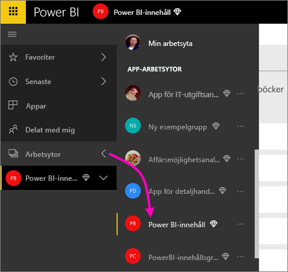
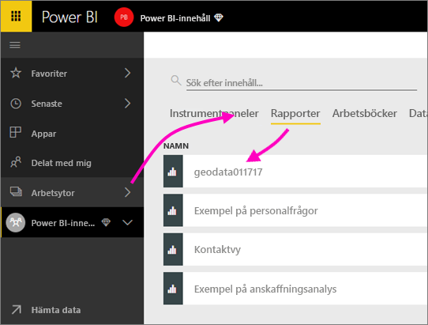

# Samarbeta på din Power BI-apparbetsyta
Power BI-apparbetsytor är bra platser för samarbete med dina kollegor. Där kan ni skapa *appar* genom att aarbeta med instrumentpaneler, rapporter och datauppsättningar. Samarbetet tar inte slut med arbetsytor i Power BI. Office 365 erbjuder andra grupptjänster, som att dela filer på OneDrive för företag, föra konversationer i Exchange, använda delade kalendrar och uppgifter osv. Läs mer om [grupper i Office 365](https://support.office.com/article/Create-a-group-in-Office-365-7124dc4c-1de9-40d4-b096-e8add19209e9).

> [!NOTE]
> Förhandsversionen av den nya arbetsytan kommer att ändra förhållandet mellan Power BI-arbetsytor och Office 365-grupper. Du kommer inte automatiskt att skapa en Office 365-grupp varje gång du skapar en av de nya arbetsytorna. Läs mer om [att skapa de nya arbetsytorna (förhandsversion)](service-create-the-new-workspaces.md)

Apparbetsytor är bara tillgängliga med en [Power BI Pro-licens](service-features-license-type.md).

## Samarbeta kring Power BI Desktop-filer på din apparbetsyta
Om du publicerar en Power BI Desktop-fil på din Power BI-apparbetsyta efter det att du har skapat den, så kan alla på din arbetsyta samarbeta med den.

1. Välj **Publicera** på menyfliksområdet **Start** i Power BI Desktop, och välj sedan din apparbetsyta i rutan **Välj ett mål**.
   
    
2. Välj först pilen bredvid Arbetsytor i Power BI-tjänsten > välj sedan din apparbetsyta.
   
    
3. Välj först fliken Rapporter, och sedan din rapport.
   
    
   
    Här ser det ut som vi vilken annan rapport som helst i Power BI. Du och andra användare på din apparbetsyta kan [ändra rapporten](consumer/end-user-reports.md) och spara paneler på en valfri instrumentpanel.

## Samarbeta i Office 365
Samarbete i Office 365 börjar med apparbetsytan i Power BI.

1. I Power BI-tjänsten väljer du pilen bredvid Arbetsytor > och väljer ellipsen (**…**) bredvid namnet på din arbetsyta. 
   
   
2. Från den här menyn kan samarbeta med din grupp på flera sätt: 
   
   * Har en [gruppkonversation i Office 365](service-collaborate-power-bi-workspace.md#have-a-group-conversation-in-office-365).
   * [Schemalägg en händelse](service-collaborate-power-bi-workspace.md#schedule-an-event-on-the-group-workspace-calendar) på appens kalenderarbetsyta.
   
   Första gången du gå till appens grupparbetsyta i Office 365 kan det ta en liten stund. Vänta mellan 15 och 30 minuter och uppdatera sedan webbläsaren.

## Ha en gruppkonversation i Office 365
1. Välj ellipsen (...) bredvid apparbetsytans namn \> **Konversationer**. 
   
    
   
   E-post- och konversationsplatsen för din appgruppsarbetsyta öppnas i Outlook för Office 365.
   
   
2. Läs mer om [gruppkonversationer i Outlook för Office 365](https://support.office.com/Article/Have-a-group-conversation-a0482e24-a769-4e39-a5ba-a7c56e828b22).

## Schemalägg en händelse på appens kalenderarbetsyta
1. Välj ellipsen (**…**) bredvid apparbetsytans namn \> **Kalender**. 
   
   
   
   Kalendern öppnas för appens grupparbetsyta i Outlook för Office 365.
   
   
2. Läs mer om [gruppkalendrar i Outlook i Office 365](https://support.office.com/Article/Add-edit-and-subscribe-to-group-events-0cf1ad68-1034-4306-b367-d75e9818376a).

## Hantera en apparbetsyta
Om du är ägare eller administratör för en apparbetsyta kan du också lägga till eller ta bort medlemmar på arbetsytan. Läs mer om [Hantera Power BI-apparbetsytan](service-manage-app-workspace-in-power-bi-and-office-365.md).

## Nästa steg
* [Skapa appar och apparbetsytor i Power BI](service-create-distribute-apps.md)
* Har du fler frågor? [Försök med att fråga Power BI Community](http://community.powerbi.com/)
* Feedback? Besök [Power BI-idéer](https://ideas.powerbi.com/forums/265200-power-bi)

