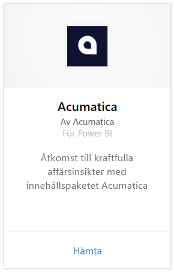
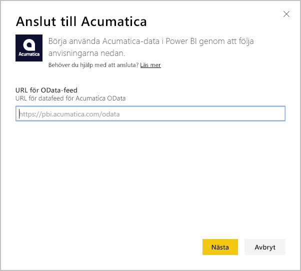
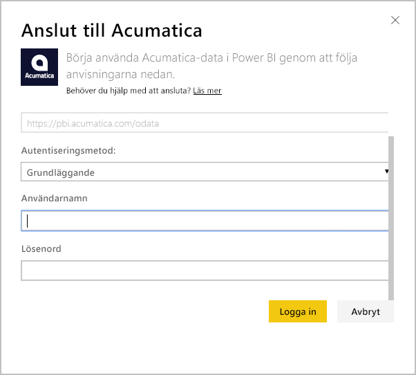
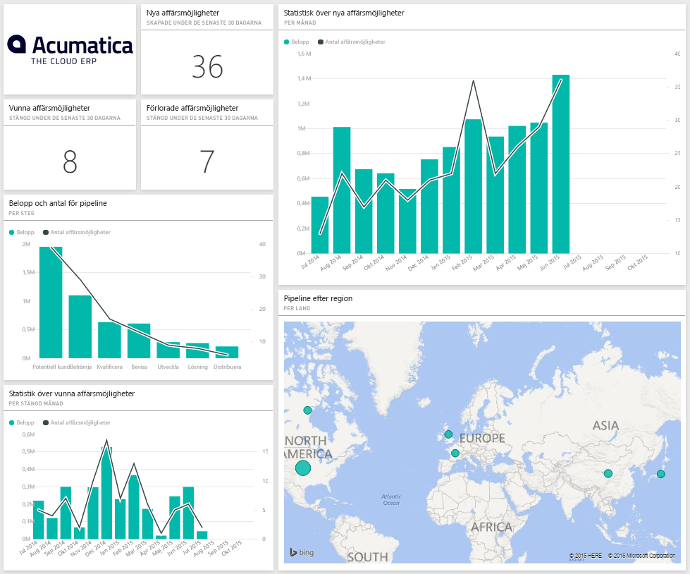

# Anslut till Acumatica med Power BI
Med innehållspaketet Power BI Acumatica kan du snabbt få insikter om dina affärsmöjlighetsdata. Power BI hämtar dina data, inklusive affärsmöjligheter, konton och kunder och skapar sedan en standardinstrumentpanel och relaterade rapporter baserat på dessa data.

[!INCLUDE [include-short-name](./includes/service-deprecate-content-packs.md)]

Anslut till [Acumatica-innehållspaketet](https://app.powerbi.com/getdata/services/acumatica) eller läs mer om [Acumatica-integrering](https://powerbi.microsoft.com/integrations/acumatica) med Power BI.

>[!NOTE]
>Det här Innehållspaketet kräver Acumatica v5.2 eller högre.

## Så här ansluter du
1. Välj **Hämta data** längst ned i navigeringsfönstret.
   
   
2. I rutan **Tjänster** väljer du **Hämta**.
   
   
3. Välj **Acumatica** \> **hämta**.
   
   
4. Ange din Acumatica OData-slutpunkt. En OData-slutpunkt tillåter ett externt system att begära data från Acumatica. Acumatica OData-slutpunkten är formaterat på följande sätt och bör använda HTTPS:
   
     `https://[sitedomain]/odata/[companyname]`
   
   Företagets namn är bara obligatoriskt om du har en distribution till flera företag. Mer information om hur du hittar den här parametern i ditt Acumatica-konto finns nedan.
   
   
5. Som autentiseringsmetod väljer du **Basic**. Ange ditt användarnamn och lösenord från ditt Acumatica-konto och klicka sedan på **logga In**.
   
    
6. När Power BI har importerat dessa data, visas en ny instrumentpanel, rapport och datamängd i navigeringsfönstret. Nya objekt markeras med en gul asterisk \* som försvinner när de valts, om du väljer instrumentpanelen så visas en layout som liknar den nedan:
   
    

**Och sedan?**

* Prova att [ställa en fråga i rutan Frågor och svar](consumer/end-user-q-and-a.md) överst på instrumentpanelen
* [Ändra panelerna](service-dashboard-edit-tile.md) på instrumentpanelen.
* [Välj en panel](consumer/end-user-tiles.md) för att öppna den underliggande rapporten.
* Medan din datauppsättning schemaläggs att uppdateras dagligen så kan du ändra uppdateringsfrekvensen eller testa att uppdatera den på begäran med **Uppdatera nu**

## Systemkrav
Det här Innehållspaketet kräver Acumatica v5.2 eller högre, bekräfta versionen med din Acumatica-administratör.

## Hitta parametrar
**Acumatica OData-slutpunkt**

Acumatica OData-slutpunkten är formaterad på följande sätt och bör använda HTTPS:

    https://[sitedomain]/odata/[companyname]

Programmets webbplatsdomän finns i webbläsarens adressfält när du har loggat in på Acumatica. I exemplet nedan är webbplatsdomänen `https://pbi.acumatica.com`, så OData-slutpunkten att ange skulle vara `https://pbi.acumatica.com/odata`.

 

Företagets namn är bara obligatoriskt om du har en distribution till flera företag. Du hittar den här informationen från din Acumatica-inloggningssida.

## Felsökning
Om du inte kan logga in, verifierar du att Acumatica OData-slutpunkten som du angav är korrekt formaterad.

    https://<application site domain>/odata/<company name>

Om du har problem med att ansluta, bekräftar du din version av Acumatica med din administratör. Det här innehållspaketet kräver version 5.2 eller senare.

## Nästa steg
[Kom igång i Power BI](service-get-started.md)

[Hämta data i Power BI](service-get-data.md)

