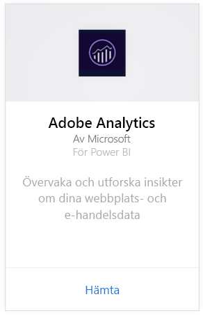
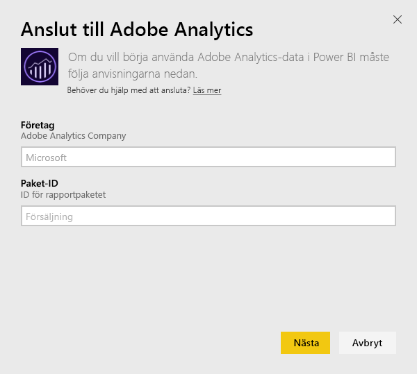
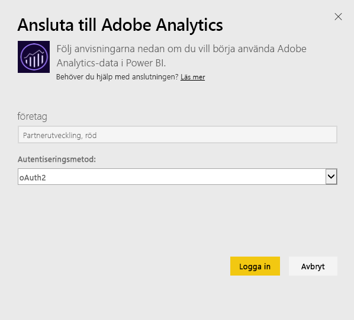
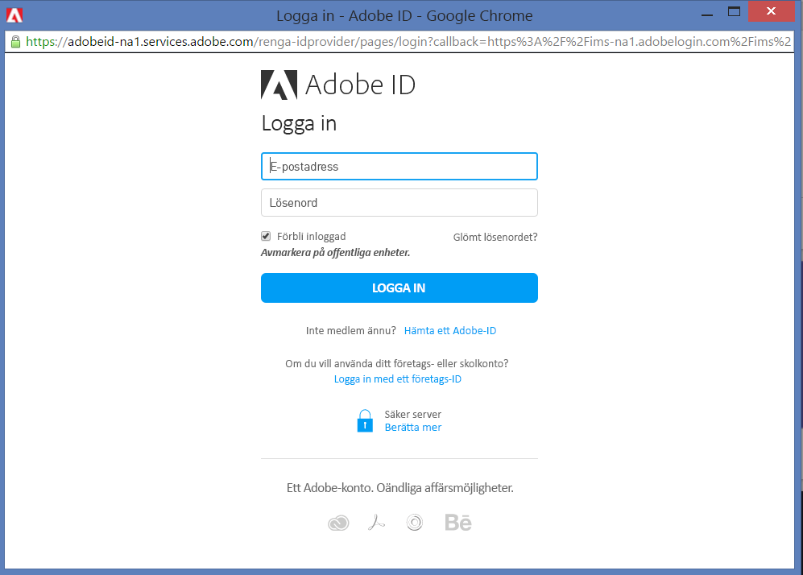
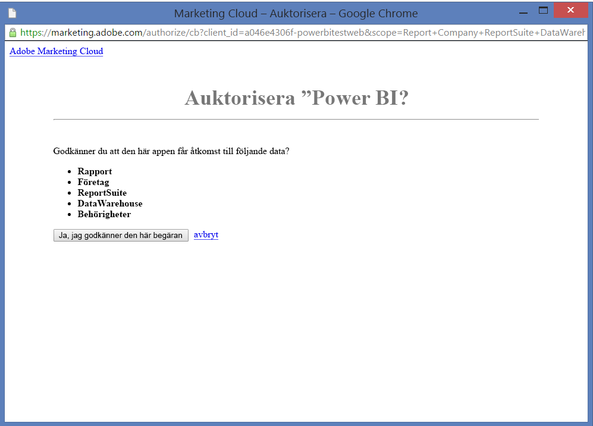
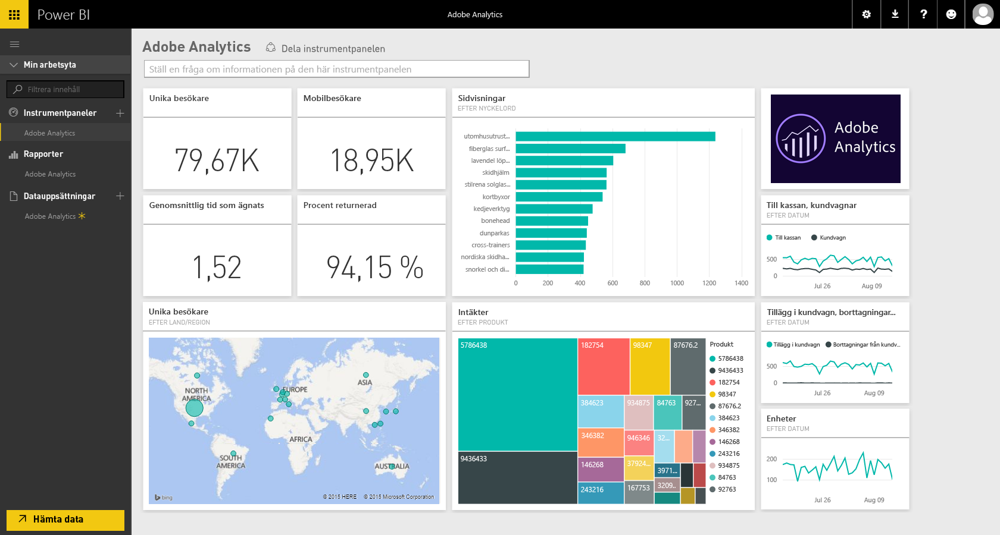
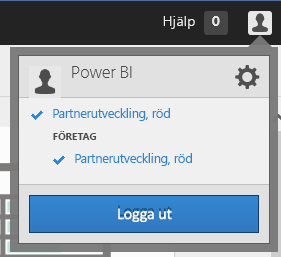
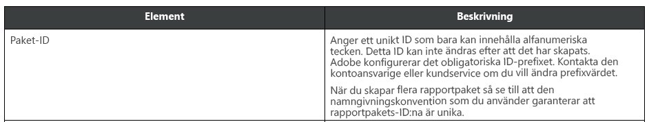

# Anslut till Adobe Analytics med Power BI
Du ansluter till Adobe Analytics via Power BI genom att ansluta till ditt Adobe Analytics Marketing Cloud-konto. Du får en app med en Power BI-instrumentpanel och en uppsättning Power BI-rapporter som ger insikter om din webbplatstrafik och användardimensioner. Data uppdateras automatiskt en gång per dag. Du kan interagera med instrumentpanelen och rapporterna, men du kan inte spara ändringarna.

Anslut till [Adobe Analytics](https://app.powerbi.com/getdata/services/adobe-analytics) eller läs mer om [Adobe Analytics-integrering](https://powerbi.microsoft.com/integrations/adobe-analytics) med Power BI.

## Så här ansluter du
[!INCLUDE [powerbi-service-apps-get-more-apps](./includes/powerbi-service-apps-get-more-apps.md)]

3. Välj **Adobe Analytics** \> **hämta**.
   
   
4. Power BI ansluter till ett specifikt Adobe Analytics-företag och Report Suite-ID (inte Report Suite-namn). Se information om att [söka efter de här parametrarna](#FindingParams) nedan.
   
   
5. Som **autentiseringsmetod** väljer du **oAuth2** \> **Logga in**. När du uppmanas, anger du dina Adobe Analytics-autentiseringsuppgifter. 
   
    
   
    
6. Klicka på **acceptera** så att Power BI kommer åt dina Adobe Analytics-data.
   
   
7. Efter du godkänner så startar importen automatiskt. 

## Visa Adobe Analytics-instrumentpanelen och rapporter
[!INCLUDE [powerbi-service-apps-open-app](./includes/powerbi-service-apps-open-app.md)]

   

[!INCLUDE [powerbi-service-apps-open-app](./includes/powerbi-service-apps-what-now.md)]

## Det här ingår
Power BI använder Adobe Analytics-rapport API för att definiera och köra rapporter för följande tabeller:

| **Tabellnamn** | **Kolumninformation** |
| --- | --- |
| Produkter |element=  "product" (översta 25)   mått="cartadditions", "cartremovals", "carts", "cartviews", "checkouts", "revenue", "units" |
| Webbläsare |element = ”browser” (översta 25)   mått="bounces", "bouncerate", "visitors", "visits", "uniquevisitors", "totaltimespent", "pageviews" |
| Sidor |element = ”page” (översta 25)   mått="cartadditions", "cartremovals", "carts", "cartviews", "checkouts", "revenue", "units", "visits", "uniquevisitors", "pageviews", "bounces", "bouncerate", "totaltimespent" |
| JavaScript-aktiverat |element = ”javascriptenabled”, ”browser” (översta 25) |
| Mobilt OS |element = ”mobileos” (översta 25)  mått="bounces", "bouncerate", "visitors", "visits", "uniquevisitors", "totaltimespent", "cartadditions", "cartremovals", "checkouts", "revenue", "units", "pageviews" |
| Nyckelord för sökmotorer |element= "searchengine" "searchenginekeyword"   mått="bounces", "bouncerate", "visitors", "visits", "entries", "uniquevisitors", "totaltimespent", "cartadditions", "cartremovals", "carts", "cartviews", "checkouts", "revenue", "units", "pageviews" |
| Sökmotor till produkter |element= "searchengine", "product"   mått="bounces", "bouncerate", "visitors", "visits", "entries", "uniquevisitors", "totaltimespent", "cartadditions", "cartremovals", "carts", "cartviews", "checkouts", "revenue", "units", "pageviews" |
| Refererande sidor |element= "referrer" (översta 15), “page" (översta 10)   mått="bounces", "bouncerate", "visitors", "visits", "entries", "uniquevisitors", "totaltimespent", "cartadditions", "cartremovals", "carts", "cartviews", "checkouts", "revenue", "units", "pageviews" |
| Geocountry-sidor |element= "geocountry" (översta 20), "page"   mått="bounces", "bouncerate", "visitors", "visits", "entries", "uniquevisitors", "totaltimespent", "cartadditions", "cartremovals", "carts", "cartviews", "checkouts", "revenue", "units", "pageviews" |
| Geocountry-produkt |element= "geocountry" (översta 20), "product"  mått="bounces", "bouncerate", "visitors", "visits", "entries", "uniquevisitors", "totaltimespent", "cartadditions", "cartremovals", "carts", "cartviews", "checkouts", "revenue", "units" |
| Land- och regionssökning |element= "geocountry" (översta 200)   mått="bounces", "bouncerate", "visitors", "visits", "entries", "uniquevisitors", "totaltimespent", "cartadditions", "cartremovals", "carts", "cartviews", "checkouts", "revenue", "units" |
| Språk |element= "language", "browser" (översta 25)   mått="bounces", "bouncerate", "visitors", "visits", "uniquevisitors", "totaltimespent", "pageviews", "cartadditions", "cartremovals", "checkouts", "carts", "cartviews" |
| Sökmotorsökning |element= "searchengine" (översta 100)   mått="bounces", "bouncerate", "visitors", "visits", "entries", "uniquevisitors", "totaltimespent", "cartadditions", "cartremovals", "carts", "cartviews", "checkouts", "revenue", "units" |
| Webbläsarsökning |element = ”browser” (översta 25) |

## Systemkrav
Åtkomst till [Adobe Analytics](http://www.adobe.com/marketing-cloud/web-analytics.html) krävs, inklusive tillgång till rätt parametrar som beskrivs nedan.

## Hitta parametrar
**Företag**

Företagsvärdet finns i det övre högra hörnet för ditt konto när du har loggat in. Värdet är skiftlägeskänsligt och blankstegskänsligt. Ange den exakt som det visas i ditt konto.

**Report Suite-ID.**

Suite-ID skapas när Report Suite skapas. Du kan kontakta din administratör för att identifiera ID-värdet. Det här är inte Report Suite-namnet.

Från Adobe-[dokumentationen](https://marketing.adobe.com/resources/help/en_US/reference/new_report_suite.html):

## Felsökning
Om du får ett felmeddelande (när du har angett dina autentiseringsuppgifter) om att du saknar behörighet, kontrollerar du med din administratör att du har åtkomst till Adobe Analytics API:n. Bekräfta även att det Adobe-ID som angetts är kopplat till din Marketing Cloud-organisation (som är kopplad till ett Adobe Analytics-företag).

Om du kommer förbi autentiseringsskärmen innan du påträffar felet, är det möjligt att rapporterna tar för lång tid att slutföra. Ett vanligt fel är i formatet *det gick inte att hämta data från Adobe Analytics-rapporten. Innehåll som ingår &quot;referent, sidan&quot;, ungefärlig varaktighet var xx sekunder*. Läs avsnittet om vad som ingår och jämför med storleken på din Adobe-instans. Det finns tyvärr inte något sätt att kringgå den här timeouten idag. Men vi överväger uppdateringar för att ge bättre stöd åt stora instanser. Ge gärna feedback till Power BI-teamet på https://ideas.powerbi.com

## Nästa steg
* [Vad är appar i Power BI?](service-create-distribute-apps.md)
* [Hämta data i Power BI](service-get-data.md)
* Har du fler frågor? [Fråga Power BI Community](http://community.powerbi.com/)

