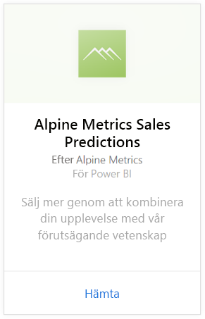
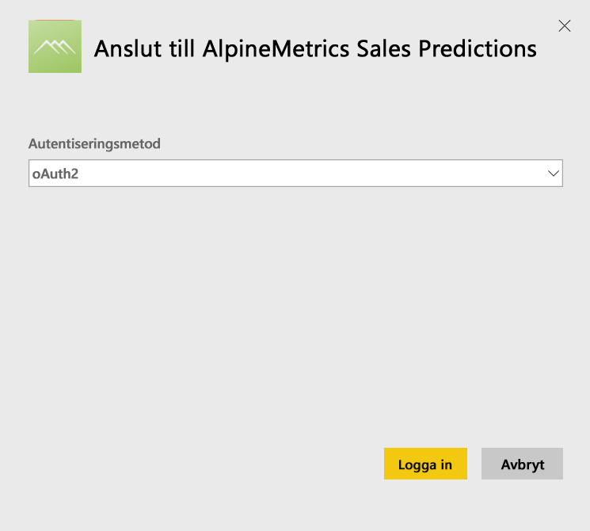
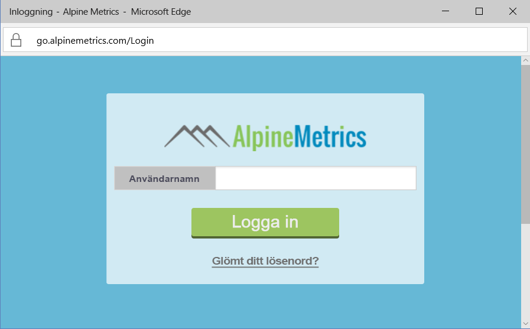
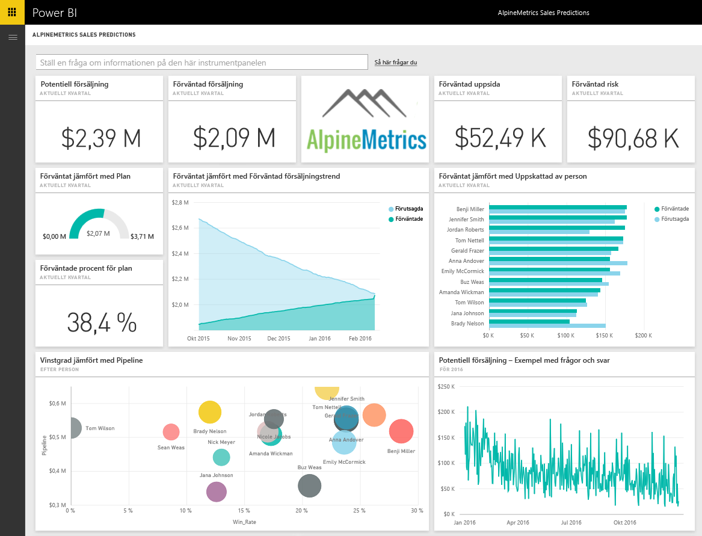

# Ansluta till Alpine Metrics Sales Predictions med Power BI
Alpine Metrics ger avancerad processoptimering för försäljningsprognoser i molnet och på begäran för både stora och små försäljningsorganisationer. Alpine Metrics Sales Predictions innehållspaket för Power BI innehåller parametrar som potentiell och förväntad försäljning och risk, så att du får bättre inblick i ditt företags framtid. 

Anslut till [Alpine Metrics Sales Predictions innehållspaket](https://app.powerbi.com/getdata/services/alpine-metrics) för Power BI.

## Så här ansluter du
1. Välj Hämta data längst ned i det vänstra navigeringsfönstret.  
   
    
2. I rutan **tjänster** väljer du **Hämta**.  
   
    
3. Välj **Alpine Metrics Sales Predictions** och sedan **Hämta**.  
   
    
4. Välj **OAuth 2** och sedan **Logga in**. Ange dina autentiseringsuppgifter för Alpine Metrics när du uppmanas till detta.
   
    
   
    
5. När du är ansluten kommer en instrumentpanel, rapport och datauppsättning automatiskt att läsas in. När du är klar, uppdateras panelerna med data från ditt konto.
   
    

**Och sedan?**

* Prova att [ställa en fråga i rutan Frågor och svar](power-bi-q-and-a.md) överst på instrumentpanelen
* [Ändra panelerna](service-dashboard-edit-tile.md) på instrumentpanelen.
* [Välj en panel](service-dashboard-tiles.md) för att öppna den underliggande rapporten.
* Även om din datauppsättning är schemalagd för att uppdateras dagligen, kan du ändra uppdateringsschemat eller försöka uppdatera den på begäran med **Uppdatera nu**.

## Vad ingår
Innehållspaketet inkluderar data från följande tabeller:  

    - Konto    
    - Företag    
    - Land    
    - Bransch    
    - Affärsmöjlighet  
    - Person  
    - Förutsägelse    
    - Prediction History (Förutsägelsehistorik)    
    - Produkt  
    - Region    

## Systemkrav
Ett Alpine Metrics-konto med behörighet för ovanstående tabeller krävs för att skapa en instans av det här innehållspaketet.

## Nästa steg
[Kom igång med Power BI](service-get-started.md)

[Power BI – grundläggande begrepp](service-basic-concepts.md)

