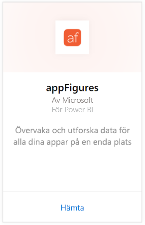
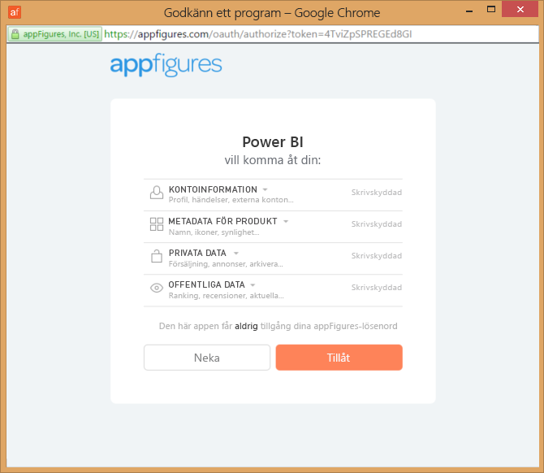
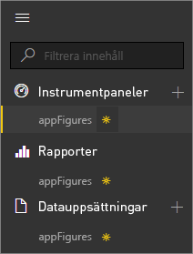
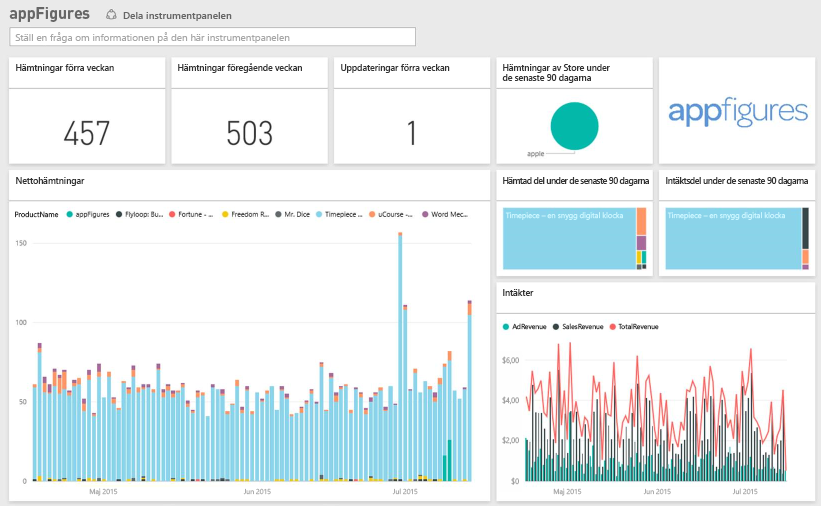
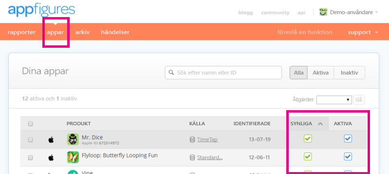

# Anslut till appFigures med Power BI
Nu är det enkelt att spåra viktig statistik om dina appar med Power BI och appFigures-innehållspaketet. Power BI hämtar dina data, inklusive appförsäljning, nedladdningar och statistik och skapar sedan en standardinstrumentpanel och relaterade rapporter baserat på dessa data.

Anslut till [appFigures-innehållspaketet](https://app.powerbi.com/getdata/services/appfigures) eller läs mer om [appFigures-integrering](https://powerbi.microsoft.com/integrations/appfigures) med Power BI.

## Så här ansluter du
1. Välj **Hämta data** längst ned i det vänstra navigeringsfönstret.
   
   
2. I rutan **tjänster** väljer du **Hämta**.
   
   
3. Välj **appFigures** \> **hämta**.
   
   
4. Som **autentiseringsmetod** väljer du **oAuth2** \> **Logga in**. När du uppmanas till det, anger du dina autentiseringsuppgifter för appFigures och följer autentiseringsprocessen.
   
   Första gången du ansluter, uppmanas du att ge Power BI skrivskyddad åtkomst till ditt konto. Klicka på **tillåt** för att starta importen. Det kan ta några minuter beroende på mängden data i ditt konto.
   
   
5. När Power BI har importerat dessa data, visas en ny instrumentpanel, rapport och datauppsättning i det vänstra navigeringsfönstret. Nya objekt har markerats med en gul asterisk \*:
   
    
6. Välj appFigures-instrumentpanelen. Det här är standardinstrumentpanelen som Power BI skapar för att visa dina data. Du kan modifiera den här instrumentpanelen för att visa dina data på det sätt som du vill.
   
    

**Och sedan?**

* Prova att [ställa en fråga i rutan Frågor och svar](power-bi-q-and-a.md) överst på instrumentpanelen
* [Ändra panelerna](service-dashboard-edit-tile.md) på instrumentpanelen.
* [Välj en panel](service-dashboard-tiles.md) för att öppna den underliggande rapporten.
* Även om din datauppsättning är schemalagd för att uppdateras dagligen, kan du ändra uppdateringsschemat eller försöka uppdatera den på begäran med **Uppdatera nu**.

## Vad ingår
Följande data finns tillgängliga från appFigures i Power BI.

| **Tabellnamn** | **Beskrivning** |
| --- | --- |
| Länder |Den här tabellen innehåller landsnamnsinformation. |
| Datum |Den här tabellen innehåller datum från idag tillbaka till det tidigaste PublishDate för appar som är aktiva och synliga i ditt appFigures-konto. |
| Händelser |Tabellen innehåller information om nedladdningar, försäljning och reklam för varje app efter land, dagligen. Observera att både appen och inköpsinformation i appen finns i en enda tabell – du kan använda kolumnen <strong>typ</strong> för att differentiera. |
| Inapps |Den här tabellen innehåller information om de olika typerna av köp via appen som är associerade med aktiva, synliga appar på ditt appFigures-konto. |
| Produkter |Den här tabellen innehåller data om de olika apparna som är aktiva och synliga på ditt appFigures-konto. |

## Felsökning
Om data från några av dina appar inte visas i Power BI, kontrollera att apparna är synlig och aktiva på **appar**-fliken på appFigures-webbplatsen.

## Nästa steg
* [Kom igång i Power BI](service-get-started.md)
* [Hämta data i Power BI](service-get-data.md)

