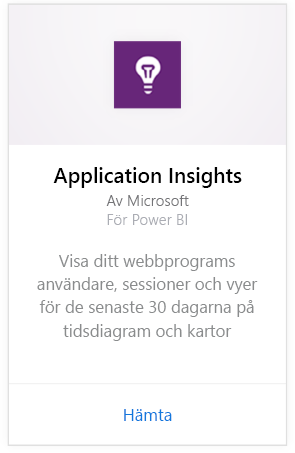
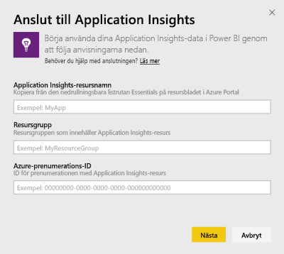
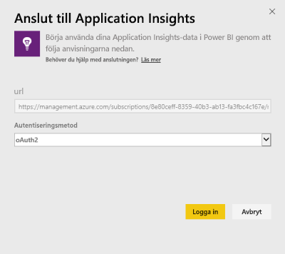
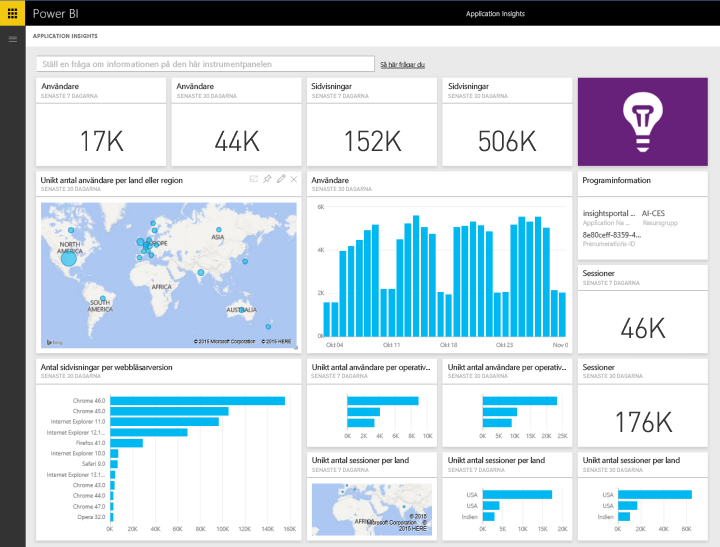
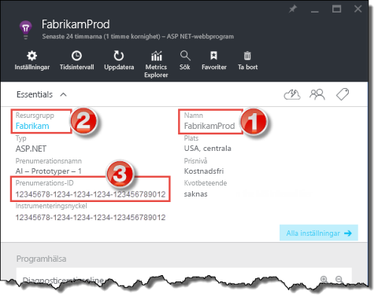
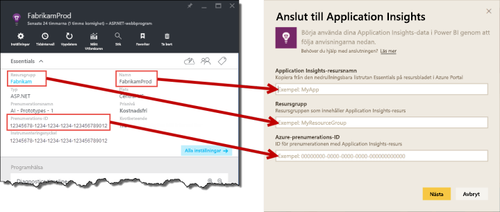

# Anslut till Application Insights med Power BI
Använd Power BI för att skapa kraftfulla anpassade instrumentpaneler från telemetrin [Application Insights](https://azure.microsoft.com/documentation/articles/app-insights-overview/). Förutse din apptelemetri på nya sätt. Kombinera mått för flera appar eller komponenttjänster på en instrumentpanel. Den första versionen av Power BI-innehållspaketet för Application Insights innehåller widgetar för vanliga användningsrelaterade mått såsom aktiva användare, sidvy, sessioner, webbläsare och OS-version och geografisk fördelning av användare på en karta.

Anslut till [Application Insights-innehållspaket för Power BI](https://app.powerbi.com/getdata/services/application-insights).

>[!NOTE]
>Den här integreringsmetoden är nu **inaktuell**. Mer information om den föredragna metoden för att ansluta Application Insights till Power BI finns i [exportera funktioner för analytiska frågor](https://docs.microsoft.com/azure/application-insights/app-insights-export-power-bi#export-analytics-queries).

## Så här ansluter du
1. Välj **Hämta data** längst ned i det vänstra navigeringsfönstret.
   
    
2. I rutan **tjänster** väljer du **Hämta**.
   
    
3. Välj **Application Insights** > **Hämta**.
   
    
4. Ange information om programmet som du vill ansluta till, inklusive **resursnamnet för Application Insights**, **resursgrupp** och **prenumerations-ID**. Se [Hitta Application Insights-parametrar](#FindingAppInsightsParams) nedan för mer information.
   
        
5. Välj **Logga In** och följ anvisningarna för att ansluta.
   
    
6. Importen startar automatiskt. När du är klar visas ett meddelande och en ny instrumentpanel, rapport och datauppsättning visas i navigeringsfönstret markerade med en asterisk.  Välj instrumentpanelen för att se dina importerade data.
   
    

**Och sedan?**

* Prova att [ställa en fråga i rutan Frågor och svar](power-bi-q-and-a.md) överst på instrumentpanelen
* [Ändra panelerna](service-dashboard-edit-tile.md) på instrumentpanelen.
* [Välj en panel](service-dashboard-tiles.md) för att öppna den underliggande rapporten.
* Även om din datauppsättning är schemalagd för att uppdateras dagligen, kan du ändra uppdateringsschemat eller försöka uppdatera den på begäran med **Uppdatera nu**.

## Vad ingår
Application Insights-innehållspaketet innehåller följande tabeller och mått:  

    ´´´
    - ApplicationDetails  
    - UniqueUsersLast7Days   
    - UniqueUsersLast30Days   
    - UniqueUsersDailyLast30Days  
    - UniqueUsersByCountryLast7Days  
    - UniqueUsersByCountryLast30Days   
    - PageViewsDailyLast30Days   
    - SessionsLast7Days   
    - SessionsLast30Days  
    - PageViewsByBrowserVersionDailyLast30Days   
    - UniqueUsersByOperatingSystemLast7Days   
    - UniqueUsersByOperatingSystemLast30Days    
    - SessionsDailyLast30Days   
    - SessionsByCountryLast7Days   
    - SessionsByCountryLast30Days   
    - PageViewsByCountryDailyLast30Days  
    ´´´ 

## Hitta parametrar
Ditt resursnamn, din resursgrupp och ditt prenumerations-ID hittar du i Azure Portal. Genom att markera namnet öppnas en detaljerad vy och du kan använda Essentials-listrutan för att hitta de värden som du behöver.

Kopiera och klistra in dessa i fälten i Power BI:

## Nästa steg
[Kom igång i Power BI](service-get-started.md)

[Hämta data i Power BI](service-get-data.md)

