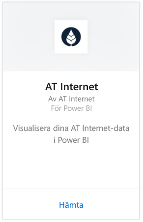
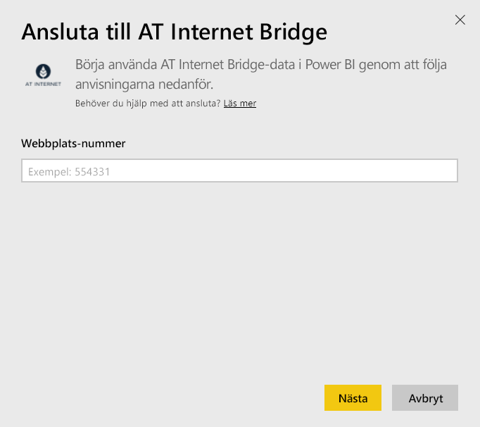
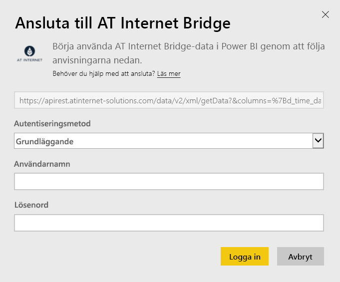

# Ansluta till AT Internet Bridge med Power BI
Hjälper dig att utvinna direkt värde från dina data med hjälp av dess enhetliga digitala analysplattform Analytics Suite på Internet. Innehållspaketet AT Internet Bridge för Power BI innehåller data om besök, datakällor, lokalisering och enheter för din webbplats.

Anslut till [AT Internet Bridge-innehållspaketet](https://app.powerbi.com/getdata/services/at-internet-bridge) för Power BI.

## Så här ansluter du
1. Välj **Hämta data** längst ned i det vänstra navigeringsfönstret.
   
    
2. I rutan **tjänster** väljer du **Hämta**.
   
    
3. Välj **AT Internet Bridge** \> **Hämta**.
   
   
4. Ange webbplatsnumret för IT Internet som du vill ansluta till.
   
   
5. Välj **grundläggande** som autentiseringsmetod, ange användarnamn och lösenord för AT Internet och klicka på **Logga In**.
   
   
6. Klicka på **Anslut** för att starta importen. När den är klar visas en ny instrumentpanel, rapport och modell i navigeringsfönstret. Välj instrumentpanelen för att se dina importerade data.
   
    

**Och sedan?**

* Prova att [ställa en fråga i rutan Frågor och svar](service-q-and-a.md) överst på instrumentpanelen
* [Ändra panelerna](service-dashboard-edit-tile.md) på instrumentpanelen.
* [Välj en panel](service-dashboard-tiles.md) för att öppna den underliggande rapporten.
* Även om din datauppsättning kommer att vara schemalagd att uppdateras dagligen, kan du ändra uppdateringsschemat eller uppdatera på begäran med **Uppdatera nu**

## Vad ingår
Det här innehållspaketet innehåller data från de senaste 45 dagarna i följande tabeller:  

    - Konvertering  
    - Enheter  
    - Lokalisering  
    - Källor  
    - Globala besök  

## Nästa steg
[Kom igång med Power BI](service-get-started.md)

[Power BI – grundläggande begrepp](service-basic-concepts.md)

