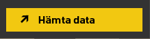
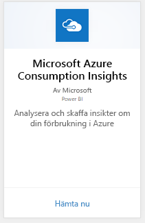
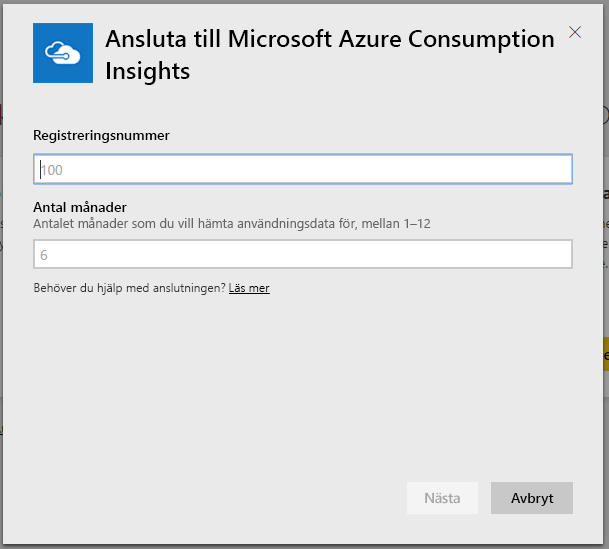
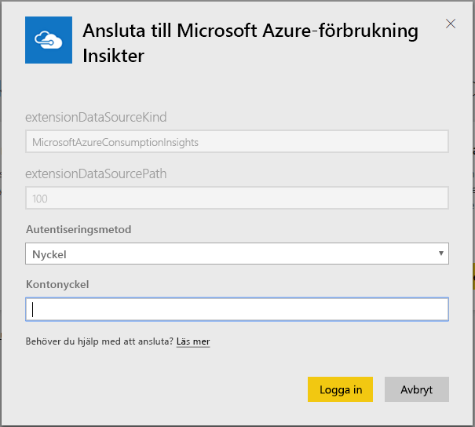
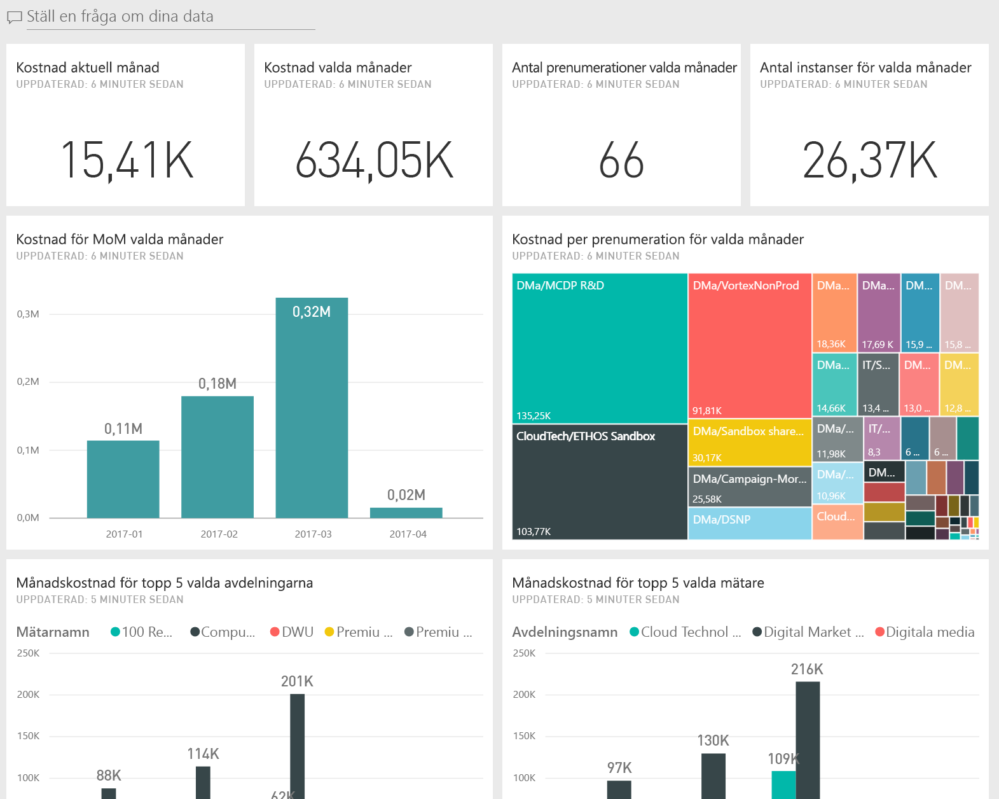
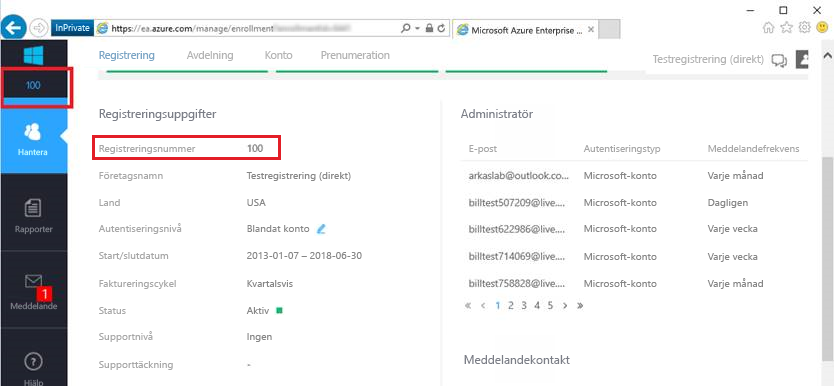
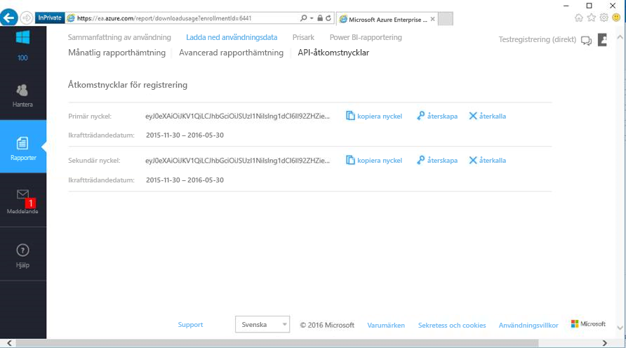

# Ansluta till Microsoft Azure Consumption Insights med Power BI
Utforska och övervaka dina Microsoft Azure-förbrukningsdata i Power BI med Power BI-innehållspaketet. Data uppdateras automatiskt en gång om dagen.

Anslut till [Microsoft Azure Consumption Insights-innehållspaketet](https://app.powerbi.com/getdata/services/azureconsumption) för Power BI.

## Så här ansluter du
1. Välj **Hämta data** längst ned i det vänstra navigeringsfönstret.
   
    
2. I rutan **Tjänster** väljer du **Hämta**.
   
   
3. Välj **Microsoft Azure Consumption Insights** \> **Hämta nu**. 
   
   
4. Ange antal månader av data som du vill importera och ditt Azure Enterprise-registreringsnummer. Se information om att [hitta parametrarna](#FindingParams) nedan.
   
    
5. Ange din åtkomstnyckel för att ansluta. Du hittar din nyckel för registrering i Azure EA-portalen. 
   
    
6. Importen startar automatiskt. När du är klar visas en ny instrumentpanel, rapport och modell i navigeringsfönstret. Välj instrumentpanelen för att visa dina importerade data.
   
   

**Och sedan?**

* Prova att [ställa en fråga i rutan Frågor och svar](consumer/end-user-q-and-a.md) överst på instrumentpanelen
* [Ändra panelerna](service-dashboard-edit-tile.md) på instrumentpanelen.
* [Välj en panel](consumer/end-user-tiles.md) för att öppna den underliggande rapporten.
* När din datauppsättning är schemalagd att uppdateras varje dag, du kan ändra uppdateringsschemat eller försöka uppdatera den på begäran med **Uppdatera nu**

## Det här ingår
Microsoft Azure Consumption Insights-Innehållspaketet innehåller månatliga rapporteringsdata för det intervallet för månad som du angav när du ansluter. Intervallet är rörligt så datumen som ingår uppdateras när datauppsättningen uppdateras.

## Systemkrav
Innehållspaketet kräver åtkomst till företagsfunktioner i Azure-portalen. 

## Hitta parametrar
Power BI-rapportering är tillgängligt för direkta EA-Partner och indirekta kunder som kan visa faktureringsinformation. Läs nedan för information om hur du hittar de värden som anslutningsflödet förväntar sig.

**Antal månader**

* Antalet månader (1 – 36) av data från i dag som du vill importera.

**Registreringsnummer**

* Ditt Azure Enterprise-registreringsnummer som du hittar vid den [Azure Enterprise Portal](https://ea.azure.com/) startsidan under **registreringsuppgifter**.
  
    

**Åtkomstnyckel**

* Du kan hitta din åtkomstnyckel i Azure Enterprise-portalen under **ladda ned användning** > **API-åtkomstnyckel**.
  
    

**Ytterligare hjälp**

* För ytterligare hjälp med att konfigurera Azure Enterprise Power BI-paketet, logga in på Azure Enterprise Portal och visa API-hjälpfilen under **hjälpa**. Du kan också hitta ytterligare instruktioner under **rapporter** -> **ladda ned användning** -> **API-åtkomstnyckel**.

## Nästa steg
[Kom igång i Power BI](service-get-started.md)

[Hämta data i Power BI](service-get-data.md)

