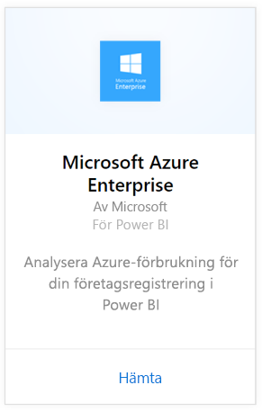
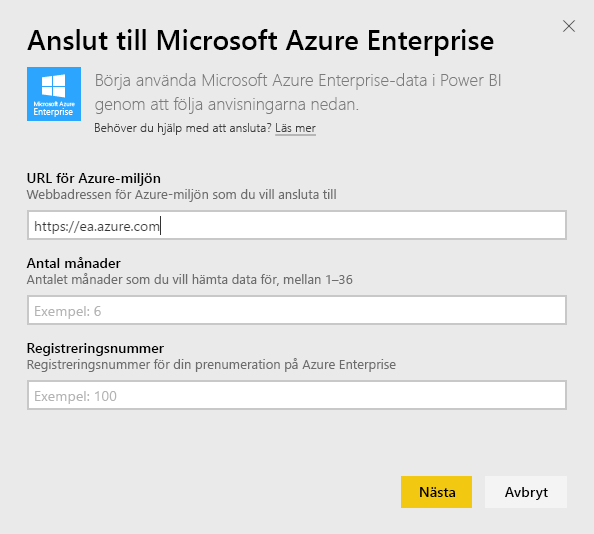
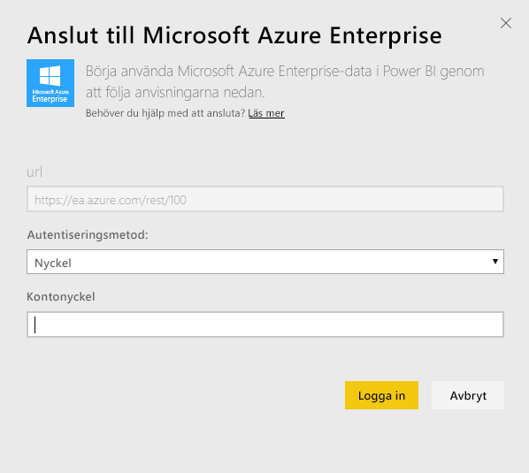
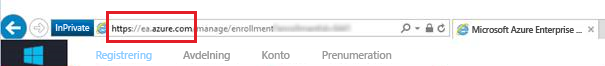
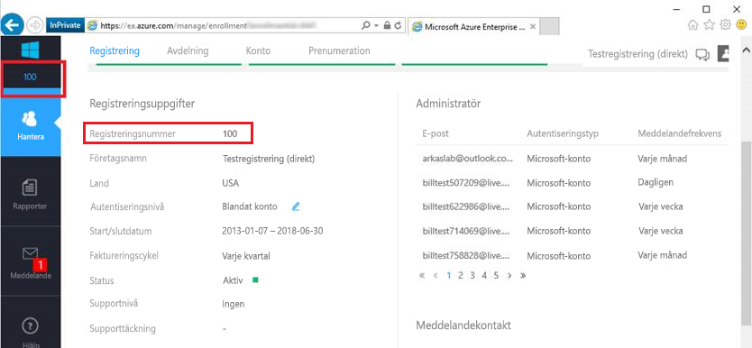
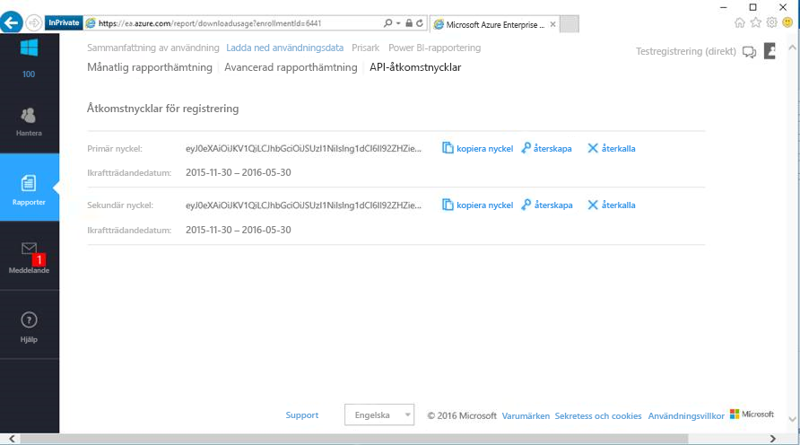

# Anslut till Microsoft Azure Enterprise med Power BI
Utforska och övervaka dina Microsoft Azure Enterprise-data i Power BI med Power BI-innehållspaketet. Data uppdateras automatiskt en gång per dag.

Anslut till [Microsoft Azure Enterprise-innehållspaketet](https://app.powerbi.com/getdata/services/azure-enterprise) för Power BI.

## Så här ansluter du
1. Välj **Hämta data** längst ned i det vänstra navigeringsfönstret.
   
    
2. I rutan **tjänster** väljer du **Hämta**.
   
   
3. Välj **Microsoft Azure Enterprise** \> **hämta**.
   
   
4. Ange URL:en för Azure-miljön, antal månader av data som du vill importera och ditt Azure Enterprise-registreringsnummer. URL:en för din Azure-miljö är `https://ea.azure.com` eller `https://ea.windowsazure.cn`. Se information om att [hitta parametrarna](#FindingParams) nedan.
   
    
5. Ange din åtkomstnyckel för att ansluta. Nyckeln för din registrering finns i din Azure EA-portal.
   
    
6. Importen startar automatiskt. När den är klar visas en ny instrumentpanel, rapport och modell i navigeringsfönstret. Välj instrumentpanelen för att visa dina importerade data.
   
   

**Och sedan?**

* Prova att [ställa en fråga i rutan Frågor och svar](power-bi-q-and-a.md) överst på instrumentpanelen
* [Ändra panelerna](service-dashboard-edit-tile.md) på instrumentpanelen.
* [Välj en panel](service-dashboard-tiles.md) för att öppna den underliggande rapporten.
* Även om din datauppsättning är schemalagd för att uppdateras dagligen, kan du ändra uppdateringsschemat eller försöka uppdatera den på begäran med **Uppdatera nu**.

## Vad ingår
Azure Enterprise-innehållspaketet innehåller månatliga rapporteringsdata för det antal månader som du anger under anslutningsflödet. Intervallet är rörligt så datumen som ingår uppdateras när datauppsättningen uppdateras.

## Systemkrav
Innehållspaketet kräver åtkomst till företagsfunktionerna i Azure Portal.

## Hitta parametrar
Power BI-rapportering finns tillgängligt för EA-direkt, partner och indirekta kunder som kan visa faktureringsinformation. Läs nedan för mer information om hur du hittar de värden som anslutningsflödet förväntar sig.

**URL för Azure-miljön**

* Det här värdet är vanligtvis https://ea.azure.com, men du kan kontrollera URL:en när du loggar in för att bekräfta.
  
    

**Antal månader**

* Det här bör vara ett tal mellan 1 och 36 som representerar antalet månader av data (från idag) som du vill importera.

**Registreringsnummer**

* Det här är ditt Azure Enterprise-registreringsnummer som finns på startsidan för [Azure Enterprise Portal](https://ea.azure.com/) under registreringsinformation.
  
    

**Åtkomstnyckel**

* Din nyckel finns i Azure Enterprise Portal under ”Ladda ned användningsdata” > ”API-åtkomstnyckel”.
  
    

**Ytterligare hjälp**

* För ytterligare hjälp med hur du konfigurerar Azure Enterprise Power BI-paketet, loggar du in i Azure Enterprise Portal och visar API-hjälpfilen under ”Hjälp” och ytterligare instruktioner under Rapporter -> Ladda ned användningsdata > API-åtkomstnyckel.

## Nästa steg
[Kom igång i Power BI](service-get-started.md)

[Hämta data i Power BI](service-get-data.md)

