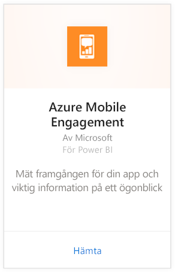
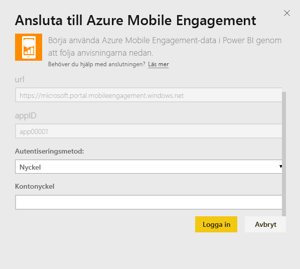
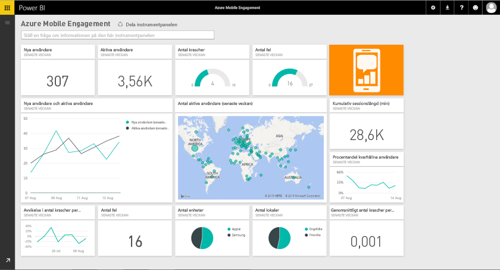

# Ansluta till Azure Mobile Engagement med Power BI
Med innehållspaketet Power BI Azure Mobile Engagement kan du snabbt få insikter om dina appdata.

Ansluta till innehållspaketet [Azure Mobile Engagement](https://app.powerbi.com/groups/me/getdata/services/azme) för Power BI.

## Så här ansluter du
1. Välj **Hämta data** längst ned i det vänstra navigeringsfönstret.
   
    
2. I rutan **tjänster** väljer du **Hämta**.
   
    
3. Välj **Azure Mobile Engagement** \> **Hämta**.
   
     
4. Ange appsamling och appnamn. Den här informationen kan hittas i ditt Azure Mobile Engagement-konto.
   
     
5. För autentiseringsmetoden väljer du din nyckel och klickar sedan på Logga in.
   
    
6. När Power BI har importerat dessa data, visas en ny instrumentpanel, rapport och datauppsättning i det vänstra navigeringsfönstret. Nya objekt har markerats med en gul asterisk \* som försvinner när de markeras:
   
    

 **Och sedan?**

* Prova att [ställa en fråga i rutan Frågor och svar](power-bi-q-and-a.md) överst på instrumentpanelen
* [Ändra panelerna](service-dashboard-edit-tile.md) på instrumentpanelen.
* [Välj en panel](service-dashboard-tiles.md) för att öppna den underliggande rapporten.
* Även om din datauppsättning kommer att vara schemalagd att uppdateras dagligen, kan du ändra uppdateringsschemat eller uppdatera på begäran med **Uppdatera nu**

## Nästa steg
[Kom igång i Power BI](service-get-started.md)

[Hämta data i Power BI](service-get-data.md)

