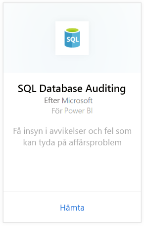
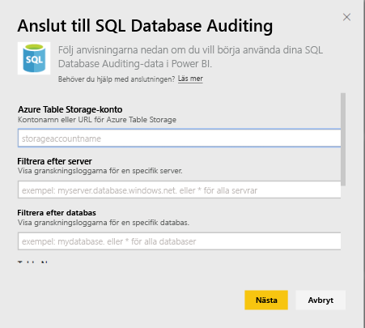
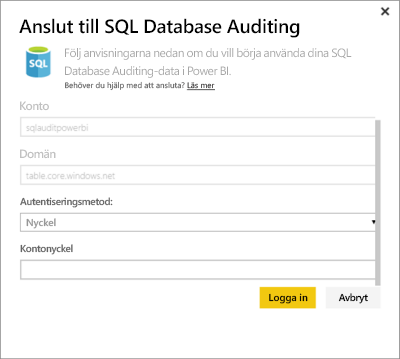
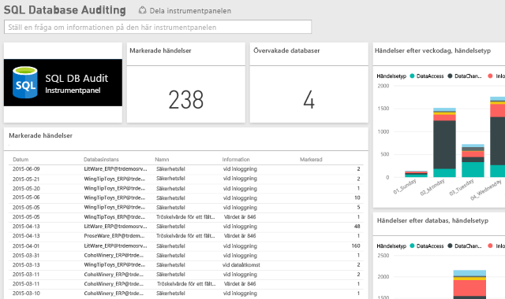

# SQL Database Auditing-innehållspaketet för Power BI
Power BI-Innehållspaketet för Azure [SQL Database Auditing](http://azure.microsoft.com/documentation/articles/sql-database-auditing-get-started/) låter dig förstå din databasaktivitet och få insikter om avvikelser och fel som kan tyda på verksamhetsproblem eller misstänkta säkerhetsöverträdelser. 

Anslut till [SQL Database Auditing-innehållspaketet](https://app.powerbi.com/getdata/services/sql-db-auditing) för Power BI.

>[!NOTE]
>Innehållspaketet importerar data från alla tabeller som innehåller AuditLogs i sina namn och lägger till dem i en enda datamodell-tabell med namnet AuditLogs. De senaste 250k händelserna kommer att inkluderas och data uppdateras dagligen.

## Så här ansluter du
1. Välj **Hämta data** längst ned i det vänstra navigeringsfönstret.
   
    
2. I rutan tjänster väljer du Hämta.
   
    
3. Välj **SQL Database Auditing** \> **hämta**.
   
   
4. I anslut till SQL Database Auditing-fönstret:
   
   - Ange kontonamn för Azure Table Storage eller URL:en där dina loggar lagras.
   
   - Ange namnet på den SQL-server som du är intresserad av. Ange \* för att läsa in granskningsloggar för alla servrar.
   
   - Ange namnet på den SQL-databas som du är intresserad av. Ange \* för att läsa in granskningsloggar för alla databaser.
   
   - Ange namnet på den Azure-tabell som innehåller de loggar som du är intresserad av. Ange \* för att läsa in granskningsloggar från alla tabeller som har AuditLogs i sina namn.
   
   >[!IMPORTANT]
   >Av prestandaskäl är det lämpligt att alltid ange ett explicit tabellnamn även om alla granskningsloggar lagras i en enda tabell.
   
   - Ange startdatum för de granskningsloggar som du är intresserad av. Ange \* för att läsa in granskningsloggar utan lägre tidsgräns eller 1d för att läsa in granskningsloggar från den senaste dagen.
   
   - Ange slutdatum för de granskningsloggar du är intresserad av. Ange \* för att läsa in granskningsloggar utan en övre tidsgräns.
   
   
5. Som autentiseringsmetod väljer du **nyckel**, anger din **kontonyckel** \> **logga in**.
   
   
6. När Power BI har importerat dessa data, visas en ny instrumentpanel, rapport och datauppsättning i det vänstra navigeringsfönstret. Nya objekt markeras med en gul asterisk \*.
   
   

**Och sedan?**

* Prova att [ställa en fråga i rutan Frågor och svar](power-bi-q-and-a.md) överst på instrumentpanelen
* [Ändra panelerna](service-dashboard-edit-tile.md) på instrumentpanelen.
* [Välj en panel](service-dashboard-tiles.md) för att öppna den underliggande rapporten.
* Även om din datauppsättning kommer att vara schemalagd att uppdateras dagligen, kan du ändra uppdateringsschemat eller uppdatera på begäran med **Uppdatera nu**

## Nästa steg
[Hämta data för Power BI](service-get-data.md)
[Vad är Power BI?](power-bi-overview.md)
