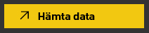
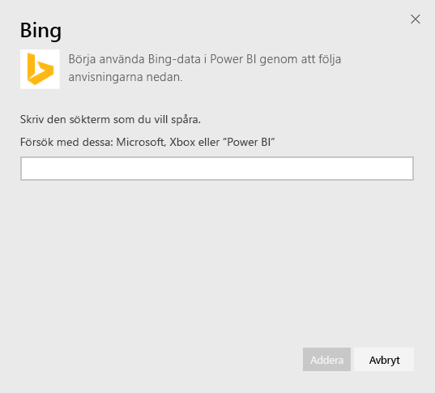
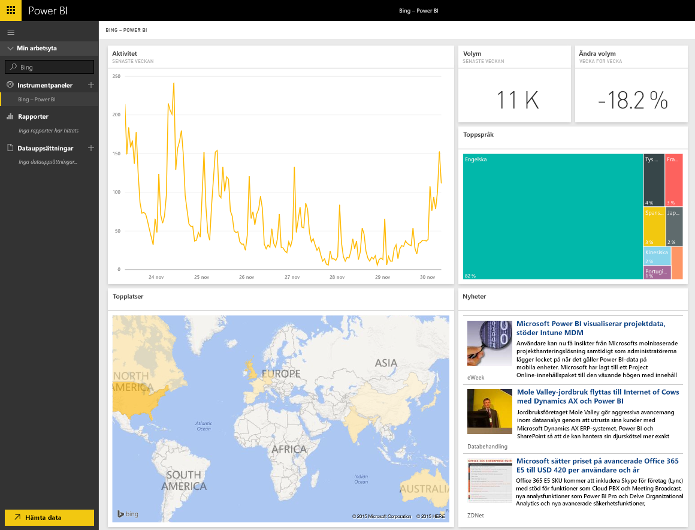

# Ansluta till Bing med Power BI
Med Bing-innehållspaketet kan du visa analyser av Internet-sökningsaktiviteter under en tidsperiod som du själv väljer.

Anslut till [Bing-innehållspaketet](https://app.powerbi.com/groups/me/getdata/services/bing) för Power BI.

>[!NOTE]
>Bing-paneler uppdateras automatiskt ungefär var femte minut och den enda panelen som kan väljas är Nyheter, som tar dig till motsvarande nyhetsartikel. 

>[!NOTE]
>Paneler från Bing-innehållspaketet återges inte i mobilapparna. Vi arbetar för att lösa problemet.

1. Välj **Hämta data** längst ned i det vänstra navigeringsfönstret.
   
    
2. I rutan **tjänster** väljer du **Hämta**.
   
    
3. Välj **Bing** > **Hämta**.
   
    
4. Ange det sökord som du vill spåra i dialogrutan Parametrar och klicka på Lägg till.
   
        
5. Till vänster visas en ny post i listan över instrumentpaneler, med Bing i namnet och den sökterm som du angav. Observera att det inte finns någon datauppsättning eller rapport associerad med den här instrumentpanelen. Panelerna kan ta lite tid att läsa in, men när det är klart visas en layout som liknar den nedan.
   
    

När inläsningen har slutförts kan du börja utforska dina data, inklusive fästa paneler från den här instrumentpanelen på andra instrumentpaneler i ditt konto.

