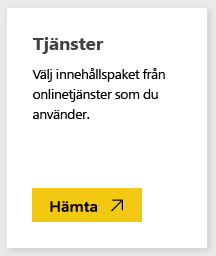
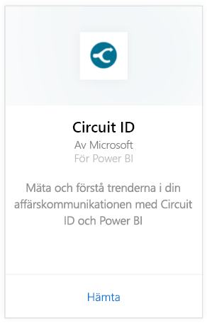
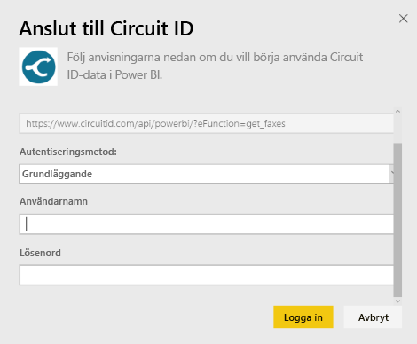
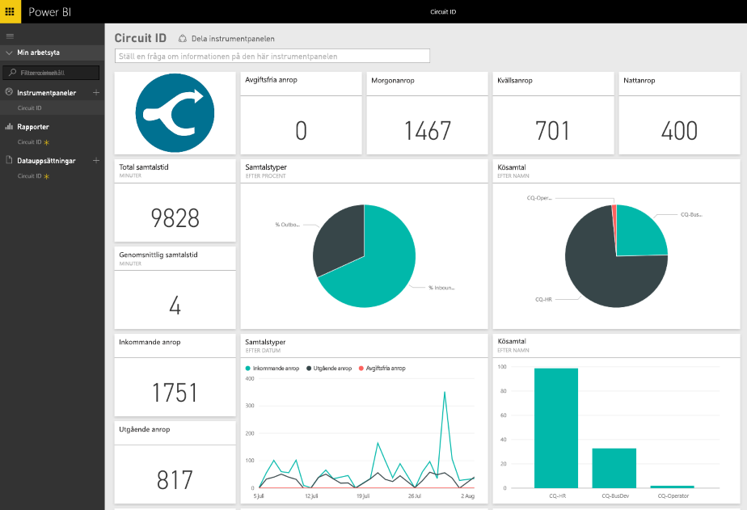

# Anslut till Circuit ID med Power BI
Det är enkelt att analysera dina kommunikationsdata från Circuit ID med Power BI. Power BI hämtar dina data och skapar sedan en standardinstrumentpanel och relaterade rapporter baserat på dessa data. När du har skapat anslutningen kan du utforska dina data och anpassa instrumentpanelen för att uppfylla dina behov. Data uppdateras automatiskt varje dag.

Anslut till [Circuit ID-innehållspaketet](https://app.powerbi.com/getdata/services/circuitid) för Power BI.

## Så här ansluter du
1. Välj **Hämta data** längst ned i det vänstra navigeringsfönstret.
   
    
2. I rutan **tjänster** väljer du **Hämta**.
   
    
3. Välj **Circuit ID** \> **hämta**.
   
    
4. Som autentiseringsmetod väljer du grundläggande och anger ditt användarnamn och lösenord. Tryck sedan på logga in.
   
    
5. När Power BI har importerat dessa data, visas en ny instrumentpanel, rapport och datauppsättning i det vänstra navigeringsfönstret. Nya objekt har markerats med en gul asterisk.
   
    

**Och sedan?**

* Prova att [ställa en fråga i rutan Frågor och svar](service-q-and-a.md) överst på instrumentpanelen
* [Ändra panelerna](service-dashboard-edit-tile.md) på instrumentpanelen.
* [Välj en panel](service-dashboard-tiles.md) för att öppna den underliggande rapporten.
* Även om din datauppsättning kommer att vara schemalagd att uppdateras dagligen, kan du ändra uppdateringsschemat eller uppdatera på begäran med **Uppdatera nu**

## Nästa steg
[Kom igång med Power BI](service-get-started.md)

[Hämta data för Power BI](service-get-data.md)

