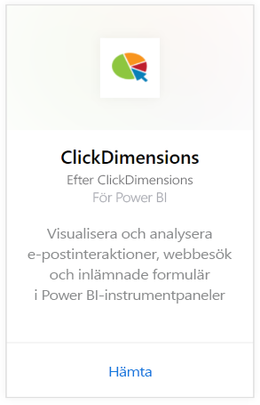
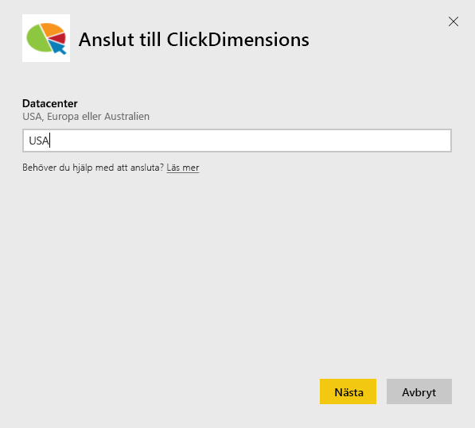
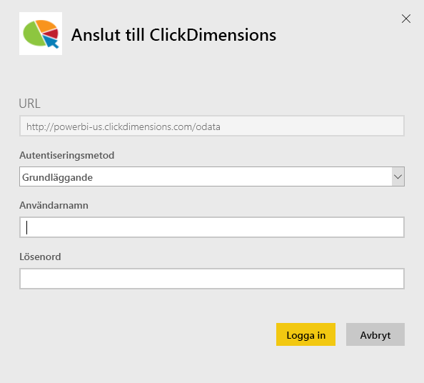
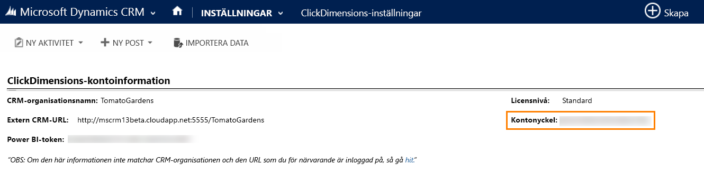
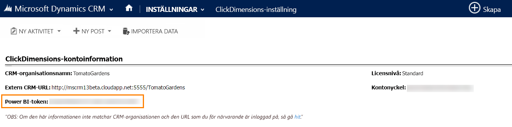

# Anslut till ClickDimensions med Power BI
ClickDimensions-innehållspaketet för Power BI låter användare använda marknadsföringsdata för ClickDimensions i Power BI, vilket ger hanteringsteam ytterligare insikter om sina försäljnings- och marknadsföringsaktiviteter. Visualisera och analysera e-postinteraktioner, webbesök och inlämnade formulär i Power BI-instrumentpaneler och rapporter.

Anslut till [ClickDimensions-innehållspaketet](https://app.powerbi.com/getdata/services/click-dimensions) för Power BI.

## Så här ansluter du
1. Välj **Hämta data** längst ned i det vänstra navigeringsfönstret.
   
   
2. I rutan **tjänster** väljer du **Hämta**.
   
   
3. Välj **ClickDimensions** \> **hämta**.
   
   
4. Ange platsen för ditt datacenter (USA, EU, eller AU) och välj **nästa**.
   
   
5. Som **autentiseringsmetod**, väljer du **grundläggande** \> **logga in**. När du uppmanas, anger du dina autentiseringsuppgifter för ClickDimensions. Se information i [sök efter de parametrarna](#FindingParams) nedan
   
    
6. Efter att du har godkänt startar importen automatiskt. När den är klar visas en ny instrumentpanel, rapport och modell i navigeringsfönstret. Välj instrumentpanelen för att visa dina importerade data.
   
     

**Och sedan?**

* Prova att [ställa en fråga i rutan Frågor och svar](consumer/end-user-q-and-a.md) överst på instrumentpanelen
* [Ändra panelerna](service-dashboard-edit-tile.md) på instrumentpanelen.
* [Välj en panel](consumer/end-user-tiles.md) för att öppna den underliggande rapporten.
* Medan din datauppsättning schemaläggs att uppdateras dagligen så kan du ändra uppdateringsfrekvensen eller testa att uppdatera den på begäran med **Uppdatera nu**

## Systemkrav
Om du vill ansluta till Power BI-innehållsapaketet, måste du ange det datacenter som motsvarar ditt konto och logga in med ditt ClickDimensions-konto. Om du är osäker på vilket datacenter du ska välja, kan du fråga din administratör.

## Hitta parametrar
Kontonyckeln hittar du i CRM-inställningar \> ClickDimensions-inställningar. Kopiera kontonyckeln från ClickDimensions-inställningarna och klistra in det i användarnamnsfältet.  

  

Kopiera Power BI-token från ClickDimensions-inställningarna och klistra in den i lösenordsfältet. Power BI-token hittar du i CRM-inställningar \> ClickDimensions-inställningar.  

  

## Nästa steg
[Kom igång i Power BI](service-get-started.md)

[Hämta data i Power BI](service-get-data.md)

