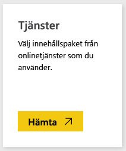
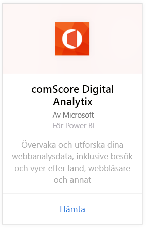
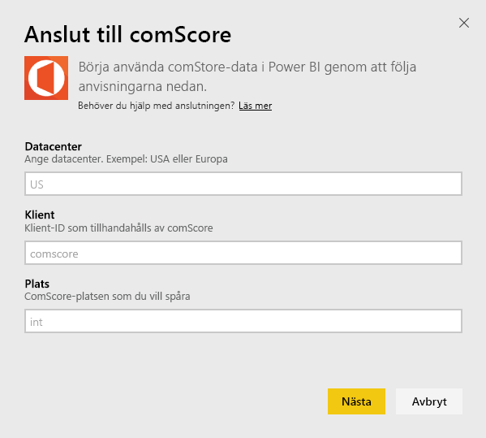
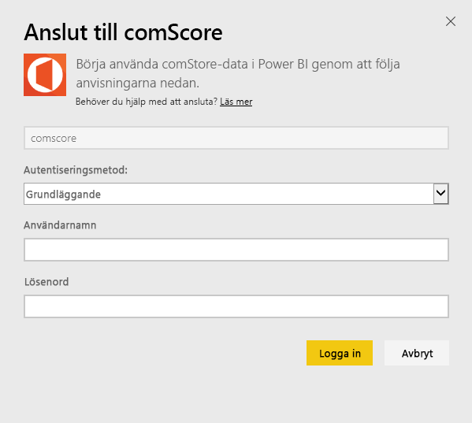
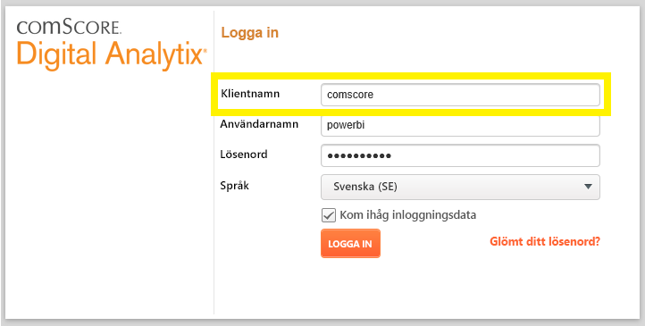
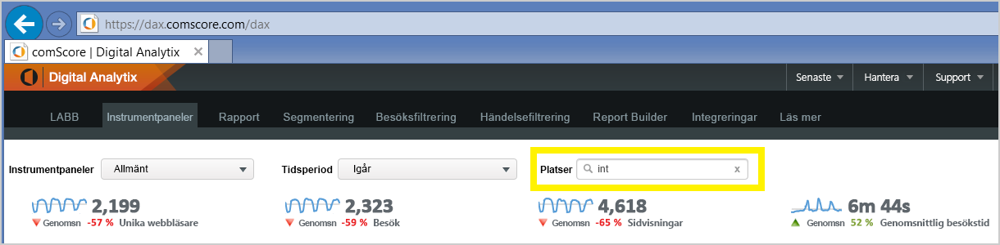

# Anslut till comScore Digital Analytix med Power BI
Visualisera och utforska dina comScore Digital Analytix-data i Power BI med Power BI-innehållspaketet. Data uppdateras automatiskt en gång per dag.

Anslut till [comScore-innehållspaketet för Power BI.](https://app.powerbi.com/getdata/services/comscore)

>[!NOTE]
>För att ansluta till innehållspaketet behöver du ett comScore DAx-användarkonto och ha comScore API-åtkomst. Mer [information](#Requirements) nedan.

## Så här ansluter du
1. Välj Hämta data längst ned i det vänstra navigeringsfönstret.
   
   
2. I rutan **tjänster** väljer du **Hämta**.
   
   
3. Välj **comScore Digital Analytix** \> **hämta**.
   
   
4. Ange datacenter, comScore klient-ID och plats som du vill ansluta till. Mer information om hur du hittar de här värdena finns i [hitta dina comScore-parametrar](#FindingParams) nedan.
   
   
5. Ange ditt användarnamn och lösenord för comScore för att fortsätta. Mer information om hur du hittar det här värdet finns nedan.
   
   
6. Importen startar automatiskt. När den är klar visas en ny instrumentpanel, rapport och modell i navigeringsfönstret. Välj instrumentpanelen för att visa dina importerade data.

**Och sedan?**

* Prova att [ställa en fråga i rutan Frågor och svar](consumer/end-user-q-and-a.md) överst på instrumentpanelen
* [Ändra panelerna](service-dashboard-edit-tile.md) på instrumentpanelen.
* [Välj en panel](consumer/end-user-tiles.md) för att öppna den underliggande rapporten.
* Medan din datauppsättning schemaläggs att uppdateras dagligen så kan du ändra uppdateringsfrekvensen eller testa att uppdatera den på begäran med **Uppdatera nu**

## Systemkrav
Ett comScore DAx-användarkonto och åtkomst till comScore DAx API krävs för att ansluta. Kontakta din comScore DAX-administratör för att bekräfta ditt konto.

## Hitta parametrar
Information om hur du hittar var och en av comScore-parametrarna finns nedan.

**Datacenter**

Datacentret som du ansluter till fastställs av den URL som du navigerar till i comScore.

 

**Klient**

Klienten är samma som du anger när du loggar in på comScore DAx.

 

**Plats**

ComScore-platsen anger vilken plats som du vill se data från. Du hittar listan över platser från ditt comScore-konto.

## Nästa steg
[Kom igång i Power BI](service-get-started.md)

[Hämta data i Power BI](service-get-data.md)

