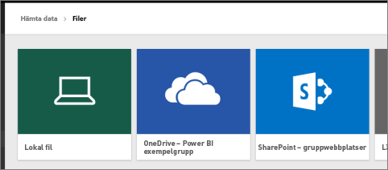
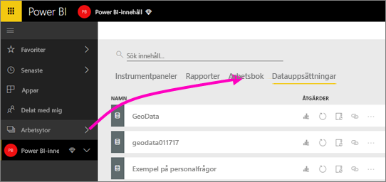
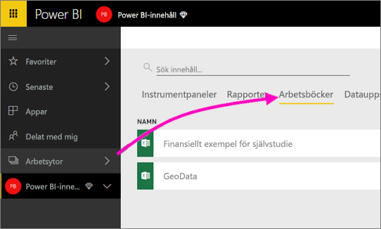

# Anslut till filer som lagras i OneDrive för din Power BI-apparbetsyta
När du har [skapat en apparbetsyta i Power BI](service-create-distribute-apps.md), kan du lagra dina Excel-, CSV-, och Power BI Desktop-filer på OneDrive för företag för din Power BI-apparbetsyta. Du kan fortsätta att uppdatera de filer som du lagrar i OneDrive och de uppdateringarna visas automatiskt i Power BI-rapporter och instrumentpaneler som baseras på filerna. 

Att lägga till filer i din apparbetsyta är en tvåstegsprocess: 

1. Först [laddar du upp filer till OneDrive för företag](service-connect-to-files-in-app-workspace-onedrive-for-business.md#1-upload-files-to-the-onedrive-for-business-for-your-app-workspace) för din apparbetsyta.
2. Sedan [ansluter du till dessa filer från Power BI](service-connect-to-files-in-app-workspace-onedrive-for-business.md#2-import-excel-files-as-datasets-or-as-excel-online-workbooks).

> [!NOTE]
> Apparbetsytor är bara tillgängliga med [Power BI Pro](service-free-vs-pro.md).
> 
> 

## 1 Ladda upp filer till OneDrive för företag för din apparbetsyta
1. I Power BI-tjänsten väljer du pilen bredvid Arbetsytor > och väljer ellipsen (**…**) bredvid namnet på din arbetsyta. 
   
   
2. Välj **filer** för att öppna OneDrive för företag för din apparbetsyta i Office 365.
   
   > [!NOTE]
   > Om du inte ser **filer** överst i menyn för apparbetsytan, väljer du **medlemmar** för att öppna OneDrive för företag för din apparbetsyta. Där väljer du **filer**. Office 365 ställer in en lagringsplats för OneDrive för din apps filer för grupparbetsytan. Den här processen kan ta lite tid. 
   > 
   > 
3. Här kan du överföra dina filer till OneDrive för företag för din apparbetsyta. Välj **överför**, och navigera till dina filer.
   
   

## 2 importera Excel-filer som datauppsättningar eller som Excel Online-arbetsböcker
Nu när dina filer finns i OneDrive för företag för din apparbetsyta, har du ett val. Du kan: 

* [Importera data från Excel-arbetsboken som en datauppsättning](service-get-data-from-files.md) och använda data för att skapa rapporter och instrumentpaneler som du kan visa i en webbläsare och på mobila enheter.
* Eller [ansluta till en hel Excel-arbetsbok i Power BI](service-excel-workbook-files.md) och visa den exakt som den visas i Excel Online.

### Importera eller anslut till filer i din app-arbetsyta
1. I Power BI växlar du till apparbetsytan så att apparbetsytans namn är i det övre vänstra hörnet i Power BI. 
2. Välj **Hämta data** längst ned i det vänstra navigeringsfönstret. 
   
   
3. I rutan **Filer** väljer du **Hämta**.
   
   
4. Välj **OneDrive** - *apparbetsytans namn*.
   
    
5. Välj den fil du vill > **ansluta**.
   
    Det är nu du väljer om du vill [importera data från Excel-arbetsboken](service-get-data-from-files.md), eller [ansluta till hela Excel-arbetsboken](service-excel-workbook-files.md).
6. Välj **importera** eller **anslut**.
   
    
7. Om du väljer **imporera** så visas arbetsboken i fliken **datauppsättningar**. 
   
    
   
    Om du väljer **anslut** så visas arbetsboken i fliken **arbetsböcker**.
   
    

## Nästa steg
* [Skapa appar och apparbetsytor i Power BI](service-create-distribute-apps.md)
* [Importera data från Excel-arbetsböcker](service-get-data-from-files.md)
* [Ansluta till hela Excel-arbetsböcker](service-excel-workbook-files.md)
* Har du fler frågor? [Försök med att fråga Power BI Community](http://community.powerbi.com/)
* Feedback? Besök [Power BI-idéer](https://ideas.powerbi.com/forums/265200-power-bi)

