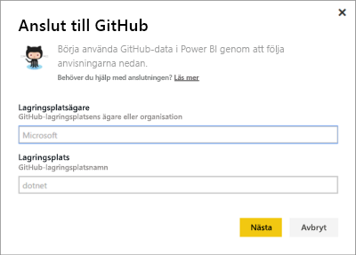
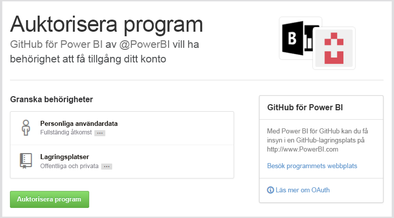
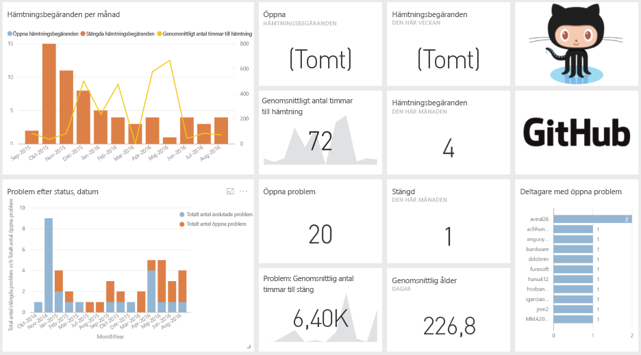
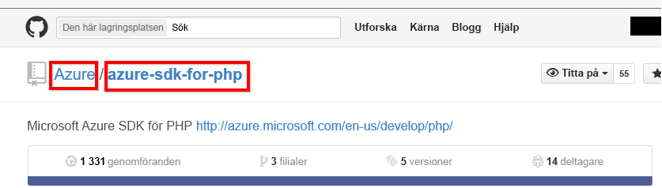

# Ansluta till GitHub med Power BI
Med GitHub-innehållspaketet för Power BI kan du få insikter om GitHub-lagringsplatsen med data för bidrag, problem, pull-begäranden och aktiva användare.

Anslut till [GitHub-innehållspaketet](https://app.powerbi.com/getdata/services/github) eller läs mer om [GitHub-integrering](https://powerbi.microsoft.com/integrations/github) med Power BI.

>[!NOTE]
>Innehållspaketet kräver att GitHub-kontot har åtkomst till lagringsplatsen. Mer information om kraven finns nedan.

## Så här ansluter du
1. Välj **Hämta data** längst ned i det vänstra navigeringsfönstret.
   
    
2. I rutan **Tjänster** väljer du **Hämta**.
   
    
3. Välj **GitHub** \> **Hämta**.
   
   
4. Ange lagringsplatsens namn och ägare. Se information om att [hitta parametrarna](#FindingParams) nedan.
   
   
5. Ange dina autentiseringsuppgifter för GitHub (det här steget kan hoppas över om du redan har loggat in med din webbläsare). 
6. Som **Autentiseringsmetod** väljer du **oAuth2** \> **Logga in**. 
7. Följ autentiseringsskärmarna i GitHub. Ge GitHub för Power BI-innehållspaketet behörighet till GitHub-data.
   
   
   
   Power BI ansluts till GitHub och Power BI får behörighet att ansluta till datan.  Data uppdateras en gång om dagen.
8. När du har anslutit till din lagringsplats importerar Power BI datan. Du ser en ny [GitHub-instrumentpanel](https://powerbi.microsoft.com/integrations/github), rapport och datauppsättning i det vänstra navigeringsfönstret. Nya objekt markeras med en gul asterisk \*.
   
   

**Och sedan?**

* Prova att [ställa en fråga i rutan Frågor och svar](power-bi-q-and-a.md) överst på instrumentpanelen
* [Ändra panelerna](service-dashboard-edit-tile.md) på instrumentpanelen.
* [Välj en panel](service-dashboard-tiles.md) för att öppna den underliggande rapporten.
* Även om din datauppsättning är schemalagd för att uppdateras dagligen, kan du ändra uppdateringsschemat eller försöka uppdatera den på begäran med **Uppdatera nu**.

## Vad ingår
Följande data finns tillgängliga från GitHub i Power BI:     

| Tabellnamn | Beskrivning |
| --- | --- |
| Bidrag |I bidragstabellen finns totalt antal tillägg, borttagningar och incheckningar som har godkänts av deltagaren, aggregerade per vecka. De 100 främsta deltagarna ingår. |
| Problem |En lista med alla problem för den valda lagringsplatsen med beräkningar som summa och genomsnittlig tid för att stänga ett problem, totalt antal öppna problem och totalt antal stängda problem. Den här tabellen är tom om det inte finns några problem med lagringsplatsen. |
| Pull-begäranden |Den här tabellen innehåller alla pull-begäranden för lagringsplatsen samt vem som hämtade begäran. Den innehåller också beräkningar för hur många öppna, stängda och totala pull-begäranden som finns, hur lång tid det tog för att hämta begärandena och hur lång tid det tog för en genomsnittlig pull-begäran. Den här tabellen är tom om det inte finns några problem med lagringsplatsen. |
| Användare |Tabellen innehåller en lista med GitHub-användare eller deltagare som har bidragit, arkiverat problem eller löst pull-begäranden för den valda lagringsplatsen. |
| Milstolpar |Den innehåller alla milstolpar för valda lagringsplatsen. |
| DateTable |Den här tabellen innehåller datum från i dag och för tidigare år för att du ska kunna analysera dina GitHub-data per datum. |
| ContributionPunchCard |Den här tabellen kan användas som ett stanskort för bidrag på den valda lagringsplatsen. Den visar incheckningar per veckodag och timme. Tabellen är inte ansluten till andra tabeller i modellen. |
| RepoDetails |Den här tabellen innehåller information om den valda lagringsplatsen. |

## Systemkrav
* GitHub-kontot som har åtkomst till lagringsplatsen.  
* Behörighet som beviljats till Power BI för GitHub-appen vid första inloggningen. Se nedan för information om att återkalla åtkomst.  
* Hur många tillräckliga API-anrop som finns tillgängliga för att hämta och uppdatera data.  

### Ta bort auktoriseringen för Power BI
Om du vill ta bort auktoriseringen för Power BI från att vara ansluten till GitHub-lagringsplatsen kan du återkalla åtkomsten i GitHub. Mer information finns i avsnittet [GitHub-hjälp](https://help.github.com/articles/keeping-your-ssh-keys-and-application-access-tokens-safe/#reviewing-your-authorized-applications-oauth).

## Hitta parametrar
Du kan se ägare och lagringsplats genom att titta på lagringsplatsen i själva GitHub:

Den första delen ”Azure” är ägare och den andra delen ”azure-sdk-for-php” är själva lagringsplatsen.  Du ser samma två objekt i URL-adressen för lagringsplatsen:

    <https://github.com/Azure/azure-sdk-for-php> .

## Felsökning
Om det behövs kan du verifiera dina autentiseringsuppgifter för GitHub.  

1. Gå till GitHub-webbplatsen i ett nytt webbläsarfönster och logga in på GitHub. Du ser att du är inloggad i det övre högra hörnet på GitHub-webbplatsen.    
2. I GitHub går du till webbadressen för den lagringsplats som du vill ha åtkomst till i Power BI. Till exempel: https://github.com/dotnet/corefx.  
3. Tillbaka i Power BI försöker du ansluta till GitHub. I dialogrutan Konfigurera GitHub använder du namnen på lagringsplatsen och lagringsplatsens ägare för samma lagringsplats.  

## Nästa steg
* [Kom igång med Power BI](service-get-started.md)
* [Hämta data](service-get-data.md)
