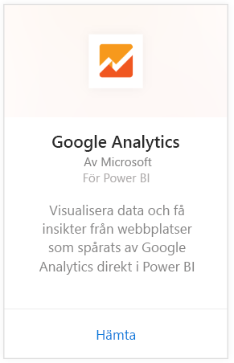
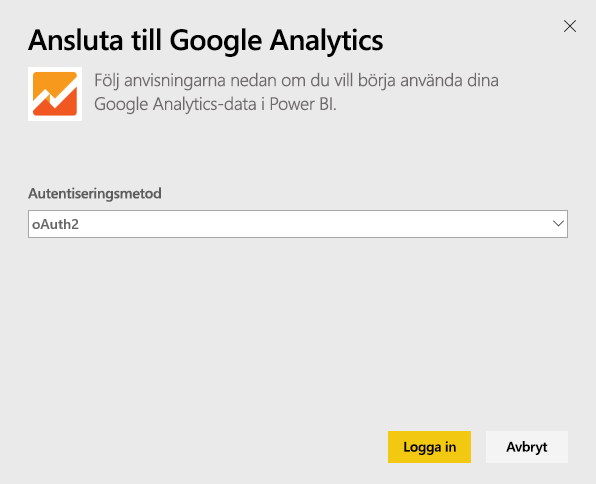
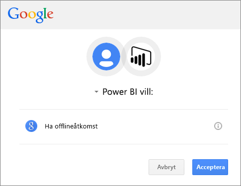
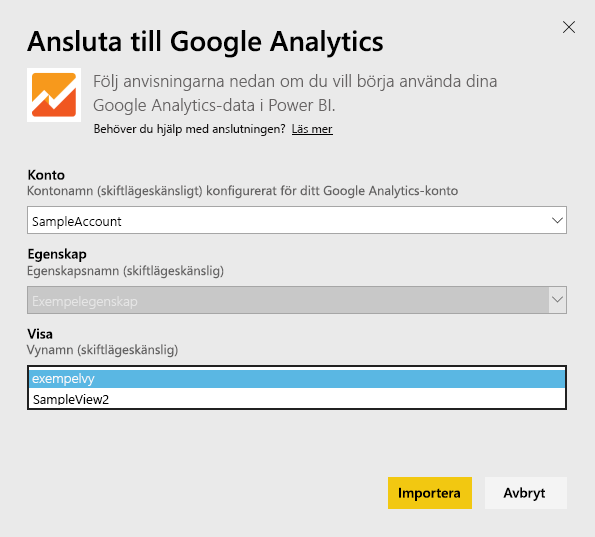
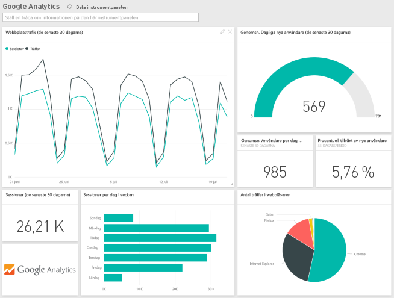
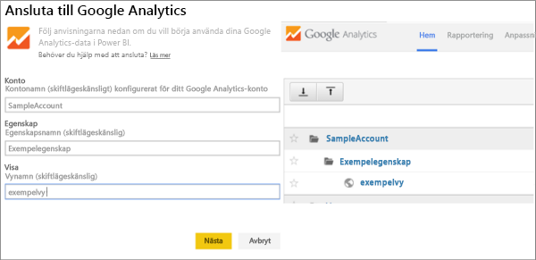

# Anslut till Google Analytics med Power BI
Anslut till Google Analytics via Power BI startar genom att ansluta till ditt Google Analytics-konto. Du får en Power BI-instrumentpanel och en uppsättning Power BI-rapporter som innehåller insikter om din webbplatstrafik och användardimensioner. Du kan interagera med instrumentpanelen och rapporterna, men du kan inte spara ändringarna. Data uppdateras automatiskt en gång per dag.

Anslut till [Google Analytics](https://app.powerbi.com/getdata/services/google-analytics) för Power BI. Läs mer om [Google Analytics-integrering](https://powerbi.microsoft.com/integrations/google-analytics) med Power BI.

Du kan skapa anpassade instrumentpaneler och rapporter genom att starta från [Google Analytics-anslutningsprogrammet](service-google-analytics-connector.md) i Power BI Desktop. Anslut bara till ditt Google Analytics-konto och skapa dina anpassade rapporter, som du kan publicera till Power BI-tjänsten.

## Så här ansluter du
[!INCLUDE [powerbi-service-apps-get-more-apps](./includes/powerbi-service-apps-get-more-apps.md)]

3. Välj **Google Analytics** \> **hämta**.
   
   
4. När du uppmanas, anger du dina Google Analytics-autentiseringsuppgifter. Välj **oAuth 2** som autentiseringsmetod och klicka på **Logga in**. Följ Google-autentiseringsflödet som kan innehålla tvåfaktorsautentisering om du har konfigurerat det.
   
   
5. Klicka på **acceptera** så att Power BI kommer åt dina Google Analytics-data.
   
   
6. Power BI ansluter till en specifik Google Analytics-vy. Välj kontonamn, egenskapsnamn och vynamn som du vill ansluta till. Den här informationen hittar du i ditt Google Analytics-konto, antingen överst till vänster eller på **Start**-fliken. Se information nedan. 
   
   
5. Klicka på **Anslut** för att starta importen. 

## Visa Google Analytics-instrumentpanelen och rapporter
[!INCLUDE [powerbi-service-apps-open-app](./includes/powerbi-service-apps-open-app.md)]

   

[!INCLUDE [powerbi-service-apps-open-app](./includes/powerbi-service-apps-what-now.md)]

## Systemkrav
För att ansluta från Power BI, måste du ha ett [Google Analytics](https://www.google.com/analytics/)-konto. Andra Google-konton som inte har ett Google Analytics-konto anslutet visas ett autentiseringsfel.

## Felsökning
**Autentiseringsuppgifter** om du har flera Google-konton, använder du en incognito eller ett in-private-webbläsarfönster vid anslutningen för att säkerställa att rätt konto används.

Om du får ett felmeddelande om att dina autentiseringsuppgifter är ogiltiga, men du kunde logga in på Google, bekräftar du att du har ett [Google Analytics](https://www.google.com/analytics/)-konto.

**Parametrarnas** unika namn krävs för närvarande för parametrarna. Om du ser ett fel om att det värdet du angett är en dubblett, väljer du ett annat värde eller ändrar namnen i Google Analytics för att göra dem unika. Vi arbetar aktivt med att förbättra det här.

>[!NOTE]
>Parametrar är skiftlägeskänsliga. Ange dem exakt som de visas i ditt Google Analytics-konto.

Har du fortfarande problem? Öppna ett supportärende för att nå Power BI-teamet:

* När du är i Power BI-appen, väljer du frågetecknet \> **kontakta supporten.**
* Från supportwebbplatsen för Power BI (där du läser den här artikeln) väljer du **Kontakta supporten** till höger på sidan.

## Nästa steg
* [Vad är appar i Power BI?](service-create-distribute-apps.md)
* [Hämta data i Power BI](service-get-data.md)
* Har du fler frågor? [Fråga Power BI Community](http://community.powerbi.com/)

