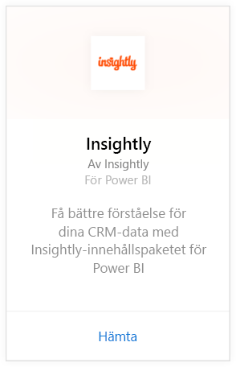
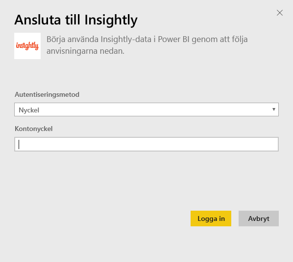
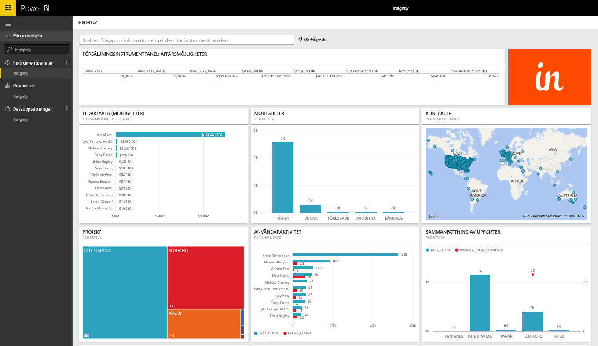
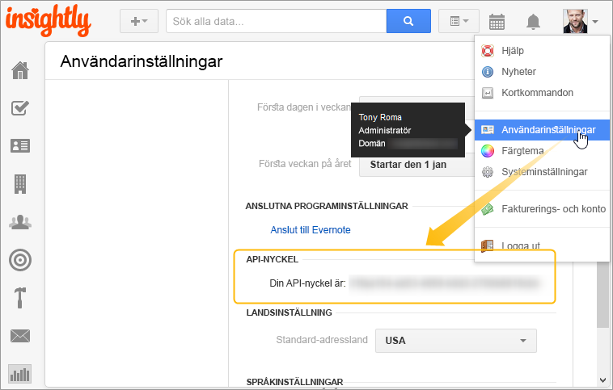

# Ansluta till Insightly med Power BI
Visualisera och dela dina Insightly CRM-data i Power BI med innehållspaketet för Insightly. Anslut till Power BI med din Insightly API-nyckel för att visa och skapa rapporter och instrumentpaneler från dina CRM-data. Med Power BI kan du analysera dina data på nya sätt, skapa kraftfulla diagram och grafer och visa kontakter, leads och organisationer på en karta.

Anslut till [Insightly-innehållspaket](https://app.powerbi.com/getdata/services/insightly) för Power BI.

## Så här ansluter du
1. Välj **Hämta data** längst ned i det vänstra navigeringsfönstret.
   
   
2. I rutan **Tjänster** väljer du **Hämta**.
   
   
3. Välj **Insightly** \> **Hämta**.
   
   
4. Välj **Nyckel** som autentiseringstyp och ange din Insightly-API-nyckel. Välj sedan **Logga In**. Mer information om hur du [hittar det](#FindingParams) nedan.
   
   
5. Efter att du har godkänt startar importen automatiskt. När den är klar visas en ny instrumentpanel, rapport och modell i navigeringsfönstret. Välj instrumentpanelen för att visa dina importerade data.
   
     

**Och sedan?**

* Prova att [ställa en fråga i rutan Frågor och svar](consumer/end-user-q-and-a.md) överst på instrumentpanelen
* [Ändra panelerna](service-dashboard-edit-tile.md) på instrumentpanelen.
* [Välj en panel](consumer/end-user-tiles.md) för att öppna den underliggande rapporten.
* Medan din datauppsättning schemaläggs att uppdateras dagligen så kan du ändra uppdateringsfrekvensen eller testa att uppdatera den på begäran med **Uppdatera nu**

## Det här ingår
Innehållspaketet innehåller följande tabeller med fält från motsvarande poster:

| Tabeller |  |  |  |
| --- | --- | --- | --- |
| Kontakter |Möjligheter |Pipeline-stadier |Uppgift slutförd datum |
| Anpassade fält |Slutdatum för affärsmöjlighet |Projektet slutfört datum |Uppgifter |
| Händelser |Prognosdatum för affärsmöjlighet |Projekt |Team/medlemmar |
| Leads |Organisationer |Tags |Användare |

Många tabeller och rapporter innehåller även unika beräknade fält, exempelvis:  

* Tabeller med ”grupperade” slutdatum för möjlighetsprognos, verkliga slutdatum för möjligheter, datum för projektets slutförande och datum för uppgifters slutförande enligt månad, kvartal eller år.  
* Ett viktat värdefält för möjligheter (möjlighetsvärde * sannolikheten för vinst).  
* Fält för genomsnittlig och total varaktighet för uppgifter baserat på start- och slutdatum.  
* Rapporter med beräknade fält för affärsmöjligheternas vinstfrekvens (antal vunna/antal totala affärsmöjligheter) och vinstvärde (värdet vunna/värdet för totalt antal affärsmöjligheter).  

## Systemkrav
Ett Insightly-konto med åtkomst till Insightly API krävs. Synlighetsbehörigheter kommer att baseras på API-nyckeln som används för att upprätta en anslutning till Power BI. Alla Insightly-poster som du kan visa kommer att vara synliga i Power BI-rapporter och instrumentpaneler som du delar med andra.

## Hitta parametrar
**API-nyckel**

Kopiera API-nyckeln från Insightly genom att markera Användarinställningar från Insightly-profilmenyn och rulla ned. Den här teckensträngen används för att ansluta dina data till Power BI.

## Felsökning
Data importeras via Insightly API, som innehåller en daglig gräns baserat på ditt Insightly-abonnemang. Gränserna anges i avsnittet om hastighetsbegränsning/begränsningsbegäran i vår API-dokumentation: https://api.insight.ly/v2.2/Help#!/Overview/Introduction#ratelimit

De angivna rapporterna använder standardfält från Insightly och innehåller kanske inte dina anpassningar. Redigera rapporten för att visa alla tillgängliga fält.

## Nästa steg
[Kom igång i Power BI](service-get-started.md)

[Hämta data i Power BI](service-get-data.md)

