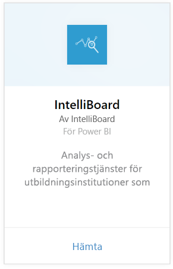
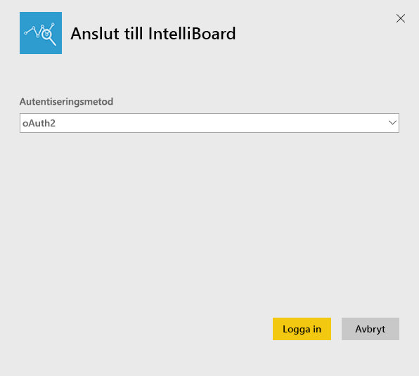
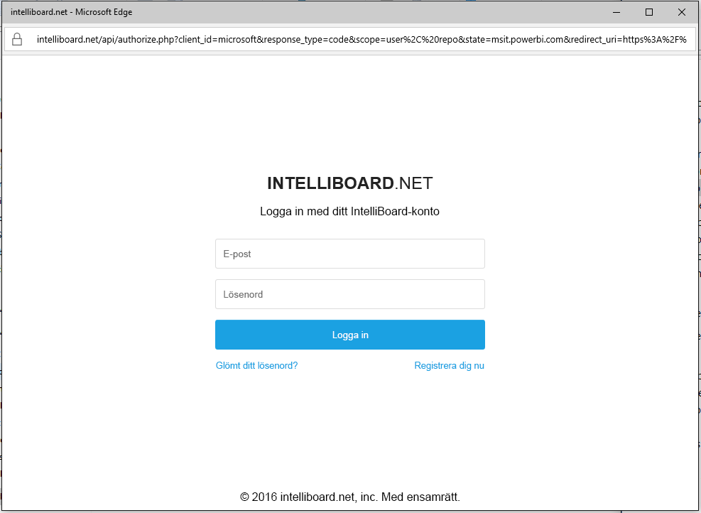
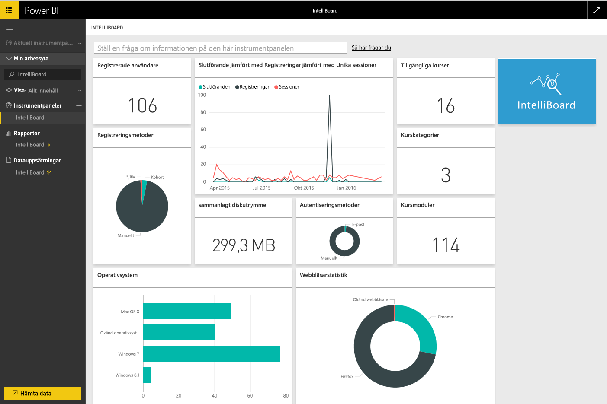

# Anslut till IntelliBoard med Power BI
IntelliBoard erbjuder en förenklad åtkomst till dina Moodle learning management system-data via Reporting Services. IntelliBoard-innehållspaketet för Power BI erbjuder ytterligare analys, inklusive mått på dina kurser, registrerade användare, övergripande prestanda och din LMS-aktivitet.

Anslut till [IntelliBoard-innehållspaketet](https://app.powerbi.com/getdata/services/intelliboard) för Power BI.

## Så här ansluter du
1. Välj **Hämta data** längst ned i det vänstra navigeringsfönstret.  
   
    
2. I rutan **tjänster** väljer du **Hämta**.  
   
    
3. Välj **IntelliBoard**och välj sedan **hämta**.  
   
    
4. Välj **OAuth 2** och sedan **Logga in**. När du uppmanas, anger du dina autentiseringsuppgifter för IntelliBoard.
   
    
   
    
5. När du är ansluten kommer en instrumentpanel, rapport och datauppsättning automatiskt att läsas in. När du är klar, uppdateras panelerna med data från ditt IntelliBoard-konto.
   
    

**Och sedan?**

* Prova att [ställa en fråga i rutan Frågor och svar](consumer/end-user-q-and-a.md) överst på instrumentpanelen
* [Ändra panelerna](service-dashboard-edit-tile.md) på instrumentpanelen.
* [Välj en panel](consumer/end-user-tiles.md) för att öppna den underliggande rapporten.
* Medan din datauppsättning schemaläggs att uppdateras dagligen så kan du ändra uppdateringsfrekvensen eller testa att uppdatera den på begäran med **Uppdatera nu**

## Det här ingår
Innehållspaketet inkluderar data från följande tabeller:  

    - Aktivitet  
    - Agenter  
    - Författare  
    - Länder  
    - CoursesProgress  
    - Registreringar
    - Språk  
    - Plattform  
    - Summor  
    - UsersProgress    

## Systemkrav
Ett IntelliBoard-konto med behörigheter till ovanstående tabeller krävs för att skapa en instans av det här innehållspaketet.

## Nästa steg
[Vad är Power BI?](power-bi-overview.md)

[Power BI – grundläggande begrepp](consumer/end-user-basic-concepts.md)

