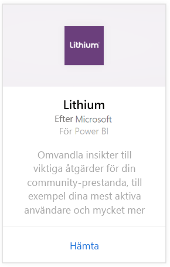
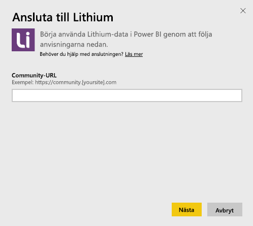
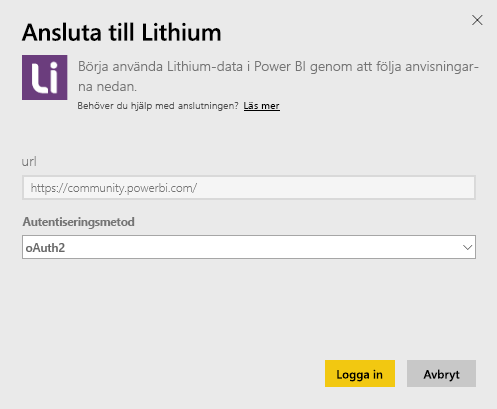
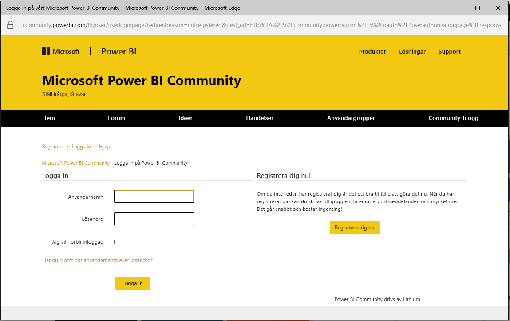
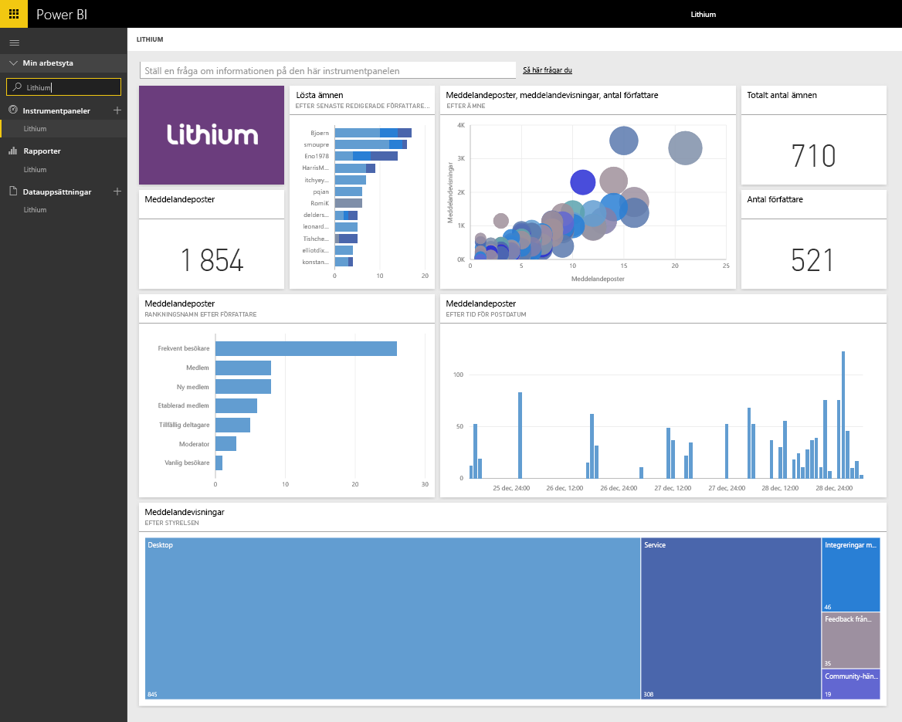

# Ansluta till Lithium med Power BI
Lithium skapar betrodda relationer mellan världens bästa varumärken och deras kunder och hjälper användarna att få svar och dela sina erfarenheter. Genom att ansluta Lithium-innehållspaketet till Power BI kan du mäta viktiga mått rörande din online-community för att öka försäljningen, minska tjänstekostnaderna och öka lojaliteten. 

Anslut till [Lithium-innehållspaketet](https://app.powerbi.com/getdata/services/lithium) för Power BI.

>[!NOTE]
>Power BI-innehållspaketet använder Lithiums API. Långa anrop till API:n kan resultera i ytterligare avgifter från Lithium. Kontrollera detta med din Lithium-administratör.

## Så här ansluter du
1. Välj **Hämta data** längst ned i det vänstra navigeringsfönstret.
   
    
2. I rutan **tjänster** väljer du **Hämta**.
   
    
3. Välj **Lithium** \> **Hämta**.
   
   
4. Ange URL:en till din Lithium-community. Den är i formen *https://community.yoursite.com* .
   
   
5. När du uppmanas till det anger du dina Lithium-autentiseringsuppgifter. Välj **oAuth 2** som autentiseringsmekanism och klicka på **Logga in** och följ autentiseringsflödet i Lithium.
   
   
   
   
6. När inloggningsflödet har slutförts startar importprocessen. När den är klar visas en ny instrumentpanel, rapport och modell i navigeringsfönstret. Välj instrumentpanelen för att visa dina importerade data.
   
    

**Och sedan?**

* Prova att [ställa en fråga i rutan Frågor och svar](consumer/end-user-q-and-a.md) överst på instrumentpanelen
* [Ändra panelerna](service-dashboard-edit-tile.md) på instrumentpanelen.
* [Välj en panel](consumer/end-user-tiles.md) för att öppna den underliggande rapporten.
* Medan din datauppsättning schemaläggs att uppdateras dagligen så kan du ändra uppdateringsfrekvensen eller testa att uppdatera den på begäran med **Uppdatera nu**

## Systemkrav
Lithium-innehållspaketet kräver en Lithium-community av v15.9 eller senare. Stäm av med din Lithium-administratör för att bekräfta versionen.

## Nästa steg
[Vad är Power BI?](power-bi-overview.md)

[Power BI – grundläggande begrepp](consumer/end-user-basic-concepts.md)

