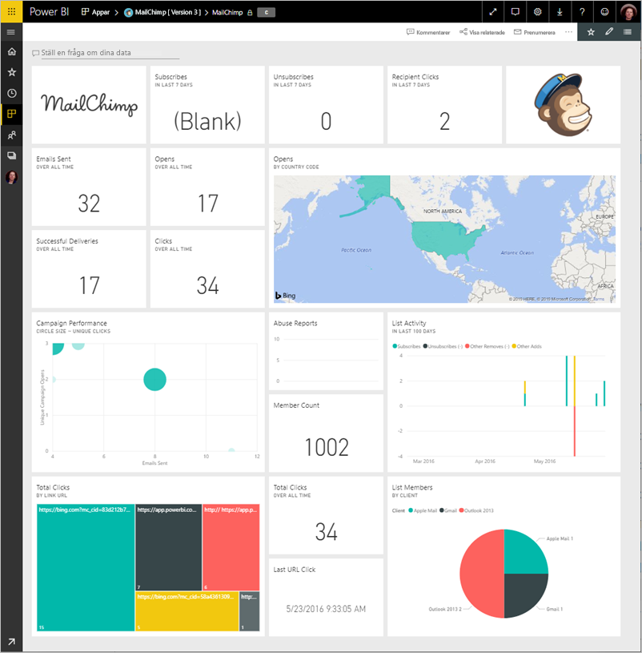
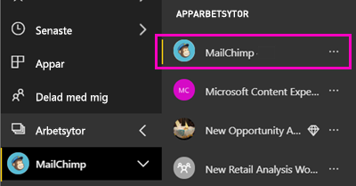
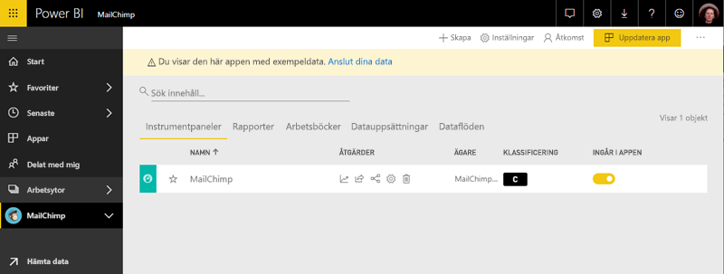

# Ansluta till MailChimp med Power BI
Den här artikeln beskriver hur du hämtar data från ditt MailChimp-konto med en mall för Power BI-appen. Appen mallen genererar en arbetsyta med en instrumentpanel, en rapportuppsättning och en datauppsättning för att utforska dina MailChimp-data. Dra in analyser för att skapa [MailChimp-instrumentpaneler](https://powerbi.microsoft.com/integrations/mailchimp) och snabbt identifiera trender för dina kampanjer, rapporter och enskilda prenumeranter. Dessa data uppdateras dagligen, se till att de data som du övervakar är uppdaterade.

När du har installerat appen mall, kan du ändra instrumentpanelen och rapporterna. Du kan sedan distribuera den som en app till kollegor i din organisation.

Ansluta till den [MailChimp mallapp](https://app.powerbi.com/getdata/services/mailchimp) för Power BI.

## Så här ansluter du

[!INCLUDE [powerbi-service-apps-get-more-apps](./includes/powerbi-service-apps-get-more-apps.md)]

3. Välj **MailChimp** \> **Hämta nu**.
4. I **installera den här Power BI-appen?** Välj **installera**.
4. I den **appar** väljer den **MailChimp** panelen.

    

6. I **Kom igång med din nya app**väljer **Anslut data**.

    

1. Som Autentiseringsmetod väljer du **oAuth2** \> **Logga in**.
   
    När du uppmanas till det anger du autentiseringsuppgifter för MailChimp och följer autentiseringsprocessen.
   
    Första gången du ansluter, uppmanas du att ge Power BI skrivskyddad åtkomst till ditt konto. Klicka på **tillåt** för att starta importen. Det kan ta några minuter beroende på mängden data i ditt konto.
   
    

5. När Power BI har importerat data, öppnas MailChimp-instrumentpanel.
   
    

## Ändra och distribuera din app

Du har installerat appen MailChimp-mall. Det innebär att du har också skapat MailChimp app-arbetsytan. I arbetsytan kan du ändra rapporten och instrumentpanelen och sedan distribuera den som en *app* till kollegor i din organisation. 

1. Om du vill visa hela innehållet i den nya MailChimp-arbetsytan i det vänstra navigeringsfältet, väljer **arbetsytor** > **MailChimp**. 

    

    Den här vyn är listan med innehåll för arbetsytan. I det övre högra hörnet ser du **uppdatera app**. När du är redo att distribuera appen till dina kollegor, är det där du börjar.

    

2. Välj **rapporter** och **datauppsättningar** så att andra element på arbetsytan. 

    Läs mer om [distribuera appar](service-create-distribute-apps.md) till dina kollegor.

## Nästa steg

* [Skapa nya arbetsytor i Power BI](service-create-the-new-workspaces.md)
* [Installera och använda appar i Power BI](consumer/end-user-apps.md)
* [Power BI-appar för externa tjänster](service-connect-to-services.md)
* Har du några frågor? [Fråga Power BI Community](http://community.powerbi.com/)

