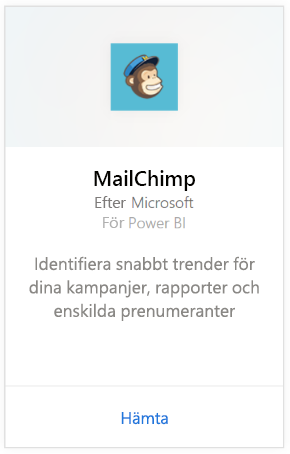
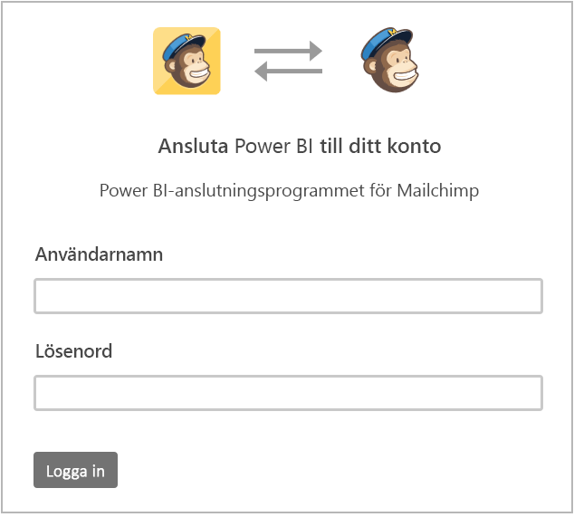
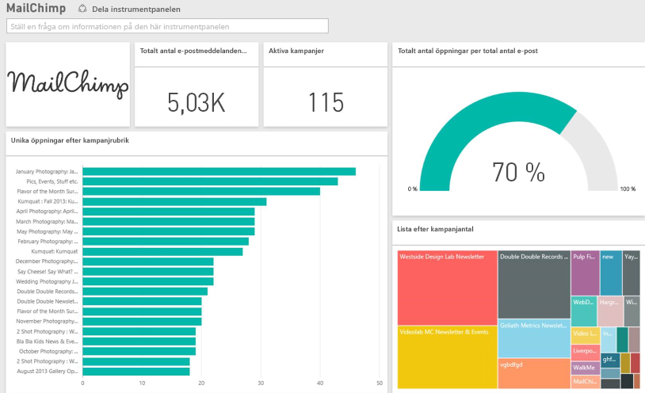

# Ansluta till MailChimp med Power BI
Power BI-innehållspaket hämtar data från ditt MailChimp-konto och genererar en instrumentpanel, en uppsättning rapporter och en datauppsättning för att utforska dina data. Dra in analyser för att skapa [MailChimp-instrumentpaneler](https://powerbi.microsoft.com/integrations/mailchimp) och snabbt identifiera trender för dina kampanjer, rapporter och enskilda prenumeranter. Data har ställts in till att uppdateras varje dag för att säkerställa att de data som du övervakar är uppdaterade.

Anslut till [MailChimp-innehållspaket](https://app.powerbi.com/getdata/services/mailchimp) för Power BI.

## Så här ansluter du
1. Välj **Hämta data** längst ned i det vänstra navigeringsfönstret.
   
    
2. I rutan **tjänster** väljer du **Hämta**.
   
   
3. Välj **MailChimp** \> **Hämta**.
   
   
4. Som Autentiseringsmetod väljer du **oAuth2** \> **Logga in**.
   
    När du uppmanas till det anger du autentiseringsuppgifter för MailChimp och följer autentiseringsprocessen.
   
    Första gången du ansluter uppmanas du att ge Power BI skrivskyddad åtkomst till ditt konto. Välj **Tillåt** för att starta importen, vilket kan ta några minuter beroende på mängden data i ditt konto.
   
    
5. När Power BI har importerat dessa data, visas en ny instrumentpanel, rapport och datauppsättning i det vänstra navigeringsfönstret. Detta är standardinstrumentpanelen som skapas i Power BI för att visa dina data. Du kan ändra den här instrumentpanelen för att visa dina data på det sätt som du vill.
   
   

**Och sedan?**

* Prova att [ställa en fråga i rutan Frågor och svar](service-q-and-a.md) överst på instrumentpanelen
* [Ändra panelerna](service-dashboard-edit-tile.md) på instrumentpanelen.
* [Välj en panel](service-dashboard-tiles.md) för att öppna den underliggande rapporten.
* Även om din datauppsättning kommer att vara schemalagd att uppdateras dagligen, kan du ändra uppdateringsschemat eller uppdatera på begäran med **Uppdatera nu**

## Nästa steg
[Kom igång med Power BI](service-get-started.md)

[Power BI – grundläggande begrepp](service-basic-concepts.md)

