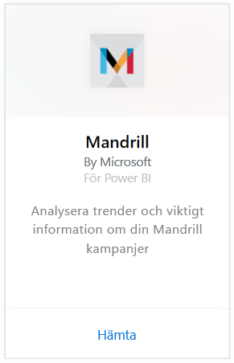
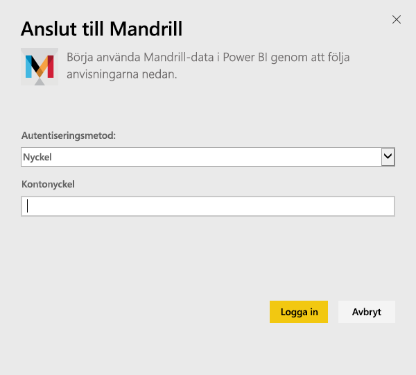

# Anslut till Mandrill med Power BI
Power BI-innehållspaketet hämtar data från ditt Mandrill-konto och genererar en instrumentpanel, en uppsättning rapporter och en datauppsättning för att utforska dina data. Använd Mandrills analys för att snabbt få insikter om ditt nyhetsbrev eller din marknadsföringskampanj. Data har ställts in att uppdateras varje dag för att säkerställa att de data som du övervakar är uppdaterade.

[!INCLUDE [include-short-name](./includes/service-deprecate-content-packs.md)]

Anslut till [Mandrill-innehållspaketet för Power BI.](http://app.powerbi.com/getdata/services/mandrill)

## Så här ansluter du
1. Välj **Hämta data** längst ned i det vänstra navigeringsfönstret.
   
    
2. I rutan **tjänster** väljer du **Hämta**.
   
    
3. Välj **Mandrill** > **hämta**.
   
    
4. Som **autentiseringsmetod**, väljer du **nyckel** och anger din API-nyckel. Du hittar nyckeln på fliken **inställningar** på Mandrill-instrumentpanelen. Välj **logga in** för att starta importen, vilket kan ta några minuter beroende på mängden data i ditt konto.
   
    
5. När Power BI har importerat dessa data, visas en ny instrumentpanel, rapport och datauppsättning i det vänstra navigeringsfönstret. Det här är standardinstrumentpanelen som Power BI skapade för att visa dina data.
   
    

**Och sedan?**

* Prova att [ställa en fråga i rutan Frågor och svar](consumer/end-user-q-and-a.md) överst på instrumentpanelen
* [Ändra panelerna](service-dashboard-edit-tile.md) på instrumentpanelen.
* [Välj en panel](consumer/end-user-tiles.md) för att öppna den underliggande rapporten.
* Medan din datauppsättning schemaläggs att uppdateras dagligen så kan du ändra uppdateringsfrekvensen eller testa att uppdatera den på begäran med **Uppdatera nu**

## Nästa steg
[Vad är Power BI?](fundamentals/power-bi-overview.md)

[Grundläggande begrepp för designers i Power BI-tjänsten](service-basic-concepts.md)

