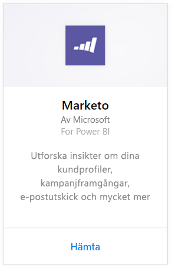
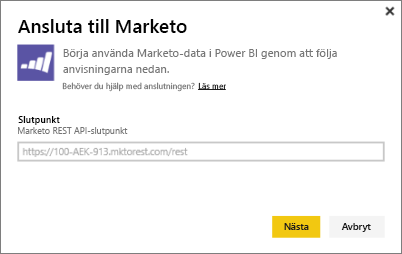
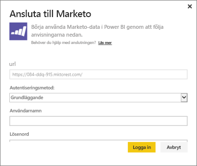
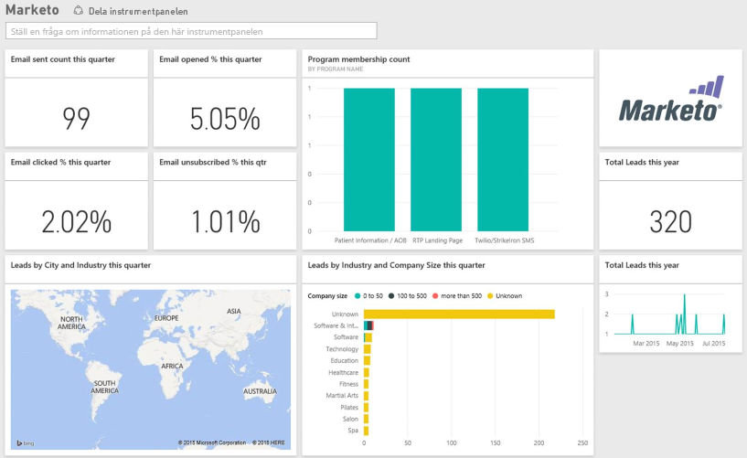

# Anslut till Marketo med Power BI
Power BI-innehållspaketet för Marketo ger dig insikter om ditt Marketo-konto med data om leads och deras aktiviteter. När du skapar den här anslutningen så hämtas dina data och du får automatiskt en instrumentpanel och rapporter baserade på dem.

Anslut till [Marketo-innehållspaketet](https://app.powerbi.com/getdata/services/marketo) för Power BI.

## Så här ansluter du
1. Välj **Hämta data** längst ned i det vänstra navigeringsfönstret.
   
   
2. I rutan **tjänster** väljer du **Hämta**.
   
    
3. Välj **Marketo** \> **hämta**.
   
   
4. Ange den Marketo REST-slutpunkt som du fått av Marketo eller din Marketo-administratör och välj nästa.
   
   
   
   Läs mer om Marketo REST-slutpunkten: [http://developers.marketo.com/documentation/rest/endpoint-url/ ](http://developers.marketo.com/documentation/rest/endpoint-url/).
5. Med hjälp av den **grundläggande** autentiseringsmetoden, anger du klient-ID som **användarnamn** och klienthemlighet som **lösenord**. Klient-ID:t och klienthemligheten finns tillgängliga i Marketo eller från din marketo-administratör ([http://developers.marketo.com/documentation/rest/custom-service/](http://developers.marketo.com/documentation/rest/custom-service/)). 
   
   
   
   Det här ger innehållspaketet *Marketo för Power BI* åtkomst till dina [Marketo-analys](https://powerbi.microsoft.com/integrations/marketo)data och låter dig analysera data i Power BI. Data uppdateras en gång om dagen.
6. När du har anslutit till ditt Marketo-konto, laddas en instrumentpanel med alla dina data:
   
   

**Och sedan?**

* Prova att [ställa en fråga i rutan Frågor och svar](consumer/end-user-q-and-a.md) överst på instrumentpanelen
* [Ändra panelerna](service-dashboard-edit-tile.md) på instrumentpanelen.
* [Välj en panel](consumer/end-user-tiles.md) för att öppna den underliggande rapporten.
* Medan din datauppsättning schemaläggs att uppdateras dagligen så kan du ändra uppdateringsfrekvensen eller testa att uppdatera den på begäran med **Uppdatera nu**

## Det här ingår
Följande data finns tillgängliga från Marketo i Power BI där aktiviteten inträffade mellan dagens datum och ett år sedan:

| Tabellnamn | Beskrivning |
| --- | --- |
| EmailActivities |Data om e-postmeddelandet som skickades till leads/kontakter, med information om enheter, kategorier, antal returnerade och procent, antal klickade och procent, antal öppnade och procent samt programnamn. E-postaktiviteterna som de visas i Power BI är en absolut levererbarhetsrapport för e-post, den tillämpar ingen ytterligare logik för data. Du kan se olika resultat mellan Marketo-klienten och Power BI på grund av detta. |
| ProgramActivites |Data om program som har fått en ändring av status. Detta omfattar information som: orsak, lyckat, antal programförvärv och procent samt antal lyckade program och procent. |
| WebPageActivities |Data från användarens webbsidebesök inkluderar sökagent, användaragent, webbsida och tidpunkt. |
| Datumtabell |Datum från idag och det senaste året.  Låter dig analysera dina Marketo-data efter datum. |
| Leads |Lead-information, till exempel företag, intäktsstorlek, antal anställda, land, bransch, leadpoäng och leadstatus. Leads hämtas baserat på deras närvaro i e-postmeddelandet, programmet och aktivitetsdata för webbsidan. |

Alla datum är i UTC. Datumen kan variera beroende på vilken tidszon ditt konto är i (ungefär som det visas i Marketo-klienten)

## Systemkrav
* Det Marketo-konto du använder för att ansluta har behörighet att komma åt leads och aktiviteter.
* Tillräckliga API-anrop finns tillgängliga för att ansluta till data.  Marketo har ett API för varje konto.  När gränsen har uppnåtts kan du inte läsa in data i Power BI. 

**Information om API-begränsning**

Import av data från Marketo använder sig av Marketo API:er. Varje Marketo-kund har högst 10 000 API-anrop per dag som delas mellan alla program som använder Marketo API:erna. Du kan använda API:erna för andra integreringar samt för Power BI-integration. Mer information om API:erna finns på: <http://developers.marketo.com/documentation/rest/>.

Mängden API-anrop som Power BI gör till Marketo beror på mängden data i ditt Marketo-konto. Power BI importerar alla leads och aktiviteter för det senaste året. Här är ett exempel på data från Marketo och mängden API-anrop som används av Power BI när du importerar:  

| Datatyp | Antal rader | API-anrop |
| --- | --- | --- |
| Leads-information |15 000 |50 |
| E-postaktiviteter |150 000 |1 000 |
| Programaktiviteter |15 000 |100 |
| Webbaktiviteter |150 000 |1 000 |
| Programändringar |7 500 |50 |
| **Totalt antal API-anrop** | |**2 200** |

## Nästa steg
[Vad är Power BI?](power-bi-overview.md)

[Hämta data för Power BI](service-get-data.md)

[Power BI-bloggen: övervaka och analysera dina Marketo-data med Power BI](http://blogs.msdn.com/b/powerbi/archive/2015/03/19/monitor-and-analyze-your-marketo-data-with-power-bi.aspx)

