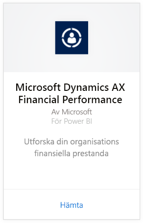
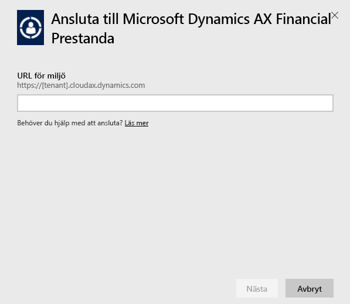
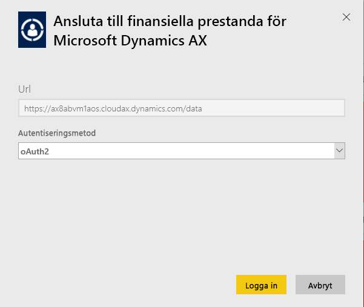
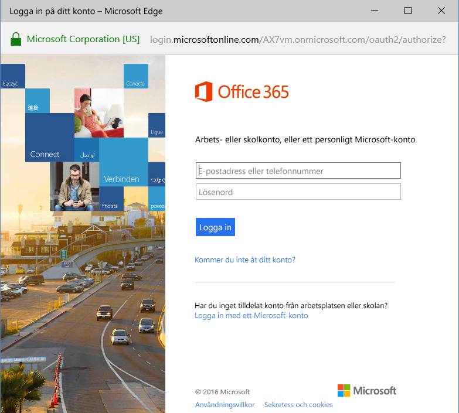
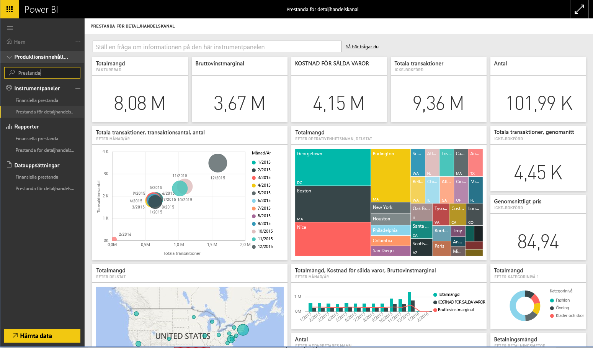

# Ansluta till Microsoft Dynamics AX-innehållspaket med Power BI
Microsoft Dynamics AX har tre Power BI-innehållspaket som vänder sig till olika företagsanvändare. Innehållspaketet Ekonomiska prestanda är speciellt avsett för ekonomichefer och ger insikter om organisationens ekonomiska resultat. Innehållspaketet Butikskanalprestanda är avsett för kanalhanterare med fokus på försäljningsresultat som vill kunna förutsäga trender och få insikter direkt från detaljhandelsdata. Innehållspaketet Kostnadshantering är utformat för verksamhets- och ekonomichefer och innehåller information om verksamhetens resultat.

Anslut till Microsoft Dynamics AX-innehållspaketet [Butikskanalprestanda](https://app.powerbi.com/getdata/services/dynamics-ax-retail-channel-performance), [Ekonomiska prestanda](https://app.powerbi.com/getdata/services/dynamics-ax-financial-performance) eller [Kostnadshantering](https://app.powerbi.com/getdata/services/dynamics-ax-cost-management) för Power BI.

## Så här ansluter du
1. Välj **Hämta data** längst ned i det vänstra navigeringsfönstret.
   
   
2. I rutan **Tjänster** väljer du **Hämta**.
   
   
3. Välj ett av Dynamics AX-innehållspaketen och välj **Hämta**.
   
   
4. Ange webbadressen till din Dynamics AX 7-miljö. Se information om att [söka efter de här parametrarna](#FindingParams) nedan.
   
   
5. Som **Autentiseringsmetod** väljer du **oAuth2** \> **Logga in**. När du uppmanas till det anger du dina Dynamics AX-autentiseringsuppgifter.
   
    
   
    
6. Efter att du har godkänt startar importen automatiskt. När den är klar visas en ny instrumentpanel, rapport och modell i navigeringsfönstret. Välj instrumentpanelen för att visa dina importerade data.
   
     

**Och sedan?**

* Prova att [ställa en fråga i rutan Frågor och svar](power-bi-q-and-a.md) överst på instrumentpanelen
* [Ändra panelerna](service-dashboard-edit-tile.md) på instrumentpanelen.
* [Välj en panel](service-dashboard-tiles.md) för att öppna den underliggande rapporten.
* Även om din datauppsättning är schemalagd för att uppdateras dagligen, kan du ändra uppdateringsschemat eller försöka uppdatera den på begäran med **Uppdatera nu**.

## Vad ingår
Innehållspaketet använder Dynamics AX 7 OData-flödet för att importera data som rör Butikskanalprestanda, Ekonomiska prestanda och Kostnadshantering.

## Systemkrav
Det här innehållspaketet kräver en URL för Dynamics AX 7-miljön och användaren måste ha åtkomst till OData-flödet.

## Hitta parametrar

Dynamics AX 7-miljöns URL finns i webbläsaren när användaren loggar in. Kopiera helt enkelt webbadressen för rotens Dynamics AX-miljö till Power BI-dialogrutan.

## Felsökning
Det kan ta en stund att läsa in alla data beroende på hur stor instans du har. Om det uppstår tomma rapporter i Power BI, kontrollerar du att du har åtkomst till de OData-tabeller som krävs för rapporterna.

## Nästa steg
[Kom igång i Power BI](service-get-started.md)

[Hämta data i Power BI](service-get-data.md)

