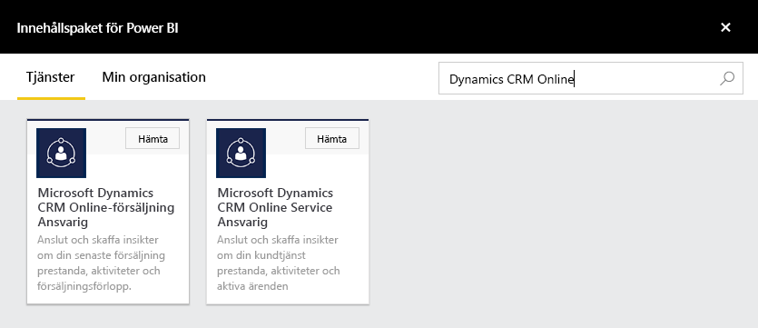
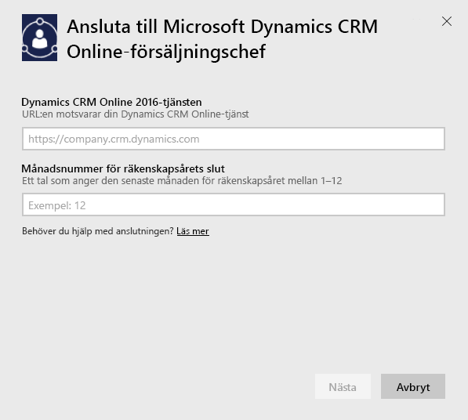
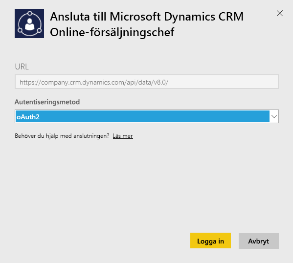
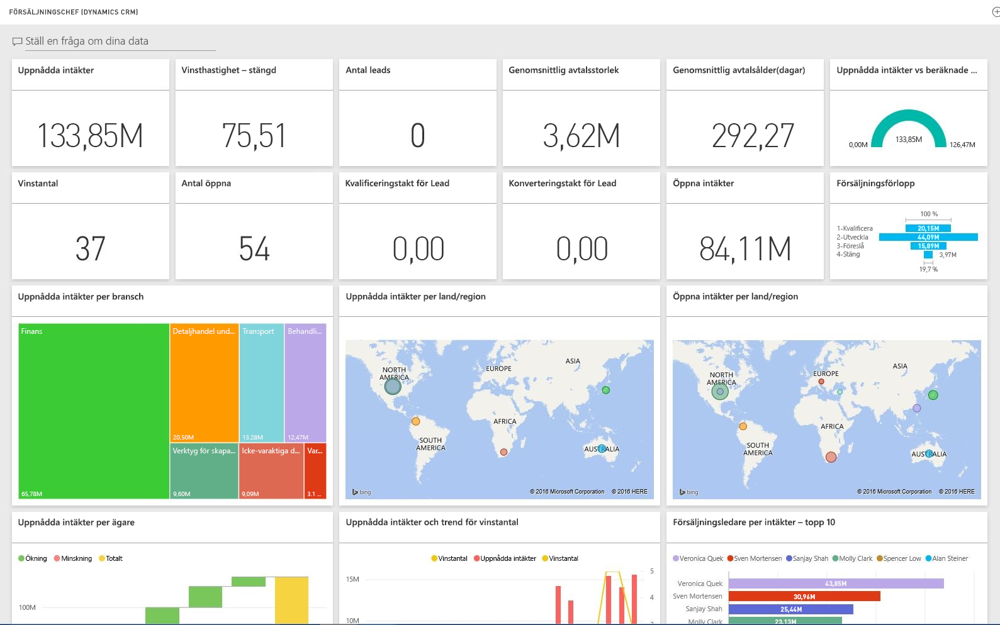

# Ansluta till Microsoft Dynamics CRM med Power BI
Med Microsoft Dynamics CRM Online för Power BI kan du enkelt komma åt och analysera dina data. Power BI använder OData-feeden för att skapa en beskrivande modell, med alla entiteter och åtgärder som behövs som Konton, Aktiviteter, Affärsmöjligheter, Produkt, Leads, Användare och annat. När du har installerat appen kan du visa instrumentpanelen och rapporterna i Power BI-tjänsten ([https://powerbi.com](https://powerbi.com)) och i Power BI-mobilapparna. 

Anslut till Dynamics CRM Online [Säljchef](https://msit.powerbi.com/groups/me/getdata/services/dynamics-crm-sales-manager) eller [Servicechef](https://msit.powerbi.com/groups/me/getdata/services/dynamics-crm-customer-service). Läs mer om [Dynamics CRM Online-integrering](https://powerbi.microsoft.com/integrations/microsoft-dynamicscrm) med Power BI.

Den här anslutningen kräver **Microsoft Dynamics CRM Online 2016 eller senare**. Mer information om [kraven](#Requirements) finns nedan.

## Så här ansluter du
[!INCLUDE [powerbi-service-apps-get-more-apps](./includes/powerbi-service-apps-get-more-apps.md)]

1. Välj **Microsoft Dynamics CRM Säljchef** eller **Microsoft Dynamics CRM Servicechef** och klicka på **Anslut**.
   
   
2. Ange den tjänst-URL som är kopplad till ditt konto.  Den är i formatet `https://company.crm.dynamics.com`, se mer information [nedan](#FindingParams).
   
   
3. Ange dina autentiseringsuppgifter när du tillfrågas (det här steget kan hoppas över om du redan har loggat in med din webbläsare). Som autentiseringsmetod anger du **oAuth2** och klickar på **Logga in**:
   
   
4. Efter anslutningen ser du en instrumentpanel som är anpassad för en försäljningschef eller en servicechef som är ifylld med dina egna data:
   
   

## Visa Microsoft Dynamics CRM-instrumentpanelen och -rapporterna
[!INCLUDE [powerbi-service-apps-open-app](./includes/powerbi-service-apps-open-app.md)]

[!INCLUDE [powerbi-service-apps-open-app](./includes/powerbi-service-apps-what-now.md)]

## Det här ingår
Avsnitten nedan innehåller information om vad som ingår för personerna [försäljningschef](#Sales) och [servicechef](#Service).

Observera att data dessutom begränsas baserat på den säkerhetsroll som tilldelats Dynamics CRM Online-användaren.

Instrumentpanelen och rapporterna är avsedda att erbjuda verksamhetsrapportering om närtidsdata med fokus på ett team eller en grupp. Varje fråga är begränsad för att hämta högst 100 000 poster från Dynamics CRM Online. Om den här gränsen överskrids på grund av hög datavolym i din organisation, misslyckas etableringen eftersom datauppdateringen av Dynamics CRM Online avslutas. Om ditt konto är för stort bör du överväga att ansluta till Power BI Desktop för att skapa en anpassad lösning.

### Säljchef
Instrumentpanelen och rapporterna innehåller nyckelvärden som  

* uppnådda intäkter   
* vinstgrad   
* öppna intäkter   
* förlorade intäkter   
* förväntat resultat  
* genomsnittlig avtalsstorlek och mycket mer.  

De innehåller också viktiga diagram som  

* trender för uppnådda och förlorade intäkter, trender för uppnådda intäkter jämfört med beräknade intäkter  
* uppnådda intäkter efter olika faktorer som bransch, region och territorium   
* försäljningsledare efter intäkter, aktiviteter   
* de främsta kontona, de främsta vunna/förlorade affärerna    
* trender för nya leads, försäljningsförlopp och mycket mer.   

Dessa mått och diagram hjälper till att öka förståelsen för säljorganisationens prestationer och analysera försäljningsförloppet för hela försäljningsteamet.

I följande tabell visas de CRM-entiteter som är tillgängliga för den här tjänsten och här ges även information om de filter som används för varje entitetspost.

| CRM-entitet | Använda filter |
| --- | --- |
| Konto |Alla konton som har relaterade affärsmöjligheter och som har ändrats under de senaste 365 dagarna |
| Aktivitet |Alla aktiviteter som har ändrats under de senaste 90 dagarna   [modifiedon] > idag – 90 dagar |
| Affärsenhet |Alla affärsenheter som inte är inaktiverade   [isdisabled] = falskt |
| Lead |Alla leads som har ändrats under de senaste 180 dagarna   [modifiedon] > idag – 180 dagar |
| Affärsmöjlighet |Alla affärsmöjligheter som ändrats under de senaste 365 dagarna   [modifiedon] > idag – 365 dagar |
| Produkt i affärsmöjlighet |Alla produkter i affärsmöjligheter som ändrats under de senaste 365 dagarna   [modifiedon] > idag – 365 dagar |
| Produkt |Alla aktiva produkter   [statecode] <> 1 |
| Territorium |Alla territorier |
| Användare |Alla aktiva användare och ej delegerade administratörer    [isdisabled] = falskt och [accessmode] <> 4 |

### Servicechef
Dessa instrumentpaneler och rapporter innehålla nyckelvärden som:  

* CSAT-procentsats   
* Uppfylld procentsats för tjänstenivåavtal   
* Eskalerade ärenden i procent   
* Genomsnittlig handläggningstid   
* Totalt antal stängda ärenden  
* Totalt antal aktiva ärenden  
* Antal gånger som KB-artikel använts i ärenden och mycket annat.    

De innehåller också viktiga diagram som:   

* Ärendevolymtrender för inkommande ärenden, antal stängda ärenden, eskalerade ärenden   
* Ärendevolym efter olika mått som ursprung, plats, prioritet och typ  
* Ledande efter CSAT-procentsats, uppfylld procentsats för tjänstenivåavtal, aktiviteter, stängda ärenden  
* Mest använda och mest visade KB-artiklar och mycket mer.  
   Dessa mått och diagram ökar förståelsen för din supportorganisations arbete och analyserar arbetsbelastningen för aktiva ärenden i serviceteamet och i serviceköerna.

I följande tabell visas de CRM-entiteter som är tillgängliga för den här tjänsten samt information om de filter som används för varje entitetspost.

| CRM-entitet | Använda filter |
| --- | --- |
| Konto |Alla konton som har relaterade ärenden som har ändrats under de senaste 90 dagarna |
| Aktivitet |Alla aktiviteter som har ändrats under de senaste 90 dagarna   [modifiedon] > idag – 90 dagar |
| Ärende |Alla ärenden som har ändrats under de senaste 90 dagarna   [modifiedon] > idag – 90 dagar |
| Ärendestängningsaktivitet |All ärendestängningsaktivitet som har ändrats under de senaste 90 dagarna   [modifiedon] > idag – 90 dagar |
| Kontakt |Alla kontakter som har relaterade ärenden som har ändrats under de senaste 90 dagarna. |
| Kunskapsartikel |Alla de senaste versionerna av kunskapsartiklar    [islatestversion] = sant |
| Kunskapsartikelincident |Alla kunskapsartikelincidenter som har ändrats under de senaste 90 dagarna   [modifiedon] > idag – 90 dagar |
| Kö |Alla aktiva köer    [statecode] = 0 |
| Köobjekt |Alla ärenderelaterade köobjekt som skapats de senaste 365 dagarna    [createdon] > idag – 365 dagar och   [objecttypecode] = 112 |
| Användare |Alla aktiva användare    [isdisabled] = falskt |

## Systemkrav
* En giltig Dynamics CRM Online 2016-instans, eller senare instans (Power BI fungerar inte med en lokal CRM-version). Om du inte har 2016 eller senare:
* En administratör måste aktivera OData-slutpunkten i platsinställningarna.
* Ett konto med mindre än 100 000 poster i någon av tabellerna. Observera att om kontot har åtkomst till fler än 100 000 poster, kommer importen att misslyckas.

## Hitta parametrar
Adressen till instansen kan hittas i webbläsarens URL-fält. Den har normalt formatet: `https://[instance_name].crm.dynamics.com`.

Power BI stöder endast Dynamics CRM 2016-slutpunkter. Anslutningen fungerar inte med tidigare versioner av CRM Online. Använd Power BI Desktop för att ansluta direkt till ditt konto.

## Felsökning
Om du har problem med att ansluta, bekräfta  

* att du etablerar rätt instans-URL (kontrollera med administratören)  
* att instansen är CRM Online 2016  
* att OData-slutpunkten är aktiverad.  

Prova också att ansluta direkt i Power BI Desktop med OData-URL `https://[instance_name].crm.dynamics.com/api/data/v8.0/`.

Om du bekräftar att du har Dynamics CRM Online 2016 men fortsätter att råka ut för problem när du försöker ansluta, ska du kontakta din CRM-administratör för att bekräfta att du har alla tillgängliga uppdateringar.

Om du inte har CRM Online 2016 eller senare, kan du använda Power BI Desktop för att ansluta direkt till ditt konto.

Om du ser ett fel om att ”datauppdateringen misslyckades eftersom en fråga överskred den maximala gränsen på 100 000 poster” kan du ansluta direkt från Power BI Desktop eller utnyttja CRM-lösningsmallen.

## Nästa steg
* [Vad är appar i Power BI?](service-install-use-apps.md)
* [Hämta data i Power BI](service-get-data.md)
* Har du fler frågor? [Fråga Power BI Community](http://community.powerbi.com/)

