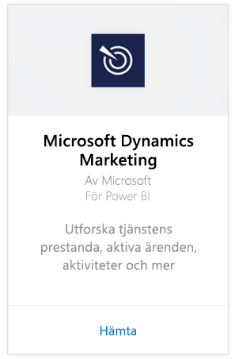
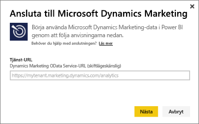
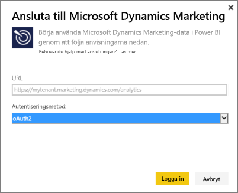
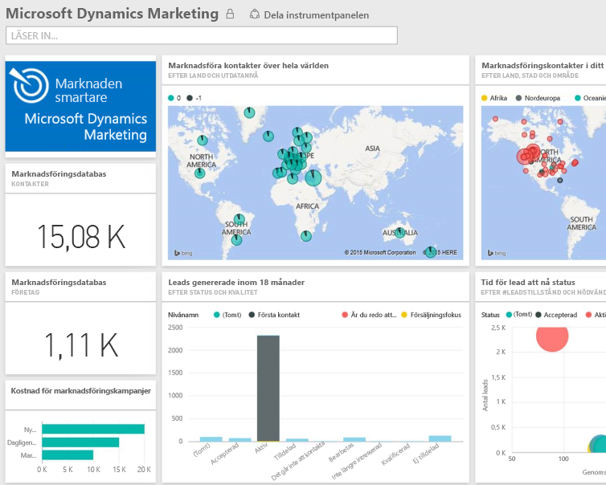

# Anslut till Microsoft Dynamics Marketing med Power BI
Innehållspaketet Microsoft Dynamics Marketing för Power BI låter dig enkelt komma åt och analysera dina data från Dynamics Marketing. Innehållspaketet använder sig av en beskrivande modell ovanpå OData-flödet, med alla enheter och mått som behövs, till exempel program, kampanjer, marknadsföringskontakter och företag, leads, lead-interaktioner och lead-bedömning, marknadsföringsmail och webbplatser, beteendeobservationer, budgetar, finansiella transaktioner, prestanda-KPI:er och mycket mer. 

Anslut till [Innehållspaketet Dynamics Marketing](https://app.powerbi.com/getdata/services/microsoft-dynamics-marketing) för Power BI.

>[!NOTE]
>Du måste ange en giltig OData-URL för en Dynamics Marketing-instans (innehållspaketet fungerar inte med en lokal CRM-version). Se ytterligare krav nedan.

## Så här ansluter du
1. Välj Hämta data längst ned i det vänstra navigeringsfönstret.
   
    
2. I rutan **tjänster** väljer du **Hämta**.
   
    
3. Välj **Microsoft Dynamics Marketing** \> **Hämta**.
   
   
4. Ange den OData-URL som är kopplad till ditt konto.  Detta ska vara i formatet https://[instans\_namn].marketing.dynamics.com/analytics.
   
   
5. Ange dina autentiseringsuppgifter när du tillfrågas (det här steget kan hoppas över om du redan har loggat in med din webbläsare). Som autentiseringsmetod anger du **oAuth2** och klickar på **logga in**:
   
   
6. Efter du ansluter, ser du en Dynamics Marketing-instrumentpanel ifylld med dina egna data. De gula asteriskerna visar de nya objekten i det vänstra navigeringsfönstret.
   
   

**Och sedan?**

* Prova att [ställa en fråga i rutan Frågor och svar](power-bi-q-and-a.md) överst på instrumentpanelen
* [Ändra panelerna](service-dashboard-edit-tile.md) på instrumentpanelen.
* [Välj en panel](service-dashboard-tiles.md) för att öppna den underliggande rapporten.
* Även om din datauppsättning är schemalagd för att uppdateras dagligen, kan du ändra uppdateringsschemat eller försöka uppdatera den på begäran med **Uppdatera nu**.

## Systemkrav
* Du måste ange en giltig OData-URL för en Dynamics Marketing-instans (innehållspaketet fungerar inte med en lokal CRM-version).  
* En administratör måste aktivera OData-slutpunkten i platsinställningarna. Adressen för OData-slutpunkten kan hittas genom att gå till **Start \> inställningar \> platsinställningar** i avsnittet **organisationens datatjänst**.  OData-URL:en ska vara i formatet https://[instans\_namn].marketing.dynamics.com/analytics  
* Användarkontot/-identiteten som du använder för att komma åt Microsoft Dynamics Marketing måste vara samma som den du registrerat dig för att använda med Power BI. När du loggar in på Microsoft Dynamics Marketing, kommer du att loggas in automatiskt med samma identitet som du använder för Power BI. Om du vill logga in på Microsoft Dynamics Marketing med ett annat konto, registrera dig som en Power BI-användare med det andra kontot. Vi hoppas att lösa det här problemet i en kommande version.   

## Felsökning
Om du ser ett meddelande om inloggning misslyckades när du försöker ansluta till ditt Dynamics CRM-konto, kontrollerar du att du loggar in på Power BI med samma konto som du använder för att komma åt CRM Online OData-flödet. Försök logga in på flödet på din webbläsare också för att testa där.

Be din administratör att bekräfta OData-URL:en och att OData-slutpunkten är aktiverad.

Kontrollera vilken version av Dynamics Marketing du använder – det fanns ytterligare korrigeringar som gjorts i 18.0 och 18.1. Om du fortfarande påträffar problem och har en äldre version, bör du överväga att uppgradera.

Om du fortfarande har problem, öppna ett supportärende för att nå Power BI-teamet:

* När du är i Power BI-appen, väljer du frågetecknet \> **kontakta supporten**.
* Från supportwebbplatsen för Power BI (där du läser den här artikeln) väljer du **Kontakta supporten** till höger på sidan.

## Nästa steg
[Hämta data för Power BI](service-get-data.md)

[Vad är Power BI?](power-bi-overview.md)

