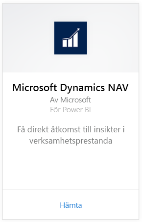
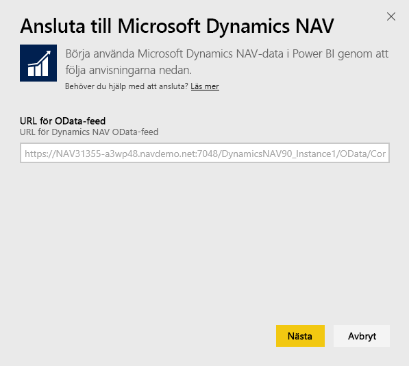
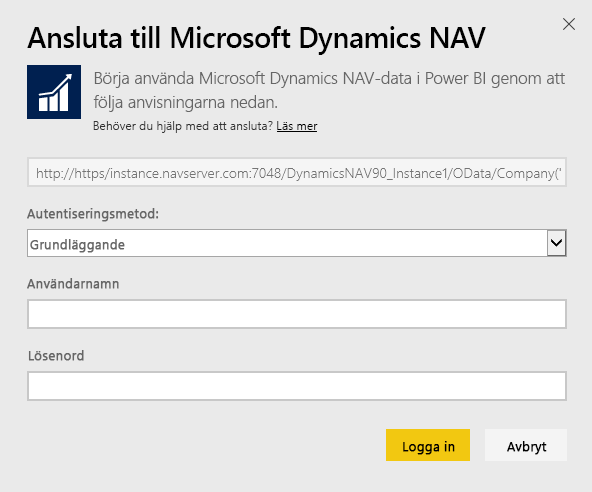
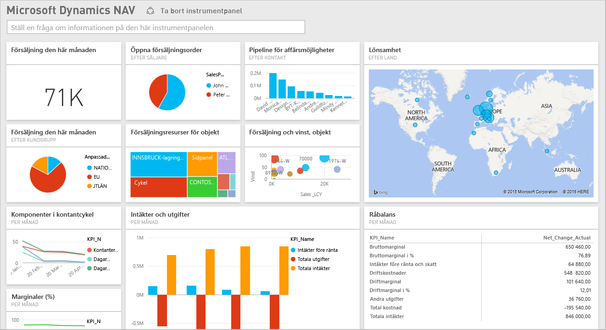

# Ansluta till Microsoft Dynamics NAV med Power BI
Att få insikter i dina data med Microsoft Dynamics NAV är enkelt med Power BI. Power BI hämtar dina data, både försäljning och ekonomi, och skapar sedan en app med en instrumentpanel och rapporter baserade på dessa data. Power BI behöver dina behörigheter till de tabeller data hämtas från, i det här fallet försäljnings- och ekonomirelaterade data. Mer information om kraven finns nedan. När du har installerat appen kan du visa instrumentpanelen och rapporterna i Power BI-tjänsten ([https://powerbi.com](https://powerbi.com)) och i Power BI-mobilapparna. 

[Anslut till Microsoft Dynamics NAV för Power BI](https://app.powerbi.com/getdata/services/microsoft-dynamics-nav) eller läs mer om [Dynamics NAV-integrering](https://powerbi.microsoft.com/integrations/microsoft-dynamics-nav) med Power BI.

## Så här ansluter du
[!INCLUDE [powerbi-service-apps-get-more-apps](./includes/powerbi-service-apps-get-more-apps.md)]

1. Välj först **Microsoft Dynamics NAV**och sedan **Hämta**.  
   
2. Ange din Microsoft Dynamics NAV OData-URL när du uppmanas till detta. URL:en ska matcha följande mönster:
   
    `https//instance.navserver.com:7048/DynamicsNAV90_Instance1/OData/Company('CRONUS%20International%20Ltd.')`
   
   * ”instance.navserver.com” med ditt NAV-servernamn
   * ”DynamicsNAV90\_Instance1” med namnet på din NAV-serverinstans
   * ”Company('CRONUS%20International%20Ltd.')” med NAV-företagets namn
     
     Ett enkelt sätt att hämta denna URL är att gå till Webbtjänster i Dynamics NAV, söka efter powerbifinance-webbtjänsten och kopiera OData-URL:en, men utelämna ”/powerbifinance” från URL-strängen.  
     
3. Välj **Basic** och ange dina autentiseringsuppgifter för Microsoft Dynamics NAV.
   
    Du behöver administratörsautentiseringsuppgifter (eller åtminstone behörigheter till försäljning och ekonomi) för ditt Microsoft Dynamics NAV-konto.  Endast Basic-autentisering (användarnamn och lösenord) stöds för närvarande.
   
    
4. Power BI hämtar dina Microsoft Dynamics NAV-data och skapar en färdig instrumentpanel och rapport åt dig.   
   

## Visa instrumentpanelen och rapporterna
[!INCLUDE [powerbi-service-apps-open-app](./includes/powerbi-service-apps-open-app.md)]

[!INCLUDE [powerbi-service-apps-open-app](./includes/powerbi-service-apps-what-now.md)]

## Vad ingår
Instrumentpanelen och rapporterna innehåller data från följande tabeller (skiftlägeskänsligt):  

* ItemSalesAndProfit  
* ItemSalesByCustomer  
* powerbifinance  
* SalesDashboard  
* SalesOpportunities  
* SalesOrdersBySalesPerson  
* TopCustomerOverview  

## Systemkrav
Om du vill importera dina Microsoft Dynamics NAV-data till Power BI, måste du ha behörighet till de försäljnings- och ekonomidatatabeller från vilka data hämtas (listade ovan). Tabellerna också måste innehålla vissa data. Tomma tabeller importeras för närvarande inte.

## Felsökning
Power BI hämtar data med hjälp av Microsoft Dynamics NAV-webbtjänster. Om du har stora mängder data i din Microsoft Dynamics NAV-instans, så kan du förslagsvis minimera effekten på din webbtjänstanvändning genom att ändra uppdateringsfrekvens utifrån dina behov. Ett annat förslag är att låta en administratör skapa appen och dela den istället för att varje administratör att skapa sin egen.

**”Parameterverifieringen misslyckades. Kontrollera att alla parametrarna är giltiga”**  
Om du ser det här felet efter att ha skrivit din Microsoft Dynamics NAV-URL. Kontrollera att följande krav är uppfyllda:

* URL:en följer exakt detta mönster:
  
    `https//instance.navserver.com:7048/DynamicsNAV90_Instance1/OData/Company('CRONUS%20International%20Ltd.')`
  
  * ”instance.navserver.com” med ditt NAV-servernamn
  * ”DynamicsNAV90\_Instance1” med namnet på din NAV-serverinstans
  * ”Company('CRONUS%20International%20Ltd.')” med NAV-företagets namn
* Kontrollera att alla bokstäver är gemena.  
* Kontrollera att URL:en är i formatet https.  
* Kontrollera att det inte finns något avslutande snedstreck i slutet av URL:en.

**”Inloggningen misslyckades”**  
Om du får felet ”Inloggningen misslyckades” när du loggar in med Microsoft Dynamics NAV-autentiseringsuppgifterna, då kan du ha drabbats av något av följande problem:

* Det konto som du använder har inte behörighet att hämta Microsoft Dynamics NAV-data från ditt konto. Kontrollera att det är ett administratörskonto och försök igen.
* Den Dynamics NAV-instans som du försöker ansluta till har inte något giltigt SSL-certifikat. I det här fallet visas ett mer detaljerat felmeddelande (”det går inte att upprätta betrodd relation med SSL”). Observera att självsignerade certifikat inte stöds.

**"Hoppsan!"**  
Om du ser en ”Hoppsan!”-dialogruta när du använder dialogrutan för autentisering, så har Power BI fått problem med att läsa in data.

* Verifiera att URL:en följer mönstret som angetts ovan. Ett vanligt fel är att man anger:
  
    `https//instance.navserver.com:7048/DynamicsNAV90\_Instance1/OData`
  
    Du måste dock inkludera avsnittet 'Company('CRONUS%20International%20Ltd.')' med NAV-företagets namn:
  
    `https//instance.navserver.com:7048/DynamicsNAV90\_Instance1/OData/Company('CRONUS%20International%20Ltd.')`

## Nästa steg
* [Vad är appar i Power BI?](consumer/end-user-apps.md)
* [Hämta data i Power BI](service-get-data.md)
* Har du fler frågor? [Fråga Power BI Community](http://community.powerbi.com/)

