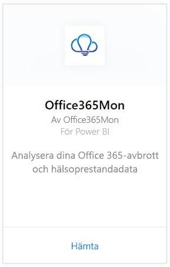
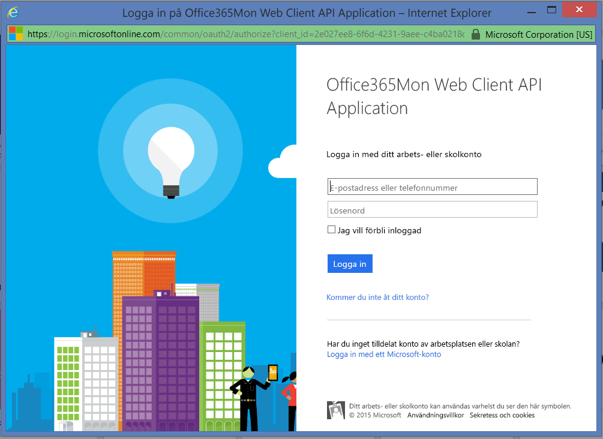

# Ansluta till Office365Mon med Power BI
Det är lätt att analysera dina Office 365-avbrott och hälsoprestandadata med Power BI och Office365Mon-mallappen. Power BI hämtar dina data, inklusive avbrott och hälsoavsökningar, och skapar sedan en anpassad instrumentpanel och rapporter som baseras på dessa data.

Anslut till [Office365Mon-mallappen](https://msit.powerbi.com/groups/me/getapps/services/office365mon.office365mon_powerbi_v3) för Power BI.

>[!NOTE]
>Du måste ha ett Office365Mon-administratörskonto för att kunna ansluta och läsa in Power BI-mallappen.

## Så här ansluter du
1. Välj **Hämta data** längst ned i navigeringsfönstret.
   
   
2. I rutan **Tjänster** väljer du **Hämta**.
   
    
3. Välj **Office365Mon** \> **Hämta**.
   
   
4. Som autentiseringsmetod väljer du **oAuth2** \> **Logga in**.
   
   När du uppmanas till det anger du autentiseringsuppgifterna som Office365Mon-administratör och följer autentiseringsprocessen.
   
   
   
   
5. När Power BI har importerat dessa data, visas en ny instrumentpanel, rapport och datamängd i navigeringsfönstret. Nya objekt har markerats med en gul asterisk \*, välj Office365Mon-posten.
   
   

**Och sedan?**

* Prova att [ställa en fråga i rutan Frågor och svar](consumer/end-user-q-and-a.md) överst på instrumentpanelen
* [Ändra panelerna](service-dashboard-edit-tile.md) på instrumentpanelen.
* [Välj en panel](consumer/end-user-tiles.md) för att öppna den underliggande rapporten.
* Medan din datauppsättning schemaläggs att uppdateras dagligen så kan du ändra uppdateringsfrekvensen eller testa att uppdatera den på begäran med **Uppdatera nu**

## Felsökning
Om du får felet **”Inloggningen misslyckades”** när du använder dina Office365Mon-autentiseringsuppgifter för prenumerationen, har inte kontot du använder behörighet att hämta Office365Mon-data från ditt konto. Kontrollera att det är ett administratörskonto och försök igen.

## Nästa steg
[Vad är Power BI?](fundamentals/power-bi-overview.md)

[Hämta data för Power BI](service-get-data.md)

